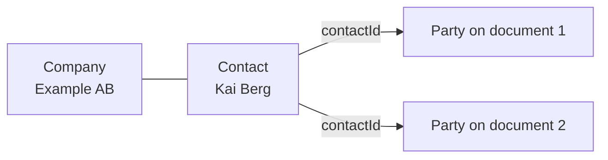

A **contact** is a person you send documents to more than once. A **company** groups contacts who work for the same organization. Both belong to a [workspace](/concepts/workspaces).

When you add a contact to a document, sajn creates a [party](/concepts/parties) from it. The party takes a copy of the contact's details, so a later change to the contact doesn't change documents you already created.



## Contact fields

| Field | Required | Description |
|-------|----------|-------------|
| `firstName` | Yes | First name |
| `lastName` | No | Last name |
| `email` | No | Email address, for email delivery |
| `phone` | No | Phone number, for SMS delivery and SMS verification |
| `nationalId` | No | National identity number, such as a Swedish personnummer. sajn compares it with the eID at signing. In API version `2026-09`, this field is `ssn`. |
| `companyId` | No | The company the contact works for |
| `companyRole` | No | The contact's role at the company, such as `CEO` |
| `externalId` | No | Your own ID for the contact, such as a CRM record ID |

The following request body creates a contact:

```json
{
  "firstName": "Kai",
  "lastName": "Berg",
  "email": "kai@example.com",
  "phone": "+46705550123",
  "companyId": "cm4k2x9p70009abcd6789cdef",
  "companyRole": "CEO",
  "externalId": "crm-10422"
}
```

To create it, send the body to [`POST /contacts`](/api-reference/create-a-new-contact).

## Companies

A company has a `name`, an optional `orgNumber`, and an optional `country`. To link a contact to a company, set the contact's `companyId`. To read a company with its contacts, call [`GET /companies/{id}`](/api-reference/get-a-company-by-id).

To find a company's details in an external business registry by its organization number, call [`GET /companies/lookup`](/api-reference/lookup-company-in-external-registry).

## Use a contact on a document

To add a contact as a party, send its `contactId`, either in `parties` when you create the document, or to [`POST /documents/{id}/parties`](/api-reference/add-a-party-to-document):

```json
{
  "contactId": "cm4k2x9p40006abcd3456qrst",
  "role": "SIGNER",
  "requiredSignature": "SE_BANKID"
}
```

The party gets the contact's name, email, phone number, national ID, and company. The party's `contactId` links back to the contact.

## Find contacts

To list contacts, call [`GET /contacts`](/api-reference/list-all-contacts). Use `query` to search first name, last name, email, phone, and company, and `companyId` or `tagId` to filter. For pagination, see [Pagination](/api-fundamentals/pagination).

Before you create a contact, search for it, so you don't create duplicates. If you sync contacts from another system, store that system's ID in `externalId`.

## Delete a contact

[`DELETE /contacts/{id}`](/api-reference/delete-a-contact) deletes a contact permanently. Parties created from the contact keep their own copy of its details and are unlinked from it, so existing documents don't change.

## Next steps

<CardGroup cols={2}>
  <Card title="Parties" icon="users" href="/concepts/parties">
    Roles, signing order, delivery, and verification.
  </Card>
  <Card title="Managing contacts" icon="address-book" href="/guides/contacts/managing-contacts">
    Create, search, and update contacts.
  </Card>
  <Card title="Working with companies" icon="building" href="/guides/contacts/working-with-companies">
    Group contacts by company.
  </Card>
</CardGroup>
