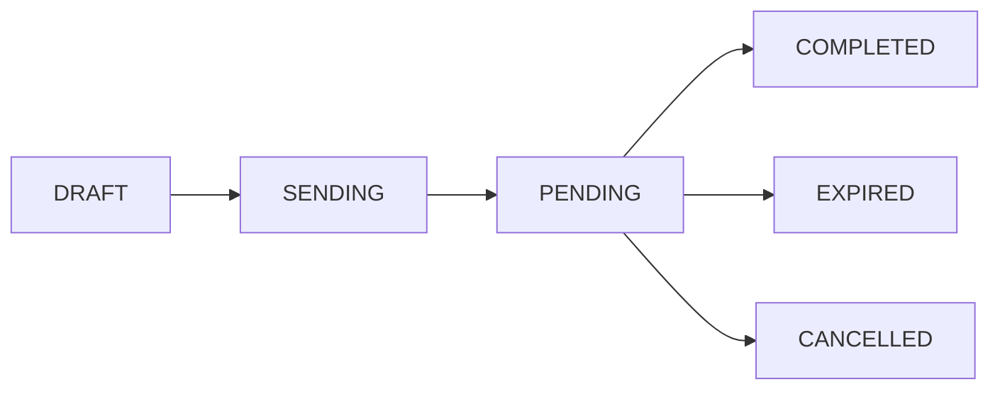

# Documents

Documents are the core of sajn. They represent contracts, agreements, or any other documents that need to be signed.

## Document Lifecycle

A document goes through several stages:



### Document Statuses

| Status | Description |
|--------|-------------|
| `DRAFT` | Document is being prepared, not yet sent |
| `SENDING` | Document is being sent to signers |
| `PENDING` | Document sent, awaiting signatures |
| `COMPLETED` | All signers have signed |
| `EXPIRED` | Document expired before all signatures collected |
| `CANCELLED` | Document was cancelled |
| `IMPORTED` | Document imported from external archive |

## Document Types

sajn supports different document types:

### SIGNABLE (Default)
Standard documents that require signatures from one or more signers.

```json
{
  "name": "Employment Contract",
  "type": "SIGNABLE"
}
```

### ACCEPTABLE
Documents that require acceptance rather than a signature, useful for terms of service or policies.

```json
{
  "name": "Terms of Service",
  "type": "ACCEPTABLE"
}
```

### ARCHIVE_IMPORTED
Documents imported from external systems for archival purposes.

## Document Metadata

Documents can have rich metadata to control the signing process:

```json
{
  "documentMeta": {
    "subject": "Please sign the employment contract",
    "message": "Welcome to the team! Please review and sign.",
    "signingOrder": "SEQUENTIAL",
    "defaultSignatureType": "DRAWING",
    "distributionMethod": "EMAIL",
    "forceReadFullDocument": true,
    "showCommentsToSigners": false,
    "preferredLanguage": "sv",
    "validFrom": "2024-01-01T00:00:00Z",
    "validTo": "2024-12-31T23:59:59Z",
    "value": "500000"
  }
}
```

### Key Metadata Fields

<AccordionGroup>
  <Accordion title="signingOrder">
    **PARALLEL**: All signers can sign simultaneously
    **SEQUENTIAL**: Signers must sign in order (1, 2, 3, etc.)
  </Accordion>

  <Accordion title="distributionMethod">
    **EMAIL**: Send via email
    **SMS**: Send via SMS
    **NONE**: Don't send automatically (use signing URLs directly)
  </Accordion>

  <Accordion title="defaultSignatureType">
    **DRAWING**: Free-hand signature
    **BANKID**: Swedish BankID electronic signature
    **MANUAL**: Manual signature (for in-person signing)
  </Accordion>

  <Accordion title="forceReadFullDocument">
    When `true`, signers must scroll through the entire document before signing.
  </Accordion>
</AccordionGroup>

## Document Fields

Documents can contain different types of fields:

- **TEXT**: Rich text content sections
- **FORM**: Form fields for signers to fill out
- **PDF**: Embedded PDF files
- **PRODUCT_TABLE**: Tables with products/services and pricing

Learn more in the [Document Fields API reference](/api-reference/POST%20/api/v1/documents/{id}/fields).

## Tags and Organization

Organize documents using:

- **Tags**: Categorize documents (e.g., "Contract", "NDA", "Employment")
- **Custom Fields**: Add structured metadata (e.g., project name, department)
- **External ID**: Link to your own system's identifiers

## Expiration

Set an expiration date to automatically expire documents that aren't completed in time:

```json
{
  "expiresAt": "2024-12-31T23:59:59Z"
}
```

When a document expires, its status changes to `EXPIRED` and signers can no longer access it.

## Best Practices

<CardGroup cols={2}>
  <Card title="Clear Naming" icon="tag">
    Use descriptive document names that clearly identify the content and purpose.
  </Card>
  <Card title="Appropriate Expiration" icon="clock">
    Set reasonable expiration dates - typically 7-30 days for most documents.
  </Card>
  <Card title="Sequential When Needed" icon="list-ol">
    Use sequential signing when the order matters (e.g., manager approval before employee signature).
  </Card>
  <Card title="External IDs" icon="link">
    Use external IDs to link documents to records in your own systems.
  </Card>
</CardGroup>

## Next Steps

<CardGroup cols={2}>
  <Card title="Signers" icon="users" href="/concepts/signers">
    Learn about adding signers to documents
  </Card>
  <Card title="Create Document Guide" icon="file-plus" href="/guides/create-document">
    Detailed guide on creating documents
  </Card>
</CardGroup>
