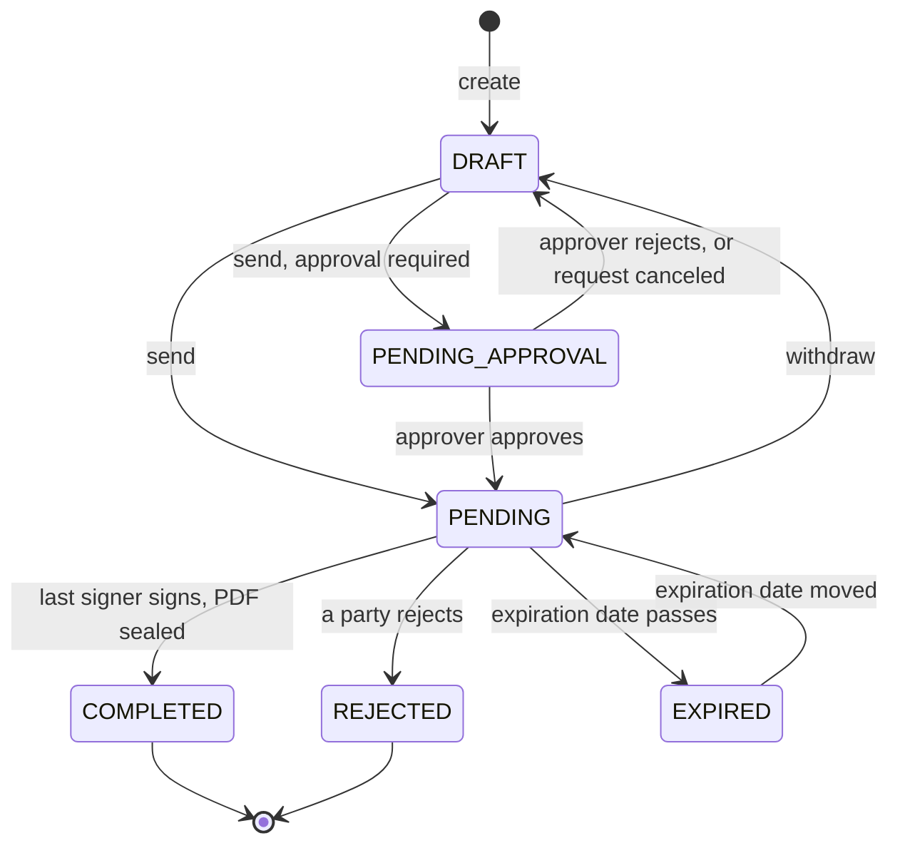

A **document** is an agreement that one or more people sign. It combines three things:

- **Content**: an ordered list of [fields](/concepts/fields), such as text, an uploaded PDF, a form, or a product table.
- **Parties**: the people who sign, review, or organize the document. For more information, see [Parties](/concepts/parties).
- **Settings**: the expiration date in `expiresAt`, and the signing order, invitation message, language, and other options in `documentMeta`.

When every party who must sign has signed, sajn seals the PDF with an eIDAS seal and appends a [signing certificate](/concepts/signing-certificate).

## Document lifecycle

A document's `status` tells you where it is. The following diagram shows the transitions:

```mermaid
stateDiagram-v2
    [*] --> DRAFT: create
    DRAFT --> PENDING: send
    DRAFT --> PENDING_APPROVAL: send, approval required
    PENDING_APPROVAL --> PENDING: approver approves
    PENDING_APPROVAL --> DRAFT: approver rejects, or request canceled
    PENDING --> COMPLETED: last signer signs, PDF sealed
    PENDING --> REJECTED: a party rejects
    PENDING --> EXPIRED: expiration date passes
    EXPIRED --> PENDING: expiration date moved
    PENDING --> DRAFT: withdraw
    COMPLETED --> [*]
    REJECTED --> [*]
```

### Statuses

| Status | Meaning | What you can do |
|--------|---------|-----------------|
| `DRAFT` | Being prepared. Nothing has been sent. | Change everything: content, parties, and settings. |
| `PENDING_APPROVAL` | Sent for internal approval. A workspace member must approve it before sajn sends it. | Wait for the approver, or cancel the approval request. |
| `PENDING` | Sent. Waiting for signatures. | Add, correct, or remove parties who haven't signed, send reminders, change some settings, or withdraw it. Content is locked. |
| `COMPLETED` | Every required party signed, and the PDF is sealed. | Download the signed PDF and the signing journal. Nothing can change. |
| `REJECTED` | A party declined to sign. | Create a new document if the agreement is still needed. |
| `EXPIRED` | The expiration date passed before everyone signed. | Move the expiration date to reopen it for signing, or withdraw it. |
| `IMPORTED` | An agreement signed outside sajn, imported into the archive. It's never sent for signing. | Edit its details, content, and parties. |

Older documents can also have the status `SENDING` or `CANCELLED`. sajn doesn't move documents into these statuses, but we recommend that your code accepts them when it reads older documents.

### Transitions

The following table lists what moves a document from one status to another:

| From | To | Trigger | Webhook event |
|------|----|---------|---------------|
| None | `DRAFT` | [Create a document](/api-reference/create-a-new-document) | `DOCUMENT_CREATED` |
| `DRAFT` | `PENDING` | [Send the document](/api-reference/send-document-for-signing). The response is `200`. | `DOCUMENT_SENT` |
| `DRAFT` | `PENDING_APPROVAL` | Send the document without the `SEND_WITHOUT_APPROVAL` permission, with an `approverId`. The response is `202`. | None |
| `PENDING_APPROVAL` | `PENDING` | The approver approves. | `DOCUMENT_SENT` |
| `PENDING_APPROVAL` | `DRAFT` | The approver rejects, or the request is canceled. | None |
| `PENDING` | `COMPLETED` | The last party who must sign signs, and sajn seals the PDF. | `DOCUMENT_COMPLETED` |
| `PENDING` | `REJECTED` | A party rejects the document. | `DOCUMENT_REJECTED` |
| `PENDING` | `EXPIRED` | The expiration date passes. | `DOCUMENT_EXPIRED` |
| `EXPIRED` | `PENDING` | [Change the expiration date](/api-reference/change-a-sent-documents-expiration-date). | `DOCUMENT_EXPIRATION_EXTENDED` |
| `PENDING` | `DRAFT` | [Withdraw the document](/api-reference/withdraw-a-sent-document). sajn removes existing signatures and notifies the parties. | `DOCUMENT_WITHDRAWN` |

Sealing runs in the background after the last signature, so a document can stay `PENDING` for a short time after everyone has signed. Wait for `DOCUMENT_COMPLETED`, or for `status` to be `COMPLETED`, before you download the signed PDF.

For the events that fire per party, such as `DOCUMENT_PARTY_SIGNED`, see [Webhook events](/webhooks/events).

## Before you send

sajn refuses to send a document, with the code `VALIDATION_FAILED`, until it meets the following conditions:

- The document has at least one party with the `SIGNER` role.
- The document has an expiration date in the future. If you don't send `expiresAt`, sajn uses the workspace's default expiration, when the workspace has one.
- Every party has the contact details its delivery and verification need: an email address for `EMAIL` delivery or email verification, and a phone number for `SMS` delivery or SMS verification.

## Change a document after sending

A `DRAFT` document accepts every change. After you send it, what you can change through [`PATCH /documents/{id}`](/api-reference/update-a-document) depends on the field:

- `name`, `externalId`, `responsibleUserId`, and `value` can always change.
- Reminders, subject, message, and the redirect URL can change until the document is completed, rejected, or cancelled.
- `forceReadFullDocument`, `accessVerification`, and `preferredLanguage` can change until someone has signed.
- `signingOrder` can't change. Withdraw the document first.

To change the content or settings that are locked, [withdraw](/api-reference/withdraw-a-sent-document) the document, change it, and send it again.

## Document settings

The `documentMeta` object holds the settings that control signing. The most common are the following:

| Field | Description |
|-------|-------------|
| `subject`, `message` | Subject line and message of the signing invitation. |
| `signingOrder` | `PARALLEL` lets every party sign at once. `SEQUENTIAL` invites parties one at a time, in their `signingOrder`. |
| `preferredLanguage` | Language of the signing page and emails: `sv`, `en`, `no`, `da`, `fi`, `de`, `is`, `es`, `fr`, or `it`. |
| `forceReadFullDocument` | If `true`, a party must scroll through the whole document before signing. |
| `reminderIntervalDays` | Days between automatic reminders. |
| `redirectUrl` | Where to send a party after signing. |
| `accessVerification` | A verification that every party passes before the document opens. |
| `value` | The monetary value of the agreement. |

For every field, see [Create a document](/api-reference/create-a-new-document).

## Document types

The `type` field sets what kind of document it is:

| Type | Description |
|------|-------------|
| `SIGNABLE` | The default. Parties sign the document. |
| `ACCEPTABLE` | Parties accept the document instead of signing it, for example terms of service. |
| `ARCHIVE_IMPORTED` | An agreement imported from another system for archiving. |

## Files

A document has up to three files, which you download with [`GET /documents/{id}/download/{fileType}`](/api-reference/download-a-document-file-by-type):

| File type | Contents | Available |
|-----------|----------|-----------|
| `ORIGINAL` | The unsigned document | In every status |
| `SIGNED` | The sealed PDF, with the signing certificate at the end | When the status is `COMPLETED` |
| `JOURNAL` | The signing journal, the full event log as a PDF | When the status is `COMPLETED` |

For more information, see [Downloading signed documents](/guides/documents/downloading-documents).

## Organize documents

The following fields help you find documents and link them to your own systems:

- **`externalId`**: your own ID for the document, such as a deal or order number. Filter the document list by it.
- **Tags**: labels such as `NDA` or `Employment`. For more information, see [Organizing with tags](/guides/documents/organizing-with-tags).
- **Custom fields**: structured values such as a project name or cost center. For more information, see [Custom fields](/guides/fields/custom-fields).

## Delete a document

[`DELETE /documents/{id}`](/api-reference/delete-a-document) moves a document to the trash, in any status. You can restore it from the trash until the workspace's trash period ends.

To delete a document immediately and permanently, move it to the trash first, and then call [`POST /documents/{id}/purge`](/api-reference/permanently-delete-a-document). Purging can't be undone. The verify link in a sealed PDF keeps working after a purge. For more information, see [storage and deletion](/guider/lagring-och-radering).

## Next steps

<CardGroup cols={2}>
  <Card title="Parties" icon="users" href="/concepts/parties">
    Roles, signing order, delivery, and verification.
  </Card>
  <Card title="Fields" icon="table-cells" href="/concepts/fields">
    The content of a document, and the values parties fill in.
  </Card>
  <Card title="Create a document" icon="file-circle-plus" href="/guides/documents/create-document">
    Create documents from scratch or from a template.
  </Card>
  <Card title="Webhook events" icon="webhook" href="/webhooks/events">
    Every event a document emits.
  </Card>
</CardGroup>
