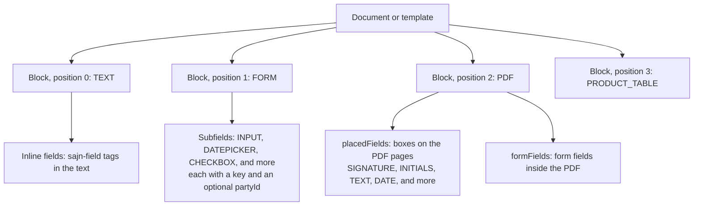

A document's **content** is an ordered list of content blocks, such as a section of text, an uploaded PDF, a form, or a product table. Templates have content in the same shape, and a document created from a template gets a copy of it.

A **field** is a value inside the content that someone fills in: you, before you send the document, or a party, before they sign. Fields live in content blocks: as subfields of a form, as boxes on a PDF, as form fields inside a PDF, or inline in a text section.



## Content block anatomy

Every content block has the following properties:

| Property | Description |
|----------|-------------|
| `id` | The content block ID. |
| `documentId`, `templateId` | The document or template the block belongs to. The other one is `null`. |
| `type` | The block type, such as `TEXT` or `PDF`. |
| `position` | The 0-based order of the block in the document. |
| `fieldMeta` | The type-specific content and settings. `fieldMeta.type` always equals `type`. |

The following content block is a short HTML section:

```json
{
  "id": "cm4k2x9p50007abcd7890uvwx",
  "documentId": "cm4k2x9p10001abcd1234efgh",
  "templateId": null,
  "type": "HTML",
  "position": 0,
  "fieldMeta": {
    "type": "HTML",
    "content": "<h2>Scope of work</h2><p>Example AB delivers the services in Appendix 1.</p>"
  }
}
```

## Content block types

| Type | Content |
|------|---------|
| `TEXT` | Rich text, as written in the sajn editor. |
| `HTML` | HTML that you send through the API. sajn sanitizes it and keeps only safe formatting. For more information, see [HTML content](/guides/fields/html-fields). |
| `FORM` | A grid of input subfields, such as text inputs, dates, and checkboxes. |
| `PDF` | An uploaded PDF. It can carry boxes placed on its pages, and form fields from the PDF itself. |
| `PRODUCT_TABLE` | Products or services with prices, quantities, discounts, and totals. For more information, see [Product tables](/guides/fields/product-tables). |
| `TABLE` | A table with your own columns and rows. |
| `DURATION` | The agreement's term and notice period, written out as text. A document has at most one. |
| `SPACER` | Vertical space. |
| `PAGE_BREAK` | A page break in the PDF. |

Most types also accept the following settings in `fieldMeta`: `locked` freezes the block in the editor, `hidden` hides it, and `visibilityRule` shows it only when a custom field has a given value.

To add content, send the blocks in a `content` array to [`POST /documents/{id}/content`](/api-reference/create-document-content), also when you add one. To read them, pass `expand=content` to [`GET /documents/{id}`](/api-reference/get-a-document-by-id), or call [`GET /documents/{id}/content`](/api-reference/list-document-content). You can change content only while a document is a `DRAFT`.

## Values that someone fills in

Fields come in four kinds:

- **FORM subfields.** A `FORM` block's `fieldMeta.fields` lists its subfields in a grid of `row` and `column`. A subfield's type is `INPUT`, `TEXT`, `SELECT`, `DATEPICKER`, `RADIO`, `CHECKBOX`, `NUMBER`, or `ATTACHMENT`.
- **Placed fields.** A `PDF` block's `fieldMeta.placedFields` lists boxes placed on its pages. Each box has a `page`, counted from 1, a `rect` in fractions of the page from its top-left corner, and a `kind`: `INPUT` for a value or mark, or `STATIC` for fixed text.
- **PDF form fields.** A `PDF` block's `fieldMeta.formFields` lists the form fields that were already in the uploaded PDF.
- **Inline fields.** A `TEXT` or `HTML` block's text can hold `<sajn-field>` tags, each a text, date, or choice that a party fills in where it stands in the sentence. For more information, see [Fields that parties fill in](/guides/fields/signer-fields#inline-fields-in-text).

Who fills a value depends on `partyId`:

| `partyId` | Who fills the value | When |
|-----------|---------------------|------|
| Set | The party | On the signing page, before signing. Set `required` to block signing until the value is filled. |
| Not set | You | Before you send the document, through the API or the editor |

A placed box with `inputType` set to `SIGNATURE` or `INITIALS` is a **signature mark**. The party draws it when they sign, and sajn seals it into the PDF at that position. A signature mark must belong to a party with the `SIGNER` role. For the coordinate model, see [Place fields on a PDF](/guides/fields/pdf-field-placement).

The following `FORM` block has one subfield that you fill in and one that the party fills in:

```json
{
  "type": "FORM",
  "position": 1,
  "fieldMeta": {
    "type": "FORM",
    "columns": 2,
    "fields": [
      {
        "id": "customer-name",
        "key": "customer-name",
        "type": "INPUT",
        "row": 0,
        "column": 0,
        "fieldMeta": { "type": "INPUT", "label": "Customer", "value": "Example AB" }
      },
      {
        "id": "start-date",
        "key": "start-date",
        "type": "DATEPICKER",
        "row": 0,
        "column": 1,
        "fieldMeta": {
          "type": "DATEPICKER",
          "label": "Start date",
          "partyId": "cm4k2x9p20002abcd5678ijkl",
          "required": true
        }
      }
    ]
  }
}
```

In API version `2026-10`, `fieldMeta` names the party `partyId`, and every enum inside it is uppercase. API version `2026-09` calls the party `signerId`, spells these enums in lowercase, and calls content blocks fields.

## Fill in values by key

A **key** is a stable name for a value, such as `customer-name`. Keys can contain lowercase letters, digits, hyphens, and underscores. Set keys on FORM subfields, placed boxes, and inline fields in a template, and every document created from it has the same keys.

A key names one field within a document or template. A request that would give two fields the same key fails with `400 VALIDATION_FAILED`, and a document that already has a duplicate key can't be sent until you rename one of them: the send fails with `409 DOCUMENT_NOT_READY` and the readiness code `DUPLICATE_KEY`. Two cases count as one field, so they share a key: one AcroForm field that spans several `PDF` blocks after a page split, and one `<sajn-field>` placed again for the same party.

To fill in values by key, use the field values endpoints:

1. To list every value on the document and its key, call [`GET /documents/{id}/field-values`](/api-reference/list-the-fillable-values-on-a-document).
1. To fill in several values in one request, call [`PATCH /documents/{id}/field-values`](/api-reference/fill-in-values-on-a-document):

   ```json
   {
     "values": [
       { "key": "customer-name", "value": "Example AB" },
       { "key": "org-number", "value": "556000-0000" },
       { "key": "accept-terms", "value": true }
     ]
   }
   ```

The same request works for FORM subfields, placed boxes, PDF form fields, and inline fields, which the list shows with `kind` set to `FORM`, `PDF_PLACED`, `PDF_ACROFORM`, and `INLINE`. You can fill in values while the document is a `DRAFT` or `IMPORTED`. On a draft, a value for a field that a party fills in, with `filledBy` set to `SIGNER`, prefills it: the party sees your value on the signing page and can change it. A value fails, and the other values are still written, when its key doesn't exist, when two fields share the key, or when the value doesn't match the field's type or options. The `results` array lists the outcome for each key: `success`, and when it's `false`, an `error` with `code`, `message`, and `userMessage`. `remaining` lists the keys of required values that you fill in and that are still empty.

## Next steps

<CardGroup cols={2}>
  <Card title="Templates and forms" icon="copy" href="/concepts/templates-and-forms">
    Reuse content and keys across documents.
  </Card>
  <Card title="Fields that parties fill in" icon="pen-field" href="/guides/fields/signer-fields">
    Collect values from parties at signing.
  </Card>
  <Card title="Place fields on a PDF" icon="file-pdf" href="/guides/fields/pdf-field-placement">
    Place signature marks and inputs on an uploaded PDF.
  </Card>
  <Card title="Product tables" icon="table" href="/guides/fields/product-tables">
    Sell products and services in a document.
  </Card>
</CardGroup>
