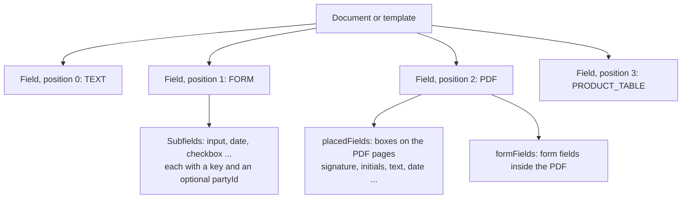

A document's content is an ordered list of **fields**. Each field is one content block, such as a section of text, an uploaded PDF, a form, or a product table. Templates have fields in the same shape, and a document created from a template gets a copy of them.

Some fields also hold values that someone fills in: you, before you send the document, or a party, before they sign.



## Field anatomy

Every field has the following properties:

| Property | Description |
|----------|-------------|
| `id` | The field ID. |
| `type` | The field type, such as `TEXT` or `PDF`. |
| `position` | The 0-based order of the field in the document. |
| `fieldMeta` | The type-specific content and settings. `fieldMeta.type` always equals `type`. |

The following field is a short HTML section:

```json
{
  "id": "cm4k2x9p50007abcd7890uvwx",
  "type": "HTML",
  "position": 0,
  "fieldMeta": {
    "type": "HTML",
    "content": "<h2>Scope of work</h2><p>Example AB delivers the services in Appendix 1.</p>"
  }
}
```

## Field types

| Type | Content |
|------|---------|
| `TEXT` | Rich text, as written in the sajn editor. |
| `HTML` | HTML that you send through the API. sajn sanitizes it and keeps only safe formatting. For more information, see [HTML fields](/guides/fields/html-fields). |
| `FORM` | A grid of input subfields, such as text inputs, dates, and checkboxes. |
| `PDF` | An uploaded PDF. It can carry boxes placed on its pages, and form fields from the PDF itself. |
| `PRODUCT_TABLE` | Products or services with prices, quantities, discounts, and totals. For more information, see [Product tables](/guides/fields/product-tables). |
| `TABLE` | A table with your own columns and rows. |
| `DURATION` | The agreement's term and notice period, written out as text. A document has at most one. |
| `SPACER` | Vertical space. |
| `PAGE_BREAK` | A page break in the PDF. |

Most types also accept the following settings in `fieldMeta`: `locked` freezes the field in the editor, `hidden` hides it, and `visibilityRule` shows it only when a custom field has a given value.

To add fields, call [`POST /documents/{id}/fields`](/api-reference/create-a-document-field). To read them, pass `expand=fields` to [`GET /documents/{id}`](/api-reference/get-a-document-by-id), or call [`GET /documents/{id}/fields`](/api-reference/list-document-fields). You can change fields only while a document is a `DRAFT`.

## Values that someone fills in

Three kinds of fields hold values:

- **FORM subfields.** A `FORM` field's `fieldMeta.fields` lists its subfields in a grid of `row` and `column`. A subfield's type is `input`, `text`, `select`, `datepicker`, `radio`, `checkbox`, `number`, or `attachment`.
- **Placed fields.** A `PDF` field's `fieldMeta.placedFields` lists boxes placed on its pages. Each box has a `page`, a `rect` in PDF points, and a `kind`: `input` for a value or mark, or `static` for fixed text.
- **PDF form fields.** A `PDF` field's `fieldMeta.formFields` lists the form fields that were already in the uploaded PDF.

Who fills a value depends on `partyId`:

| `partyId` | Who fills the value | When |
|-----------|---------------------|------|
| Set | The party | On the signing page, before signing. Set `required` to block signing until the value is filled. |
| Not set | You | Before you send the document, through the API or the editor |

A placed box with `inputType` set to `signature` or `initials` is a **signature mark**. The party draws it when they sign, and sajn seals it into the PDF at that position. A signature mark must belong to a party with the `SIGNER` role. For the coordinate model, see [PDF field placement](/guides/fields/pdf-field-placement).

The following `FORM` field has one subfield that you fill in and one that the party fills in:

```json
{
  "type": "FORM",
  "position": 1,
  "fieldMeta": {
    "type": "FORM",
    "columns": 2,
    "fields": [
      {
        "id": "customer-name",
        "key": "customer-name",
        "type": "input",
        "row": 0,
        "column": 0,
        "fieldMeta": { "type": "input", "label": "Customer", "value": "Example AB" }
      },
      {
        "id": "start-date",
        "key": "start-date",
        "type": "datepicker",
        "row": 0,
        "column": 1,
        "fieldMeta": {
          "type": "datepicker",
          "label": "Start date",
          "partyId": "cm4k2x9p20002abcd5678ijkl",
          "required": true
        }
      }
    ]
  }
}
```

In API version `2026-10`, `fieldMeta` names the party `partyId`. API version `2026-09` calls it `signerId`.

## Fill in values by key

A **key** is a stable name for a value, such as `customer-name`. Keys can contain lowercase letters, digits, hyphens, and underscores. Set keys on FORM subfields and placed boxes in a template, and every document created from it has the same keys.

To fill in values by key, use the field values endpoints:

1. To list every value on the document and its key, call [`GET /documents/{id}/field-values`](/api-reference/list-the-fillable-values-on-a-document).
1. To fill in several values in one request, call [`PATCH /documents/{id}/field-values`](/api-reference/fill-in-values-on-a-document):

   ```json
   {
     "values": [
       { "key": "customer-name", "value": "Example AB" },
       { "key": "org-number", "value": "556000-0000" },
       { "key": "accept-terms", "value": true }
     ]
   }
   ```

The same request works for FORM subfields, placed boxes, and PDF form fields. You can fill in values while the document is a `DRAFT` or `IMPORTED`. A value fails, and the other values are still written, when its key doesn't exist, when two fields share the key, when a party fills it in at signing, or when the value doesn't match the field's type or options. The `results` array lists the outcome for each key.

## Next steps

<CardGroup cols={2}>
  <Card title="Templates and forms" icon="copy" href="/concepts/templates-and-forms">
    Reuse fields and keys across documents.
  </Card>
  <Card title="Fields that parties fill in" icon="pen-field" href="/guides/fields/signer-fields">
    Collect values from parties at signing.
  </Card>
  <Card title="PDF field placement" icon="file-pdf" href="/guides/fields/pdf-field-placement">
    Place signature marks and inputs on an uploaded PDF.
  </Card>
  <Card title="Product tables" icon="table" href="/guides/fields/product-tables">
    Sell products and services in a document.
  </Card>
</CardGroup>
