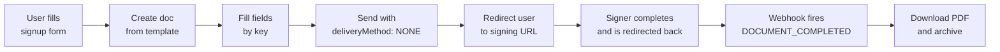

# Onboarding Signing Flow

A common pattern when building a product on top of sajn is to collect a signed document as part of account signup or onboarding — a terms of service, a data processing agreement, a broker authorization, a membership contract. The user fills in a form in your app, signs inline, and is dropped back into your flow without ever seeing an email.

This concept explains how the pieces fit together. Each piece links to its own reference.

## The Pattern



The flow has two tracks running in parallel:

- **User-facing:** your form → signing page → redirect back to your app. The user perceives one continuous signup.
- **Server-to-server:** webhook → PDF download → archive. This is how you get a durable copy of the signed document, independent of whatever the browser does.

Keep both. The redirect drives UX; the webhook is the source of truth.

## Prerequisites

Before wiring this up:

- A **template** with [FORM fields](/guides/signer-fields) that have stable **keys** (e.g. `full_name`, `company_number`, `address`). Keys are how you fill the fields programmatically — unlike field IDs, they survive template edits.
- A **webhook endpoint** subscribed to `DOCUMENT_COMPLETED`. See [Webhooks](/guides/webhooks).
- A **redirect URL** in your app that finishes the onboarding (e.g. `/onboarding/done`).

<Tip>
  Templates keep content and layout out of your code. When the legal team changes the contract text, you don't redeploy — you edit the template.
</Tip>

---

## Step 1 — Collect input from the user

The user fills in your signup form. Nothing sajn-specific here — just capture the values you're going to push into the template: name, email, org number, whatever your document needs.

## Step 2 — Create the document from a template

When the user submits the form, create a document from your template and include the signer inline. The critical bit is `deliveryMethod: "NONE"` — this tells sajn *not* to send an email. You're going to show the signing page yourself.

```bash
curl -X POST https://app.sajn.se/api/v1/documents \
  -H "Authorization: Bearer YOUR_API_KEY" \
  -H "Content-Type: application/json" \
  -d '{
    "name": "Membership Agreement - Anna Svensson",
    "templateId": "template_abc123",
    "externalId": "signup_456",
    "documentMeta": {
      "redirectEnabled": true,
      "redirectUrl": "https://yourapp.com/onboarding/done?doc={documentId}"
    },
    "signers": [
      {
        "name": "Anna Svensson",
        "email": "anna@example.com",
        "role": "SIGNER",
        "deliveryMethod": "NONE",
        "requiredSignature": "BANKID",
        "ssn": "198001011234"
      }
    ]
  }'
```

A few things worth noting:

- **`externalId`** links the sajn document back to the signup in your own system. When the webhook fires, you'll use this to find the user.
- **`redirectEnabled` + `redirectUrl`** send the user back to your app after signing. The `{documentId}` and `{signerId}` placeholders are replaced with real values. See [Redirect URL](/guides/redirect-url).
- **`deliveryMethod: "NONE"`** suppresses the email. The signing URL still exists — you'll fetch it in Step 4.

The response includes the new `documentId` and `signerId`.

## Step 3 — Fill the form fields

For each FORM field with a key, issue a PATCH using `key:<fieldKey>` instead of a field ID:

```bash
curl -X PATCH https://app.sajn.se/api/v1/documents/doc_123/fields/key:full_name \
  -H "Authorization: Bearer YOUR_API_KEY" \
  -H "Content-Type: application/json" \
  -d '{"fieldMeta": {"type": "input", "value": "Anna Svensson"}}'
```

Repeat for each field you captured in Step 1. Run the calls in parallel — they're independent.

<Note>
  Fields without keys can't be filled this way. If a template field isn't filling, check that the template has a key set on that field.
</Note>

## Step 4 — Send the document and fetch the signing URL

`POST /api/v1/documents/{id}/send` moves the document from `DRAFT` to `PENDING`. Because every signer has `deliveryMethod: "NONE"`, no emails go out. Then fetch the signing URL for the signer:

```bash
# Transition to PENDING
curl -X POST https://app.sajn.se/api/v1/documents/doc_123/send \
  -H "Authorization: Bearer YOUR_API_KEY" \
  -H "Content-Type: application/json" \
  -d '{}'

# Fetch the signing URL
curl -X GET https://app.sajn.se/api/v1/documents/doc_123/signers/signer_456 \
  -H "Authorization: Bearer YOUR_API_KEY"
```

The response contains `signingUrl`. Return this to your frontend and either redirect the browser to it or open it in an embedded iframe (see [Embedding](/guides/embedding)).

<Warning>
  Never share signing URLs publicly or expose them in logs. Each URL contains a token tied to that specific signer.
</Warning>

## Step 5 — User signs and is redirected

The user signs on sajn's hosted page (or inside your embed). When they finish, sajn redirects to the URL you configured in Step 2, with the placeholders filled in:

```
https://yourapp.com/onboarding/done?doc=doc_123
```

Use this as a *UX signal only* — show a success screen, maybe poll your own backend for confirmation. Don't trust the redirect alone as proof of signing. The user could close the tab, lose their connection, or land on the redirect before your webhook has been processed.

## Step 6 — Webhook fires and you archive the PDF

When the document is sealed, sajn POSTs `DOCUMENT_COMPLETED` to your webhook. This is where you get the authoritative signal. Download the PDF (with the audit certificate) and store it:

```javascript
app.post('/webhooks/sajn', async (req, res) => {
  // Verify the request
  if (req.headers['x-sajn-secret'] !== process.env.SAJN_WEBHOOK_SECRET) {
    return res.status(401).send('Invalid secret');
  }

  const { event, payload } = req.body;

  if (event === 'DOCUMENT_COMPLETED') {
    const signedPdf = await fetch(
      `https://app.sajn.se/api/v1/documents/${payload.id}/download?includeCertificate=true`,
      { headers: { Authorization: `Bearer ${process.env.SAJN_API_KEY}` } }
    ).then(r => r.arrayBuffer());

    // payload has externalId, so you can find the signup
    await storeSignedAgreement({
      signupId: payload.externalId,
      documentId: payload.id,
      pdf: Buffer.from(signedPdf),
    });

    await activateAccount(payload.externalId);
  }

  res.status(200).send('OK');
});
```

See [Downloading Signed Documents](/guides/downloading-documents) for the full archival options.

---

## Why this shape?

A few design choices worth calling out:

<AccordionGroup>
  <Accordion title="Why deliveryMethod: NONE instead of EMAIL?">
    During onboarding the user is already in your app. Emailing them a link and asking them to check their inbox breaks the flow and drops conversion. `NONE` lets you keep them in-session.

    For signers who aren't present — a counterparty, a supervisor — use `EMAIL` or `SMS` on that specific signer. Delivery method is per-signer, so you can mix them.
  </Accordion>

  <Accordion title="Why templates instead of generating the document inline?">
    Templates let non-developers own the document content. They also give you stable field **keys** — so your code fills `full_name` regardless of how the legal text around it shifts over time.

    If your document is truly dynamic (generated from user input), you can also create documents directly with [file uploads](/guides/file-uploads) or inline content, but you lose the template's stability.
  </Accordion>

  <Accordion title="Why both redirect URL and webhook?">
    They answer different questions.

    - **Redirect URL** answers *"what does the user see next?"* It runs in the browser, so it's subject to network drops and closed tabs.
    - **Webhook** answers *"is this signup actually complete?"* It runs server-to-server, with request logs you can inspect in the dashboard. It's the one that should unlock downstream state (activate account, provision resources, bill the customer).

    Using only the redirect risks orphaned signups if the user's browser fails. Using only the webhook gives the user a blank screen after signing. Use both.
  </Accordion>

  <Accordion title="What about retries if the webhook fails?">
    sajn does not automatically retry failed webhook deliveries. Failures are logged for 72 hours in the dashboard and organization members are notified in-app.

    If your archival logic is critical, consider also running a reconciliation job that periodically lists documents (`GET /api/v1/documents`) with status `COMPLETED` and checks that you've archived each one. Using `externalId` makes this join trivial.
  </Accordion>

  <Accordion title="BankID vs Drawing signature in onboarding?">
    If you need to verify *who* signed — for KYC, regulated contracts, or anything where identity matters later — use `BANKID` (requires Swedish SSN). For simple terms-of-service style acceptance, `CLICK_TO_SIGN` or `DRAWING` is lighter and has no SSN prerequisite. See [Signing Methods](/concepts/signing-methods).
  </Accordion>
</AccordionGroup>

---

## Putting it together

End-to-end pseudocode for a signup handler:

```javascript
async function handleSignup(form) {
  // 1. Create signup record in your own DB
  const signup = await db.signups.create({
    email: form.email,
    name: form.name,
    status: 'AWAITING_SIGNATURE',
  });

  // 2. Create the sajn document from a template
  const doc = await sajn.post('/documents', {
    name: `Membership Agreement - ${form.name}`,
    templateId: process.env.SAJN_TEMPLATE_ID,
    externalId: signup.id,
    documentMeta: {
      redirectEnabled: true,
      redirectUrl: `${process.env.APP_URL}/onboarding/done?doc={documentId}`,
    },
    signers: [{
      name: form.name,
      email: form.email,
      ssn: form.ssn,
      role: 'SIGNER',
      deliveryMethod: 'NONE',
      requiredSignature: 'BANKID',
    }],
  });

  // 3. Fill fields in parallel
  await Promise.all([
    sajn.patch(`/documents/${doc.documentId}/fields/key:full_name`,   { fieldMeta: { type: 'input', value: form.name } }),
    sajn.patch(`/documents/${doc.documentId}/fields/key:email`,       { fieldMeta: { type: 'input', value: form.email } }),
    sajn.patch(`/documents/${doc.documentId}/fields/key:org_number`,  { fieldMeta: { type: 'input', value: form.orgNumber } }),
  ]);

  // 4. Send and fetch the signing URL
  await sajn.post(`/documents/${doc.documentId}/send`, {});
  const signer = await sajn.get(
    `/documents/${doc.documentId}/signers/${doc.signers[0].signerId}`
  );

  // 5. Return to the browser — your frontend redirects to signer.signingUrl
  return { signingUrl: signer.signingUrl };
}
```

The webhook handler (Step 6) runs separately and flips the signup from `AWAITING_SIGNATURE` to `ACTIVE` once the signed PDF is archived.

## Next Steps

<CardGroup cols={2}>
  <Card title="Templates & Forms" icon="file-lines" href="/guides/templates-and-forms">
    Structure a template with field keys
  </Card>
  <Card title="Redirect URL" icon="arrow-right" href="/guides/redirect-url">
    Full reference for post-signing redirects
  </Card>
  <Card title="Webhooks" icon="webhook" href="/guides/webhooks">
    Subscribe to DOCUMENT_COMPLETED
  </Card>
  <Card title="Downloading Signed Documents" icon="download" href="/guides/downloading-documents">
    Archive the signed PDF with audit trail
  </Card>
  <Card title="Embedding" icon="window" href="/guides/embedding">
    Show the signing page inside your app
  </Card>
  <Card title="Signing Methods" icon="signature" href="/concepts/signing-methods">
    Choose BankID, Drawing, or Click-to-Sign
  </Card>
</CardGroup>
