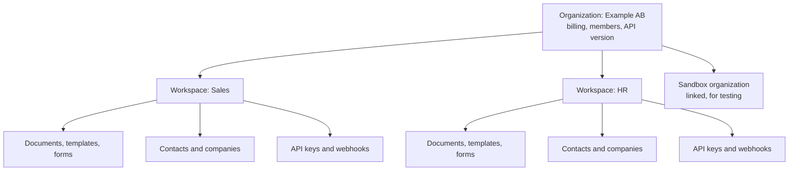

An **organization** is your company's sajn account. It holds the subscription, the members, and one or more [workspaces](/concepts/workspaces). The workspaces hold the actual work: documents, templates, contacts, webhooks, and API keys.

## What belongs to the organization

The organization owns what applies to the whole company:

- **Subscription and billing.** The plan, its quotas, and usage. Read them with [`GET /limits`](/api-reference/get-plan-limits-and-usage).
- **Members.** People are members of the organization, and get access to individual workspaces.
- **Organization roles.** Permission sets for organization-wide tasks, such as managing billing or OAuth apps.
- **Single sign-on**, for organizations that sign in through their own identity provider.
- **The organization audit log**, which records security-relevant actions such as API key changes.
- **The default API version.** Every workspace and API key in the organization shares it. For more information, see [API versioning](/api-fundamentals/versioning).
- **Sandboxes.** Each [sandbox](/get-started/sandbox) is a separate organization linked to yours.

Everything else, including every document, belongs to a workspace. For the full list, see [Workspaces](/concepts/workspaces#what-belongs-to-a-workspace).

## Members and roles

A person joins the organization once, and then gets access to workspaces. Two kinds of role control what they can do:

| Role | Scope | Controls |
|------|-------|----------|
| Organization role | The whole organization | Organization-wide tasks, such as billing and OAuth apps |
| Workspace role | One workspace | What the member can do with that workspace's documents, templates, contacts, and settings |

A member can have a different workspace role in each workspace. Every workspace has five built-in roles: **Läsare**, **Medarbetare**, **Säljare**, **Godkännare**, and **Avdelningsansvarig**. They range from **Läsare**, with the fewest permissions, to **Avdelningsansvarig**, with the most. You can also create custom roles. For more information, see [Workspaces](/concepts/workspaces#members-and-roles).

## Organizations in the API

An API key or OAuth token always acts in one workspace, so you rarely work with the organization directly. To read the organization a key belongs to, call [`GET /me`](/api-reference/get-authenticated-user-+-workspace-context): the response has an `organization` object with its `id` and `name`.

Webhook payloads carry `organizationId`, so an endpoint that receives events from several organizations can tell them apart.

## When you need more than one organization

Most companies need one organization with several workspaces. Create a separate organization only for a separate legal entity with its own billing. For testing, use a [sandbox](/get-started/sandbox) instead.

## Next steps

<CardGroup cols={2}>
  <Card title="Workspaces" icon="folder" href="/concepts/workspaces">
    How workspaces isolate data, members, and credentials.
  </Card>
  <Card title="Documents" icon="file-contract" href="/concepts/documents">
    The document lifecycle, from draft to sealed PDF.
  </Card>
</CardGroup>
