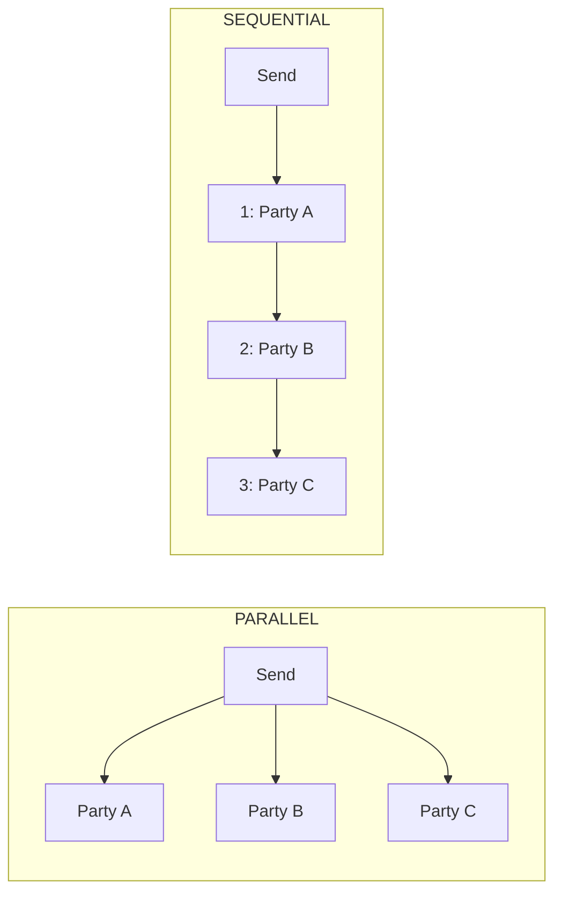

A **party** is a person on a document. Each party has a role, which decides whether they sign, and their own settings for how sajn reaches them and how they prove who they are. You manage parties with the `/documents/{id}/parties` endpoints and read them from the `parties` array of a document.

<Note>
  API version `2026-10` removes the `/signers` endpoints and the `signers` field. To move from them, see [Migrate from signers to parties](/upgrading/migrate-signers-to-parties).
</Note>

## Roles

The `role` field decides what a party does:

| Role | What the party does | Must act for the document to complete |
|------|---------------------|---------------------------------------|
| `SIGNER` | Signs the document. | Yes |
| `REVIEWER` | Is invited to review the document. Doesn't sign. | No |
| `ORGANIZER` | Is added to follow the document as its organizer. Doesn't sign. | No |

A document completes when every `SIGNER` has signed. A document needs at least one `SIGNER` before you can send it. Reviewers and organizers also receive the sealed PDF when the document completes.

<Note>
  API version `2026-10` rejects the `ACCEPTOR` role. Use `SIGNER` instead. In API version `2026-09`, `ACCEPTOR` is accepted on input and treated as `SIGNER`.
</Note>

## Individuals and companies

A party's `type` is `COMPANY` when it has a company name and organization number, and `INDIVIDUAL` otherwise. A company party is a person who signs on behalf of the company. Send `companyName` and `companyOrgNumber` together, and optionally `companyRole`, such as `CEO`.

## Add a party

You can add parties when you create the document, or afterward:

- **When you create the document**, each entry in `parties` takes either a `contactId`, or a `name` and an `email`.
- **After you create it**, [`POST /documents/{id}/parties`](/api-reference/add-a-party-to-document) takes a `contactId`. To add someone who isn't a contact yet, [create the contact](/api-reference/create-a-new-contact) first.

A party added from a contact gets its name, email, phone number, national ID, and company from the contact. It keeps its own copy: changing the contact later doesn't change the party.

The following request creates a document with two parties, one from a contact and one by name:

```json
{
  "name": "Partnership agreement",
  "expiresAt": "2030-01-01T00:00:00Z",
  "documentMeta": { "signingOrder": "SEQUENTIAL" },
  "parties": [
    {
      "contactId": "cm4k2x9p40006abcd3456qrst",
      "role": "SIGNER",
      "signingOrder": 1,
      "requiredSignature": "SE_BANKID"
    },
    {
      "name": "Quinn Holm",
      "email": "quinn@example.com",
      "role": "SIGNER",
      "signingOrder": 2,
      "requiredSignature": "CLICK_TO_SIGN"
    }
  ]
}
```

To set a phone number or national ID on a party you added by name, [update the party](/api-reference/update-a-party).

## Signing order

The document's `documentMeta.signingOrder` decides whether parties sign at the same time:



- **`PARALLEL`** invites every party when you send the document, and they sign in any order. The party's `signingOrder` is ignored.
- **`SEQUENTIAL`** invites parties one at a time, in ascending `signingOrder`. sajn invites the next party only after the previous one has signed.

## Delivery

The `deliveryMethod` field decides how a party receives the signing invitation:

| Value | Delivery |
|-------|----------|
| `EMAIL` | An email with the signing link. The default. Requires an email address. |
| `SMS` | A text message with the signing link. Requires a phone number. |
| `NONE` | Nothing. You get the signing URL from the API and give it to the party yourself. |
| `IN_APP` | Nothing. The party signs in person, on your device. |

You can mix delivery methods on one document.

## Signature method

The `requiredSignature` field decides how a party signs. The method also decides the legal level of the signature:

| Value | Method |
|-------|--------|
| `CLICK_TO_SIGN` | Click to sign |
| `DRAWING` | A drawn signature |
| `SE_BANKID` | Swedish BankID |
| `DK_MITID`, `DK_MITID_ERHVERV` | Danish MitID, personal or business |
| `FI_FTN` | Finnish Trust Network |
| `NO_BANKID_BIOMETRIC`, `NO_BANKID_HIGH`, `NO_QES` | Norwegian BankID |
| `NL_IDIN` | Dutch iDIN |
| `MANUAL` | Signed on paper, outside sajn. Used for imported documents. |

eID schemes are switched on market by market. To build a picker, call [`GET /helpers/signature-methods`](/api-reference/list-selectable-signature-methods) instead of hard-coding the list. For what each method proves, see [Signing methods](/concepts/signing-methods).

To check that the right person signs with an eID, set the party's `nationalId`. sajn compares it with the identity the eID returns. Without it, sajn compares names. The identity the eID verified is available from [`GET /documents/{id}/signatures`](/api-reference/get-verified-signer-identities).

## Verification before opening

The `twoStepVerification` field adds a check that the party must pass **before** the document opens. It's independent of `requiredSignature`, so you can, for example, put a BankID check in front of a click-to-sign document:

| Value | Check |
|-------|-------|
| `NONE` | No check. The default. |
| `SMS_BEFORE_SIGNING` | A code sent by SMS. Requires a phone number. |
| `EMAIL_BEFORE_SIGNING` | A code sent by email. Requires an email address. |
| `PIN_BEFORE_SIGNING` | A PIN that you share with the party yourself |
| `SE_BANKID_BEFORE_SIGNING` | Swedish BankID |
| `DK_MITID_BEFORE_SIGNING`, `DK_MITID_ERHVERV_BEFORE_SIGNING` | Danish MitID |
| `FI_FTN_BEFORE_SIGNING` | Finnish Trust Network |
| `NO_BANKID_BIOMETRIC_BEFORE_SIGNING`, `NO_BANKID_HIGH_BEFORE_SIGNING` | Norwegian BankID |
| `NL_IDIN_BEFORE_SIGNING` | Dutch iDIN |

For the list your account can use, call [`GET /helpers/two-step-verifications`](/api-reference/list-selectable-verification-gates). To require the same check from every party, set `documentMeta.accessVerification` instead. For more information, see [Identity verification](/guides/identity/identity-verification).

## Party status

Three fields track each party's progress:

| Field | Values |
|-------|--------|
| `sendStatus` | `NOT_SENT`, `SENT`, `DELIVERED`, `BOUNCED`, `FAILED` |
| `readStatus` | `NOT_OPENED`, `OPENED`, `READ` |
| `signingStatus` | `NOT_SIGNED`, `SIGNED`, `REJECTED` |

`signedAt` holds the time the party signed. `identityVerified` is `true` when an eID verified the party, either as the signature or as the check before opening.

When a party rejects the document, the document's status becomes `REJECTED`, and nobody else can sign it.

## Signing URLs

Each party has its own signing URL. To get it, call [`GET /documents/{id}/parties/{partyId}`](/api-reference/get-a-party-with-signing-url):

```json
{
  "id": "cm4k2x9p20002abcd5678ijkl",
  "name": "Quinn Holm",
  "role": "SIGNER",
  "signingStatus": "NOT_SIGNED",
  "signingUrl": "https://app.sajn.se/sign/cm4k2x9p10001abcd1234efgh?token=SIGNING_TOKEN"
}
```

Only this endpoint returns `signingUrl`. The party list and the document leave it out. sajn records an audit log entry each time you fetch a signing URL.

<Warning>
  A signing URL lets anyone who holds it act as that party. Give it only to that party, and never publish it.
</Warning>

## Change a party

You can [update](/api-reference/update-a-party) or [remove](/api-reference/remove-a-party-from-document) a party until they sign, also after the document is sent. After a party signs, their details can't change.

Include `role` in every update request. If you leave it out, the party's role is set to `SIGNER`.

## Next steps

<CardGroup cols={2}>
  <Card title="Signing methods" icon="pen-nib" href="/concepts/signing-methods">
    What each signature method proves, and when to use it.
  </Card>
  <Card title="Contacts" icon="address-book" href="/concepts/contacts">
    Reuse people across documents.
  </Card>
  <Card title="Multi-party signing" icon="users" href="/guides/documents/multi-party-signing">
    Send one document to several parties.
  </Card>
  <Card title="Send for signing" icon="paper-plane" href="/guides/documents/send-for-signing">
    Send a document and follow its progress.
  </Card>
</CardGroup>
