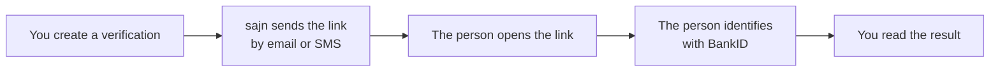

sajn ID verifies a person's identity with Swedish BankID, without a document to sign. Use it to check who someone is before you give them access to a service or complete a transaction. sajn sends the person a link, they identify themselves with BankID, and you read the result.

## Overview

sajn ID checks the BankID identity in one of two ways:

- **By national ID.** If you send `nationalId`, BankID verifies the identity, and sajn checks that the personal number matches.
- **By name.** Without `nationalId`, sajn checks that the name matches `fullName`.

## How it works



The verification's `status` follows these steps, from `CREATED` to `VERIFIED` or `FAILED`. A verification that isn't completed in time becomes `EXPIRED`.

### Verification statuses

| Status | Description |
|--------|-------------|
| `CREATED` | Verification created but not sent |
| `SENT` | Verification sent to recipient |
| `OPENED` | Recipient opened verification link |
| `VERIFIED` | Successfully verified |
| `FAILED` | Verification failed |
| `EXPIRED` | Verification link expired |
| `CANCELED` | Verification was canceled |

## Create a verification

Creating a verification through the API sends it to the person right away, over the `channel` you choose. To create one, call [`POST /sajn-id`](/api-reference/create-a-new-sajn-id-verification).

### Verify by national ID

Send the personal number in the `nationalId` field:

```json
{
  "fullName": "Alex Lindqvist",
  "nationalId": "197001011234",
  "email": "alex@example.com",
  "channel": "EMAIL",
  "reference": "onboarding-4711"
}
```

In API version `2026-09`, this field is `ssn`.

### Verify by name

Leave out `nationalId`:

```json
{
  "fullName": "Alex Lindqvist",
  "email": "alex@example.com",
  "channel": "EMAIL",
  "reference": "onboarding-4712"
}
```

## Delivery channels

### EMAIL
sajn sends the verification link by email:

```json
{
  "channel": "EMAIL",
  "email": "alex@example.com"
}
```

### SMS
sajn sends the verification link by SMS:

```json
{
  "channel": "SMS",
  "phone": "+46701234567"
}
```

<Note>
  API-created verifications use `EMAIL` or `SMS`. The `channel` field returned by the API may also be `IN_APP` for verifications delivered inside the sajn app.
</Note>

## Verification data

After a successful verification, [get the verification](/api-reference/get-a-sajn-id-verification-by-id) to read the BankID response in `data`:

```json
{
  "id": "cm4k2x9p80010abcd0123ghij",
  "status": "VERIFIED",
  "fullName": "Alex Lindqvist",
  "verifiedAt": "2024-01-15T10:30:00Z",
  "data": {
    "completionData": {
      "user": {
        "personalNumber": "197001011234",
        "name": "Alex Lindqvist",
        "givenName": "Alex",
        "surname": "Lindqvist"
      },
      "device": {
        "ipAddress": "192.0.2.1"
      }
    }
  }
}
```

<Note>
  sajn encrypts personal numbers at rest, and returns them only to users with the right permissions.
</Note>

## Use cases

### Customer onboarding

Verify a customer's identity when they sign up:

```json
{
  "fullName": "Alex Lindqvist",
  "nationalId": "197001011234",
  "email": "alex@example.com",
  "channel": "EMAIL",
  "reference": "signup-4714"
}
```

### Identity without a personal number

Verify a person by name, without collecting their personal number:

```json
{
  "fullName": "Alex Lindqvist",
  "email": "alex@example.com",
  "channel": "EMAIL",
  "reference": "signup-4713"
}
```

### Before a contract

Verify a person, and link the verification to their contact, before you send them a contract:

```json
{
  "fullName": "Alex Lindqvist",
  "nationalId": "197001011234",
  "email": "alex@example.com",
  "channel": "EMAIL",
  "contactId": "cm4k2x9p40006abcd3456qrst",
  "reference": "contract-4715"
}
```

## Link to a contact

To link a verification to a contact, send `contactId`:

```json
{
  "fullName": "Alex Lindqvist",
  "email": "alex@example.com",
  "channel": "EMAIL",
  "contactId": "cm4k2x9p40006abcd3456qrst"
}
```

The verification then appears with the contact.

## Audit log

A verification returned by the get endpoint includes its audit log in `audits`:

```json
{
  "audits": [
    {
      "type": "ID_CREATED",
      "createdAt": "2024-01-15T10:00:00Z"
    },
    {
      "type": "ID_SENT",
      "createdAt": "2024-01-15T10:01:00Z",
      "data": {
        "channel": "EMAIL"
      }
    },
    {
      "type": "ID_OPENED",
      "createdAt": "2024-01-15T10:15:00Z",
      "ipAddress": "192.0.2.1"
    },
    {
      "type": "ID_VERIFIED",
      "createdAt": "2024-01-15T10:30:00Z"
    }
  ]
}
```

## Expiration

A verification and its link expire 7 days after creation by default. To set another expiration, send `expiresAt` when you create the verification. It must be in the future:

```json
{
  "expiresAt": "2030-01-22T23:59:59Z"
}
```

The current expiration is returned as `expiresAt` on the verification object.

## Billing

<Info>
  Creating a sajn ID verification counts toward your monthly sajn ID quota and is billed according to your plan.
</Info>


## Security

<AccordionGroup>
  <Accordion title="Token security">
    Verification tokens are single use, and expire after completion or when the verification expires.
  </Accordion>

  <Accordion title="Personal number encryption">
    sajn encrypts personal numbers at rest, and returns them only to users with the right permissions.
  </Accordion>

  <Accordion title="Audit trail">
    The audit log records every step of the verification.
  </Accordion>

  <Accordion title="BankID security">
    The identity check runs through Swedish BankID.
  </Accordion>
</AccordionGroup>

## Best practices

<CardGroup cols={2}>
  <Card title="Reference IDs" icon="link">
    Send a `reference` to link the verification to your own records
  </Card>
  <Card title="Set an expiration" icon="clock">
    Use `expiresAt` to control how long the verification link stays valid
  </Card>
  <Card title="Collect less" icon="scale-balanced">
    Send `nationalId` only when you need it. Verifying by name collects less personal data
  </Card>
  <Card title="Use webhooks" icon="webhook">
    Subscribe to the `ID_VERIFIED` and `ID_FAILED` events instead of polling
  </Card>
</CardGroup>

## Next steps

<CardGroup cols={2}>
  <Card title="Identity verification guide" icon="shield-check" href="/guides/identity/identity-verification">
    Step-by-step guide to implementing ID checks
  </Card>
  <Card title="API Reference" icon="code" href="/api-reference/create-a-new-sajn-id-verification">
    Explore the sajn ID API
  </Card>
</CardGroup>
