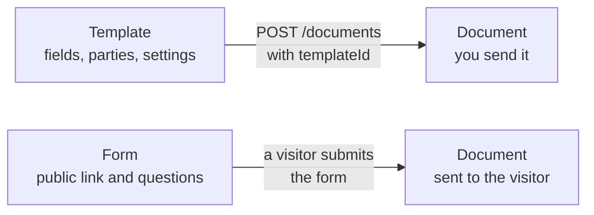

A **document** is one agreement that you send once. When you send the same kind of agreement again and again, you don't build each document from scratch: you start from a **template**, or you publish a **form** that people fill in themselves.



## Compare documents, templates, and forms

| | Document | Template | Form |
|---|---|---|---|
| What it is | One agreement with real parties | A reusable blueprint | A public link with questions |
| Gets signed | Yes | No | No. Each submission creates a document that gets signed. |
| Who starts it | You | You, by creating a document from it | A visitor, by opening the link |
| Parties | Real people | Placeholder parties that each document replaces or keeps | One respondent, the visitor, plus any fixed parties |
| API | [Documents](/api-reference/list-all-documents) | [Templates](/api-reference/list-all-templates) | [Forms](/api-reference/list-forms) |

## Templates

A template holds the fields, parties, and settings of a kind of document, such as an employment contract or an NDA. Templates have their own fields and parties, managed with the `/templates/{id}/fields` and `/templates/{id}/parties` endpoints, in the same shapes as on a document.

To create a document from a template, send `templateId` to [`POST /documents`](/api-reference/create-a-new-document):

```json
{
  "name": "Employment contract: Quinn Holm",
  "templateId": "cm4k2x9p60008abcd2345yzab",
  "expiresAt": "2030-01-01T00:00:00Z",
  "parties": [
    { "name": "Quinn Holm", "email": "quinn@example.com", "role": "SIGNER" }
  ]
}
```

The new document gets a copy of the template's fields and parties. Changing the template later doesn't change documents you already created. If you send `parties`, they replace the template's parties, and sajn removes the signature and initials boxes that were placed for the template's parties.

The usual flow from a template is the following:

1. Create the template in the sajn editor, and set a key on every value you want to fill in, such as `salary` or `start-date`.
1. Create a document from the template, with the real parties.
1. Fill in the values by key with [`PATCH /documents/{id}/field-values`](/api-reference/fill-in-values-on-a-document). For more information, see [Fields](/concepts/fields#fill-in-values-by-key).
1. Send the document.

To list the documents created from a template, call [`GET /templates/{id}/documents`](/api-reference/list-documents-created-from-a-template). For more information, see [Templates and forms](/guides/templates/templates-and-forms) and [Managing templates](/guides/templates/managing-templates).

## Forms

A form is a public link that anyone can open, without an account. The visitor answers the form's questions, and sajn creates a document from the form, fills in the answers, and sends it to the visitor to sign. Use a form for sign-ups, applications, and order forms, where you don't know the signer in advance.

A form owns its own document base: fields, parties, and settings. You create it blank, or as a copy of a template. The copy is independent, so later changes to the template don't affect the form. One of the form's parties is the **respondent**, the `SIGNER` slot that the visitor fills.

A form goes through the following steps:

1. [Create a draft form](/api-reference/create-a-draft-form), blank or from a `templateId`.
1. Configure its questions, fields, and parties, and [select the respondent party](/api-reference/select-the-respondent-party).
1. [Publish the form](/api-reference/publish-a-form). The user who publishes becomes the sender of every document the form creates, and must be allowed to send without approval.
1. Share the form's public URL.
1. Read the answers with [`GET /forms/{id}/submissions`](/api-reference/list-form-submissions), or subscribe to the `FORM_SUBMITTED` webhook event.

Every submission creates an ordinary document. It follows the normal [document lifecycle](/concepts/documents#document-lifecycle), and you read it with the document endpoints. To stop new submissions, [unpublish the form](/api-reference/unpublish-a-form). For more information, see [Managing forms](/guides/templates/managing-forms).

## Next steps

<CardGroup cols={2}>
  <Card title="Fields" icon="table-cells" href="/concepts/fields">
    Field types, keys, and the values parties fill in.
  </Card>
  <Card title="Templates and forms guide" icon="copy" href="/guides/templates/templates-and-forms">
    Create a document from a template and fill it in.
  </Card>
</CardGroup>
