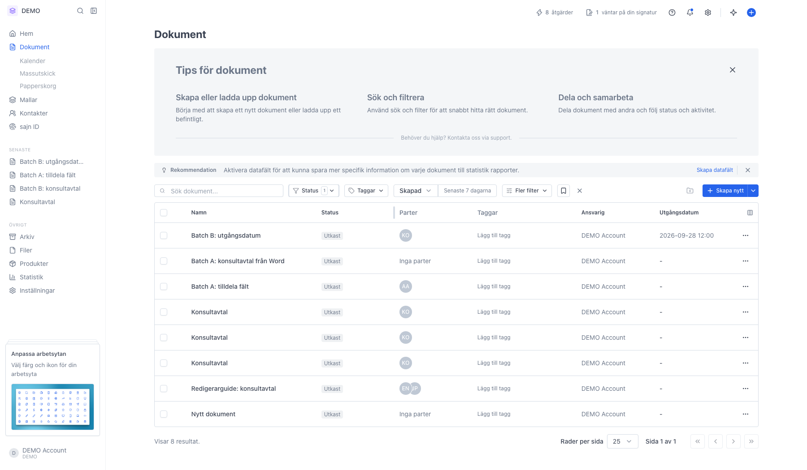
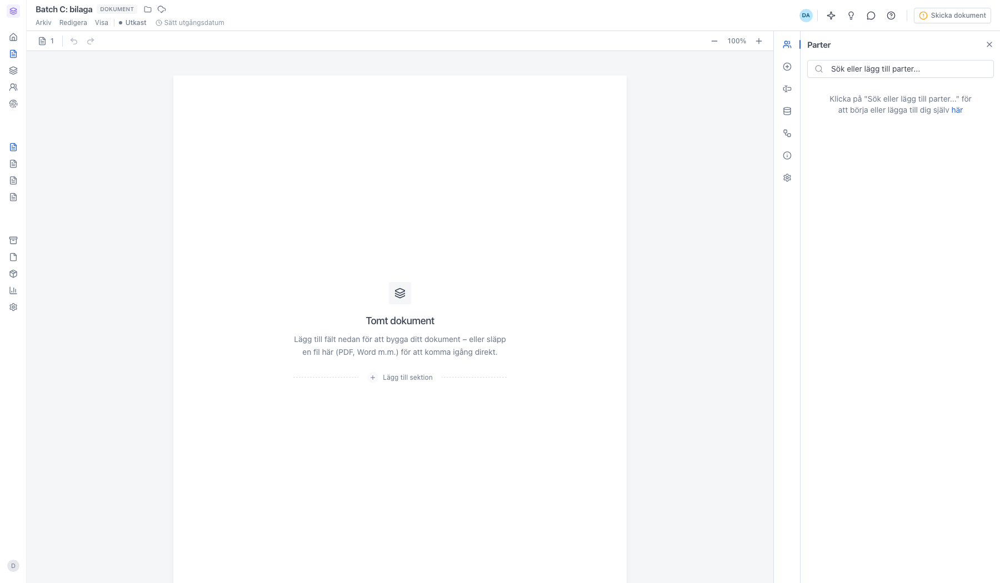
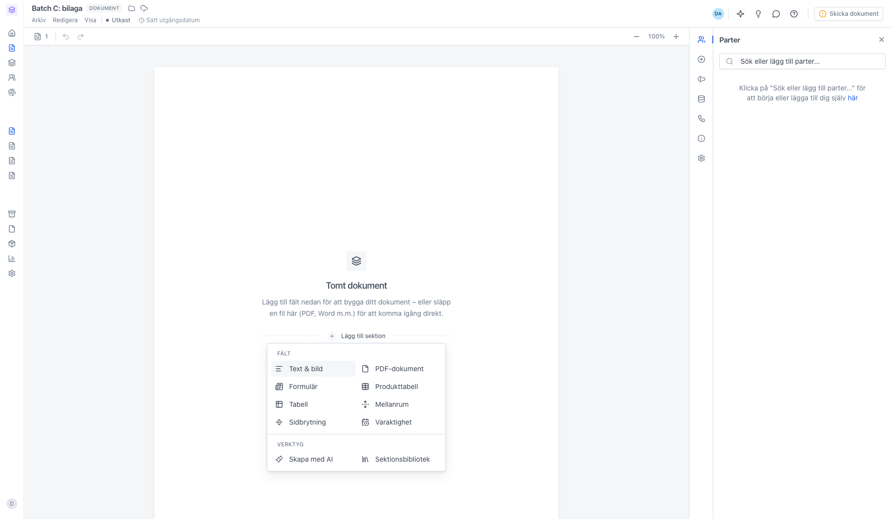
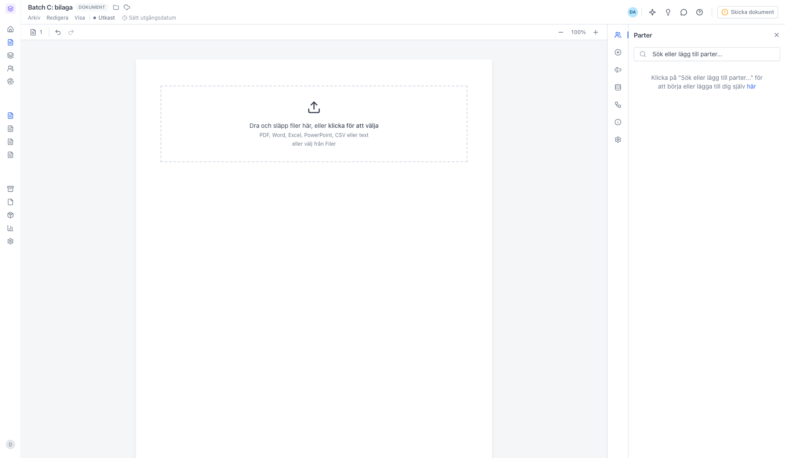
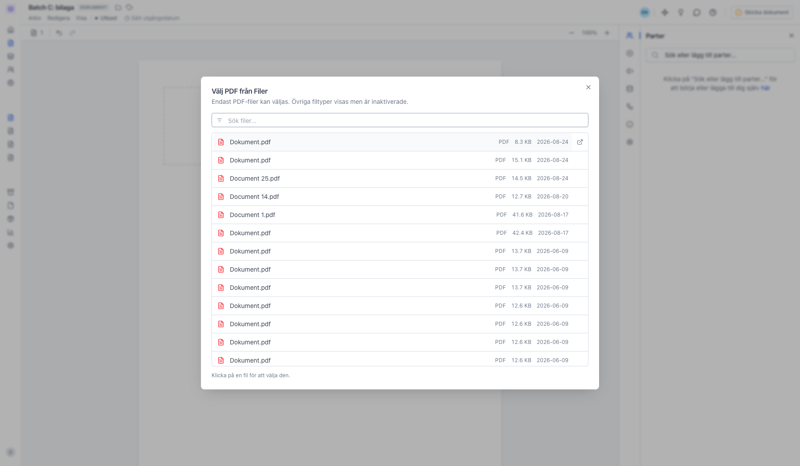
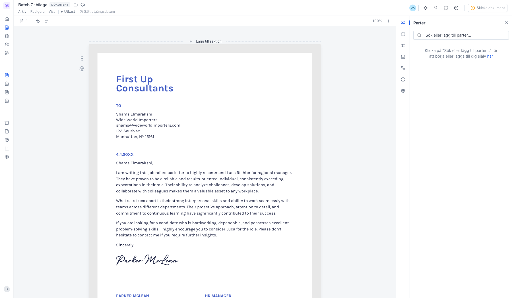

# Lägg till en bilaga i ett dokument

<!--
slug: add-attachments
audience: Alla användare
last_verified: 2026-09-13
auto-generated from steps.json — edit the spec, then re-run the runner
-->

En bilaga är en egen PDF-sektion i dokumentet. Den följer med när dokumentet skickas för signering.

## Innan du börjar

- Du är inloggad i sajn och har ett dokument i status Utkast.
- Du har en PDF på datorn, eller en fil som redan ligger under Filer.

## Steg

### 1. Öppna Dokument och filtrera på Utkast

Bilagor lägger du till medan dokumentet fortfarande är ett utkast. Klicka på det utkast du vill bifoga en PDF till.

### 2. Lägg till sektion bygger upp dokumentet

Mellan sektionerna, och längst ner i dokumentet, ligger en streckad linje med texten Lägg till sektion. Bilagor är bara en sektionstyp bland flera.

### 3. Välj PDF-dokument i menyn

Under Fält ligger Text & bild, PDF-dokument, Formulär, Produkttabell, Tabell, Mellanrum, Sidbrytning och Varaktighet. Under Verktyg ligger Skapa med AI och Sektionsbibliotek. En bilaga är en PDF-dokument-sektion.

### 4. Sektionen börjar som en tom uppladdningsruta

Dra in filen eller klicka för att välja. PDF, Word, Excel, PowerPoint, CSV och text går bra — Word, Excel och PowerPoint konverteras automatiskt till PDF. Vill du återanvända något du redan laddat upp klickar du på välj från Filer.

### 5. Filväljaren visar arbetsytans uppladdade filer

Bara PDF-filer går att välja här. Andra filtyper syns i listan men är inaktiverade.

### 6. Bilagan renderas som en egen sektion

Sidorna visas i full bredd längst ner i dokumentet och sparas automatiskt. Vill du ta bort eller flytta bilagan använder du kugghjulet till höger om sektionen, precis som för övriga sektioner.

---

*Senast verifierad: 2026-09-13. Generad av `scripts/guide-runner.ts`.*
