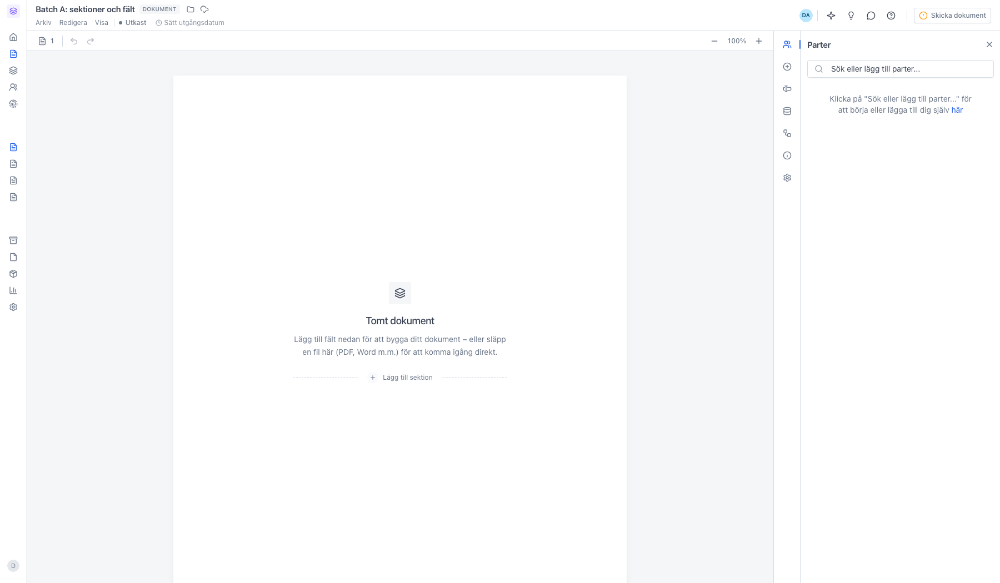
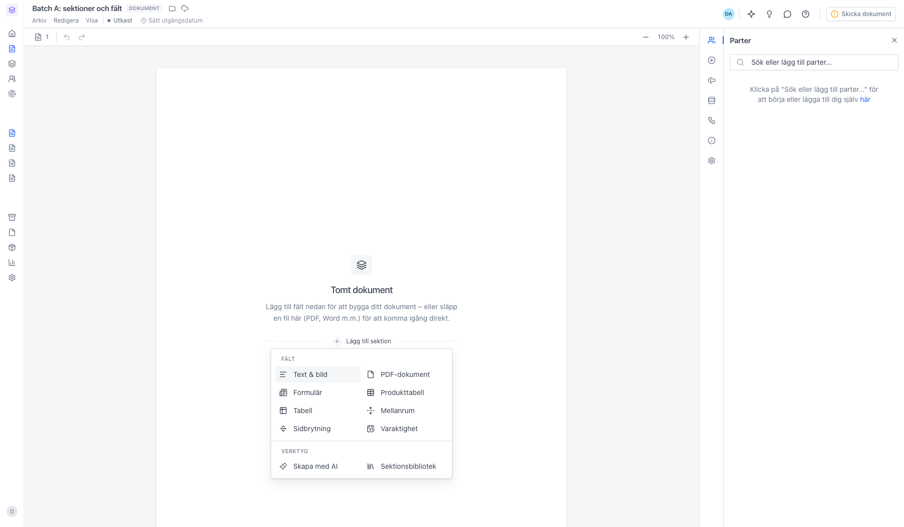
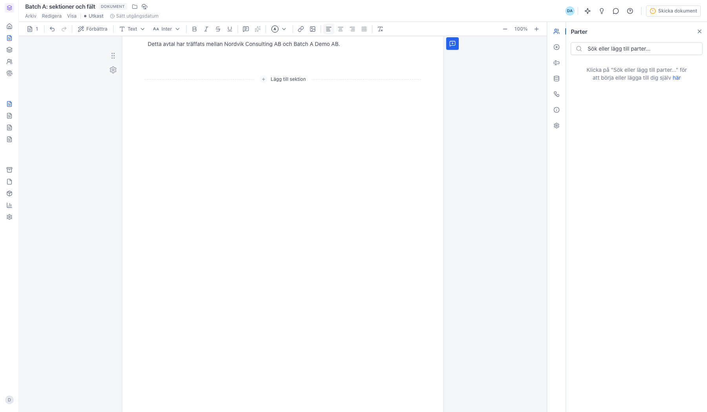
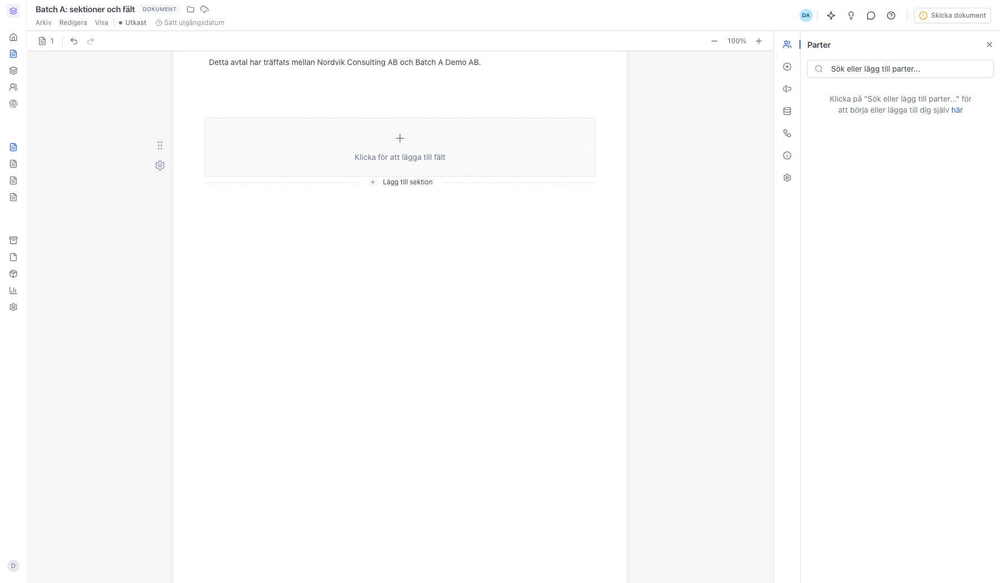
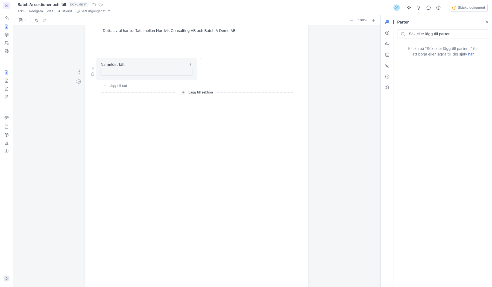
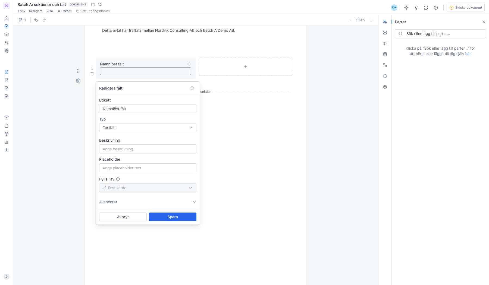
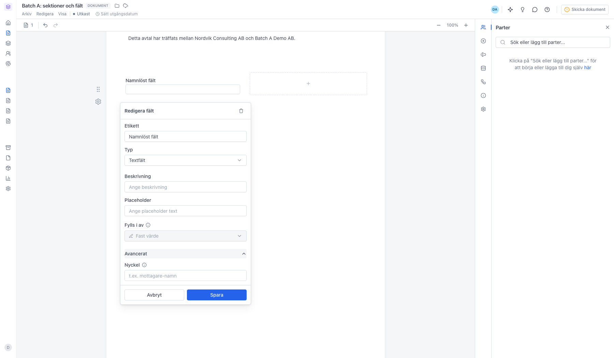
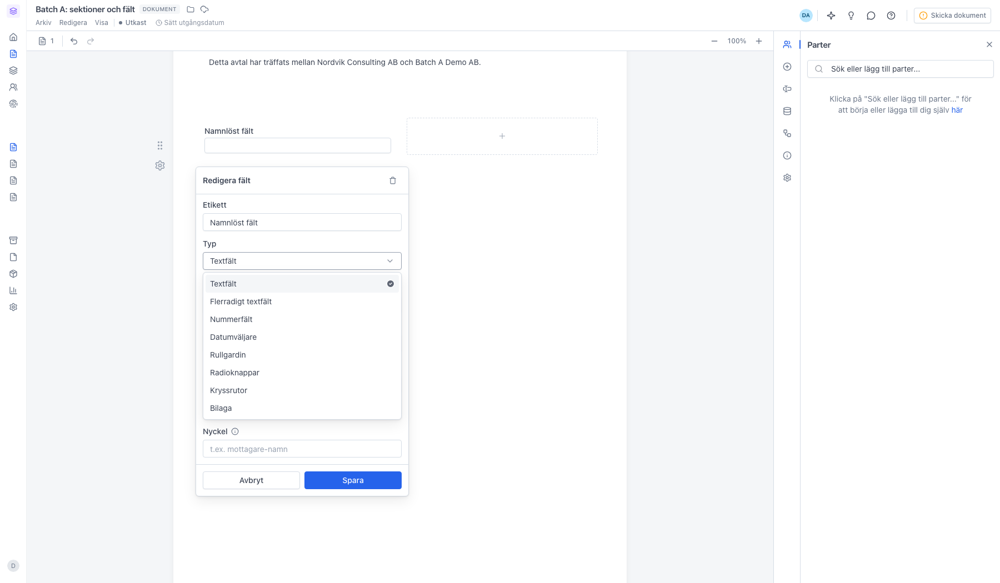
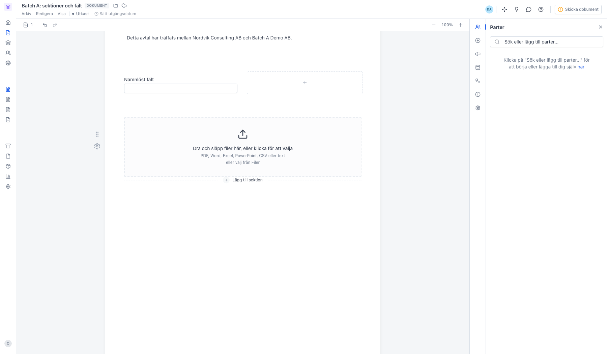
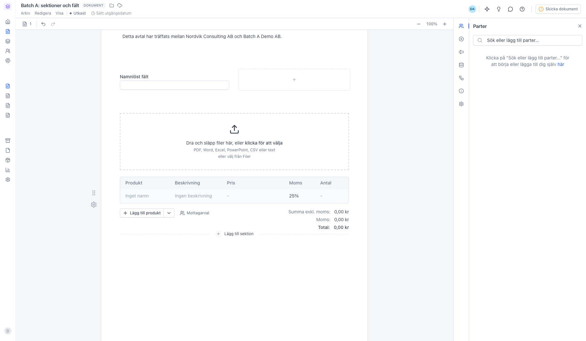

# Lägg till sektioner och fält i ett dokument

<!--
slug: add-fields-to-document
audience: Alla användare
last_verified: 2026-09-13
auto-generated from steps.json — edit the spec, then re-run the runner
-->

Ett dokument byggs av sektioner, och en av sektionstyperna — Formulär — rymmer de fält parterna fyller i. Guiden går igenom sektionsmenyn och hur ett formulärfält ställs in.

## Innan du börjar

- Du är inloggad i en arbetsyta där du har behörighet att skapa dokument.

## Steg

### 1. Börja från ett tomt dokument

Knappen Skapa nytt är delad. Texten öppnar sidan Nytt dokument med filuppladdning och mallar; pilen bredvid är genvägen med Tomt dokument och Ladda upp fil.

### 2. Ett tomt dokument öppnas i redigeraren

Pappret startar tomt — innehållet byggs upp som sektioner. Den streckade linjen Lägg till sektion är ingången.

### 3. Välj sektionstyp i sektionsmenyn

Under Fält ligger sektionstyperna: Text & bild, PDF-dokument, Formulär, Produkttabell, Tabell, Mellanrum, Sidbrytning och Varaktighet. Under Verktyg skriver Skapa med AI en sektion åt dig, och Sektionsbibliotek hämtar en sektion du sparat tidigare.

### 4. Text & bild är fri brödtext

Sektionen läggs till som en tom textyta. När du står i den byts raden överst mot formateringen — rubriker, typsnitt, listor, länkar, bilder och tabeller.

### 5. Formulär är rutan som rymmer fälten

Formulärsektionen är en behållare med ett rutnät på 1–4 kolumner. Klicka på Klicka för att lägga till fält för att skapa det första fältet.

### 6. Nya fält startar som textfält

Fältet heter Namnlöst fält tills du döper om det. Klicka på fältet för att öppna inställningarna.

### 7. Redigera fält styr allt om fältet

Etikett är vad läsaren ser, Typ avgör vad som går att fylla i, och Beskrivning och Placeholder är hjälptext. Fylls i av avgör vem som fyller i värdet — en part, eller Fast värde om du fyller i det själv redan nu. Väljer du en part dyker Obligatoriskt upp under.

### 8. Avancerat rymmer nyckeln

Nyckeln är fältets unika identifierare för API-anrop, massutskick och formulär. Vid massutskick matchas CSV-kolumnen mot nyckeln. Använd gemener, siffror, bindestreck och understreck.

### 9. Åtta fälttyper att välja mellan

Textfält, Flerradigt textfält, Nummerfält, Datumväljare, Rullgardin, Radioknappar, Kryssrutor och Bilaga. Rullgardin, Radioknappar och Kryssrutor får en extra ruta Val där du fyller i alternativen. Bilaga måste tilldelas en part, eftersom det är parten som laddar upp filen.

### 10. PDF-dokument bäddar in en färdig fil

Dra och släpp en PDF i rutan, eller klicka för att välja från datorn. Word, Excel, PowerPoint, CSV och text konverteras automatiskt till PDF. Har du redan laddat upp filen i sajn hämtar du den via välj från Filer.

### 11. Produkttabell räknar ihop raderna

Tabellen visar varor och tjänster med namn, beskrivning, pris, antal, rabatt och moms, och summerar längst ner. Lägg till rader för hand eller hämta dem från Produkter. Vilka kolumner som visas, valutan och utseendet ändrar du i sektionens kugghjul.

---

*Senast verifierad: 2026-09-13. Generad av `scripts/guide-runner.ts`.*
