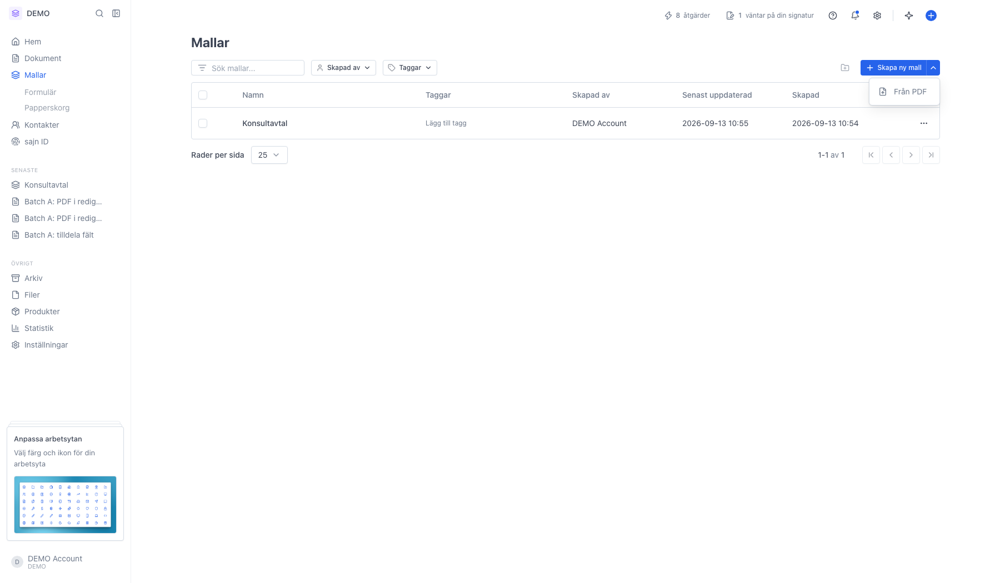
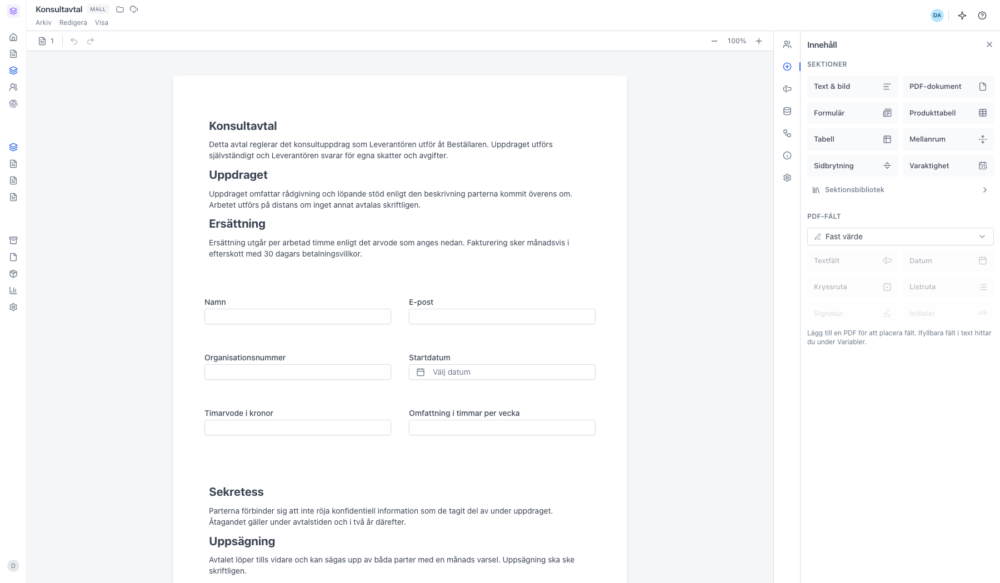
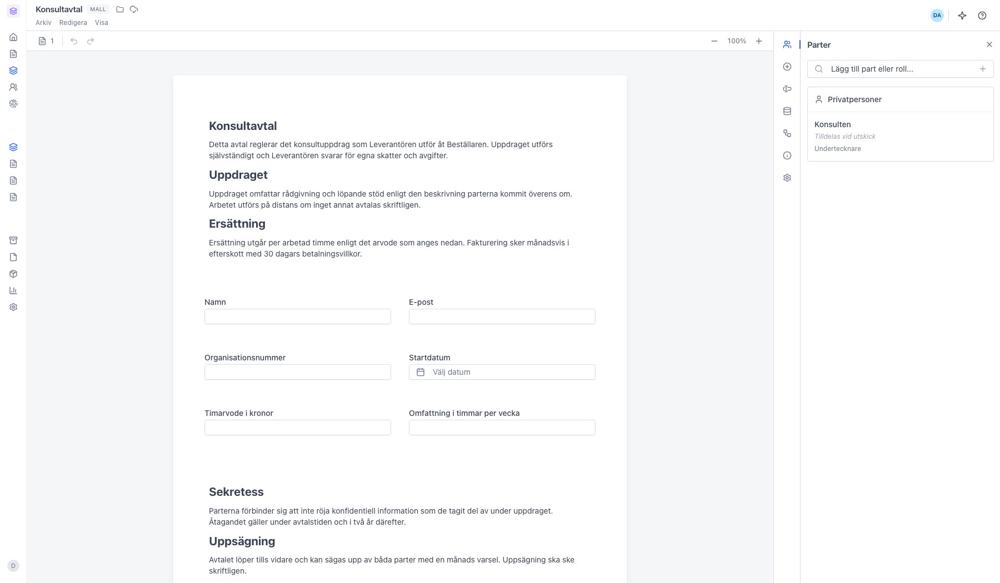
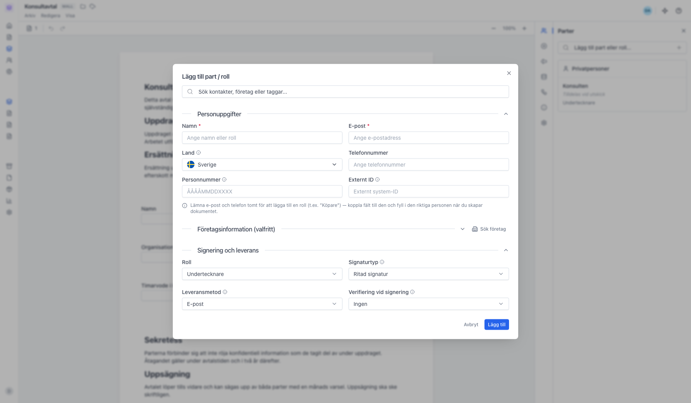
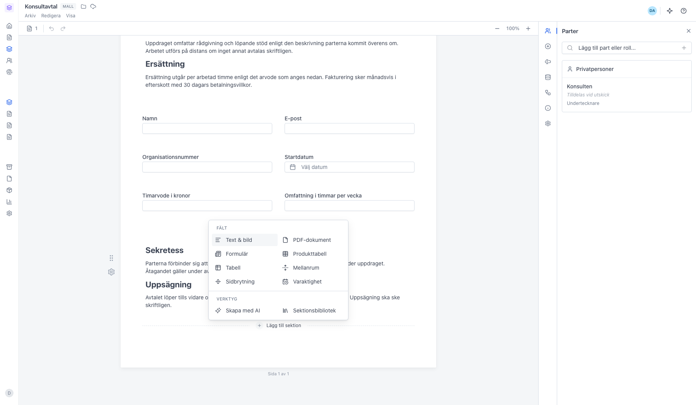
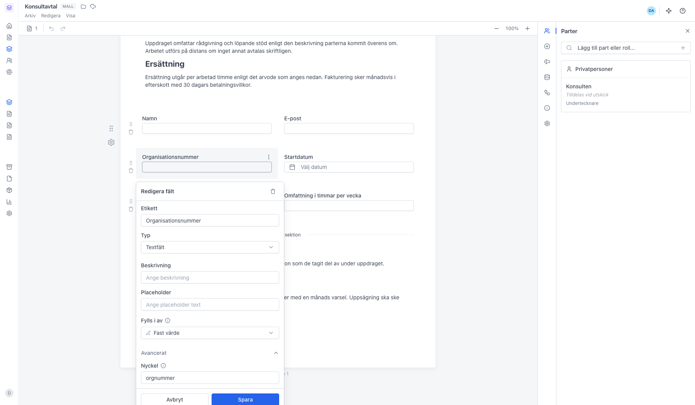
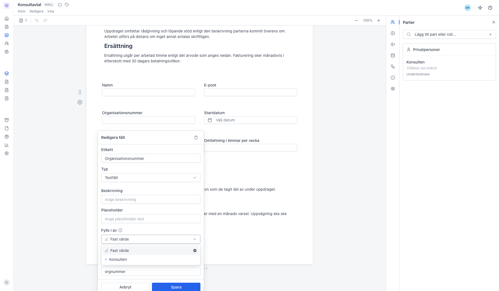

# Lägg till sektioner och fält i en mall

<!--
slug: add-fields-to-template
audience: Alla som skapar mallar
last_verified: 2026-09-13
auto-generated from steps.json — edit the spec, then re-run the runner
-->

En mall är ett dokument du återanvänder. Den byggs av samma sektioner som ett vanligt dokument, men signerarna är roller i stället för personer.

## Innan du börjar

- Du är inloggad i en arbetsyta där du får skapa mallar.

## Steg

### 1. Öppna Mallar

Skapa ny mall skapar direkt en tom mall och öppnar den. Nedåtpilen bredvid har ett enda alternativ, Från PDF.

### 2. Nedåtpilen rymmer Från PDF

### 3. Mallen öppnas i redigeraren

### 4. Parter är rollerna som ska signera

### 5. Bara namnet är obligatoriskt

### 6. Lägg till sektion listar alla sektionstyper

### 7. Fylls i av avgör vem som fyller i fältet

### 8. Välj part för att göra fältet till en signeraruppgift

---

*Senast verifierad: 2026-09-13. Generad av `scripts/guide-runner.ts`.*
