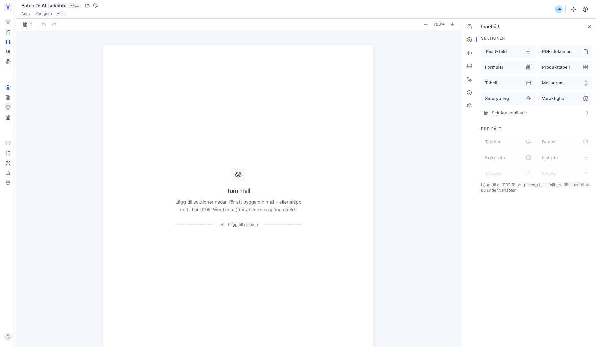
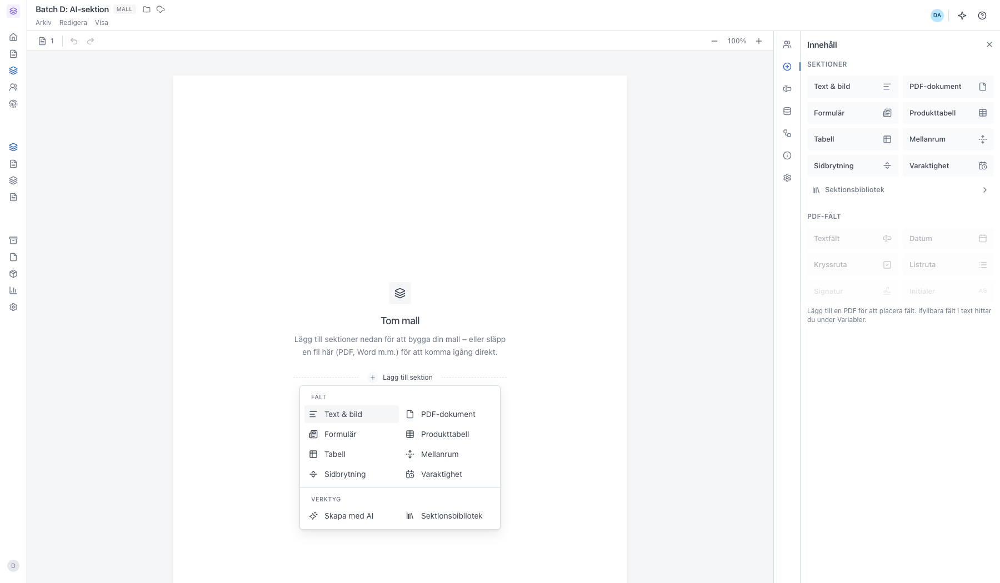
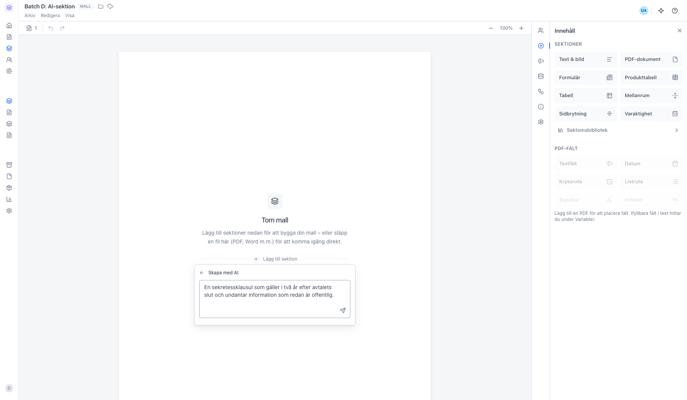
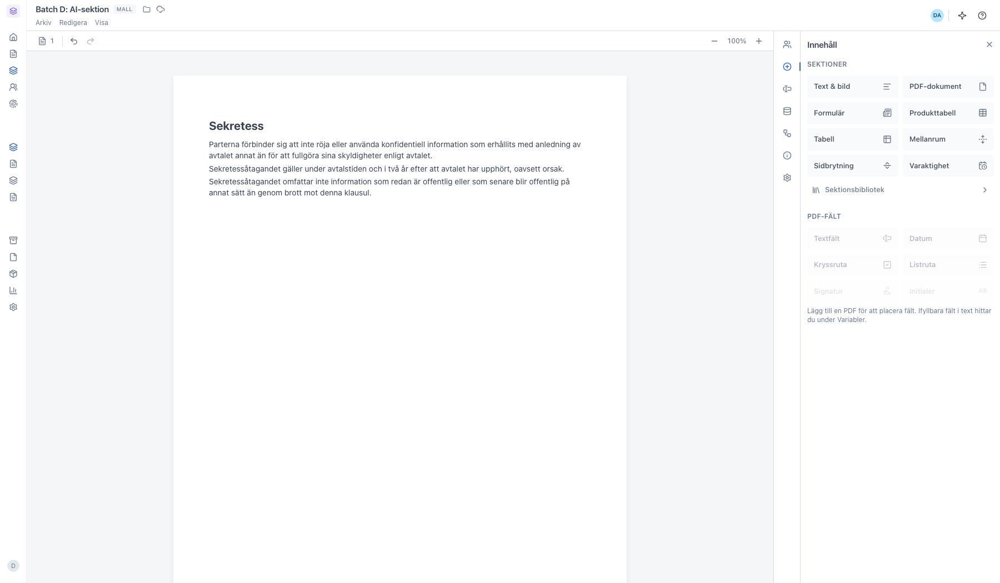

# Skapa en sektion med AI i en mall

<!--
slug: ai-generate-template-section
audience: Alla som skapar mallar
last_verified: 2026-09-13
auto-generated from steps.json — edit the spec, then re-run the runner
-->

Beskriv vad sektionen ska handla om, så skriver AI:n den och lägger in den i mallen.

## Innan du börjar

- Du är inloggad i en arbetsyta där du får redigera mallar.
- Organisationen har AI-kvot kvar för månaden.

## Steg

### 1. Öppna mallen du vill lägga till sektionen i

### 2. Skapa med AI ligger under Verktyg

### 3. Beskriv vad sektionen ska innehålla

### 4. Sektionen läggs in i mallen

---

*Senast verifierad: 2026-09-13. Generad av `scripts/guide-runner.ts`.*
