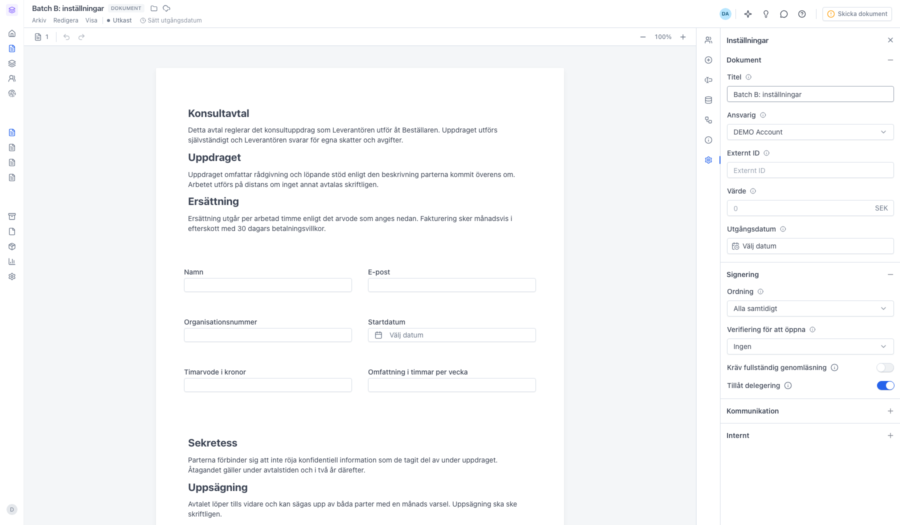
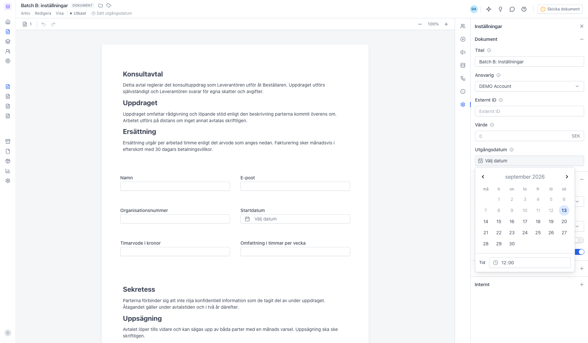
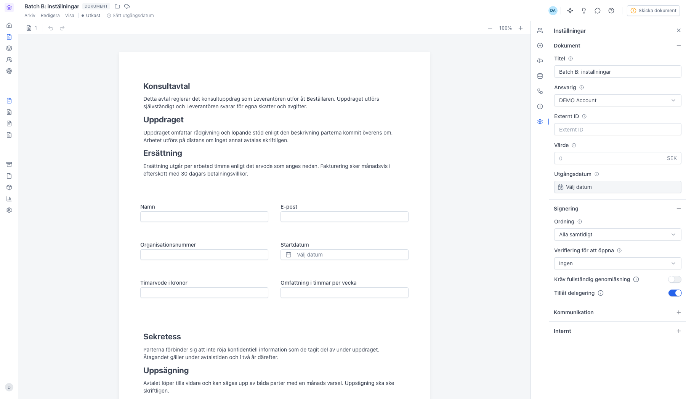
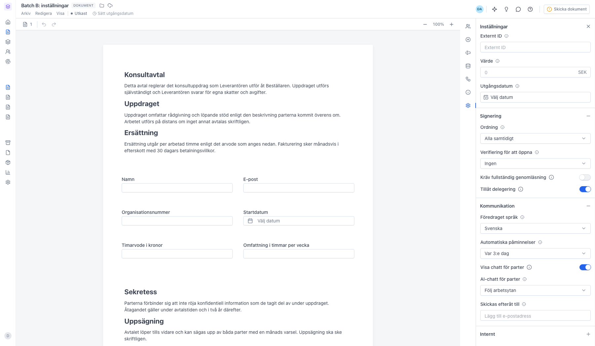
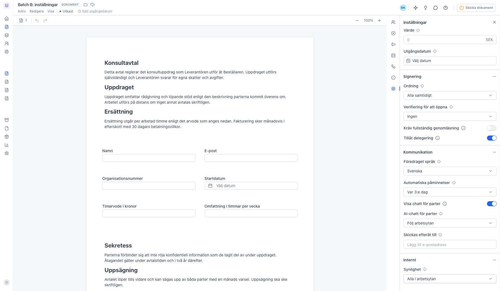

# Ändra inställningar på ett dokument

<!--
slug: andra-installningar
audience: Alla användare
last_verified: 2026-09-13
auto-generated from steps.json — edit the spec, then re-run the runner
-->

Panelen Inställningar samlar villkoren för dokumentet: titel och ansvarig, hur signeringen ska gå till, vad som skickas till parterna och vem i arbetsytan som får se dokumentet. Allt sparas automatiskt.

## Innan du börjar

- Du är inloggad i sajn och har valt en arbetsyta.
- Dokumentet är i status Utkast — efter utskicket låses de flesta inställningarna.

## Steg

### 1. Fyra sektioner, allt sparas automatiskt

Panelen öppnas med Dokument och Signering utfällda; Kommunikation och Internt är hopfällda. Det finns ingen spara-knapp — varje ändring sparas direkt. Under Dokument sätter du titel, ansvarig, ett eget referens-ID, dokumentets värde och utgångsdatum.

### 2. Utgångsdatum är fristen för signering

Efter det här datumet går dokumentet inte längre att signera och signeringslänkarna slutar fungera. Ett utgångsdatum krävs innan dokumentet kan skickas. Lämnar du det tomt får du en påminnelse i knappen Skicka dokument.

### 3. Signering styr hur parterna signerar

Ordning avgör om alla parter signerar samtidigt eller i turordning. Verifiering för att öppna kräver att parten legitimerar sig innan dokumentet visas. Kräv fullständig genomläsning tvingar parten att bläddra igenom hela dokumentet, och Tillåt delegering låter en part lämna över signeringen till någon annan.

### 4. Kommunikation styr vad parterna får

Föredraget språk avgör vilket språk e-post och signeringssida visas på. Automatiska påminnelser skickar en påfyllnad till dem som inte signerat — välj Av, Varje dag, Varannan dag, Var 3:e dag eller Var 5:e dag. Här slår du också på chatten för parterna och anger vilka som ska få dokumentet automatiskt när det är signerat.

### 5. Internt styr vem i arbetsytan som ser dokumentet

Synlighet avgör om alla i arbetsytan, bara skaparen och ansvarig, eller en utvald lista med användare kan öppna dokumentet. Inställningen påverkar bara vyn inne i sajn — parterna får sin signeringslänk oavsett.

---

*Senast verifierad: 2026-09-13. Generad av `scripts/guide-runner.ts`.*
