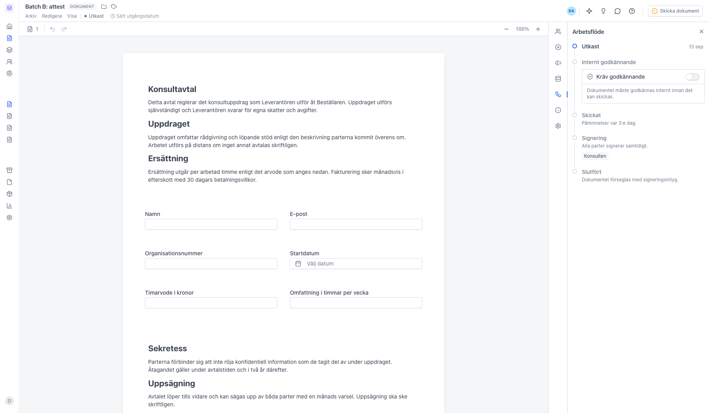
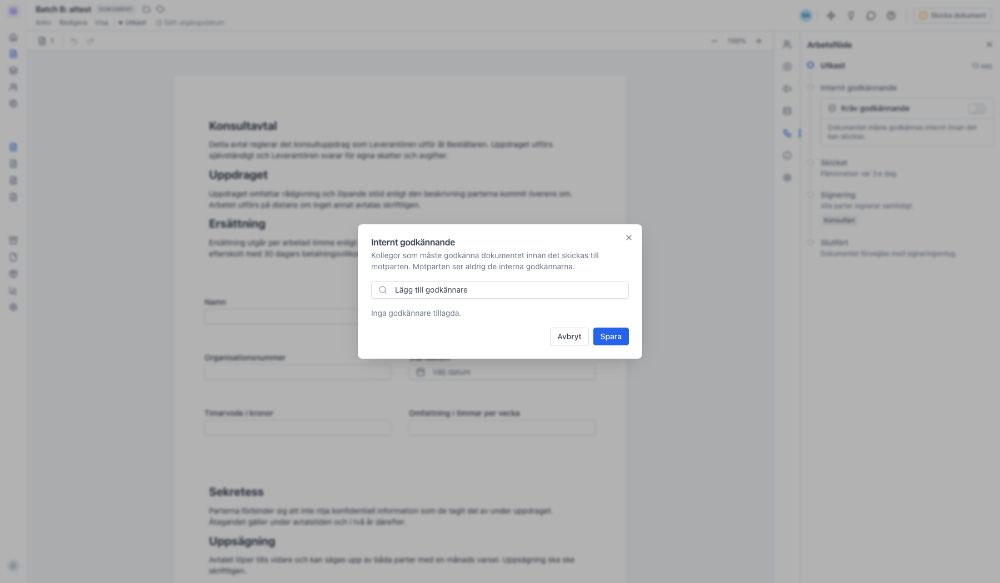
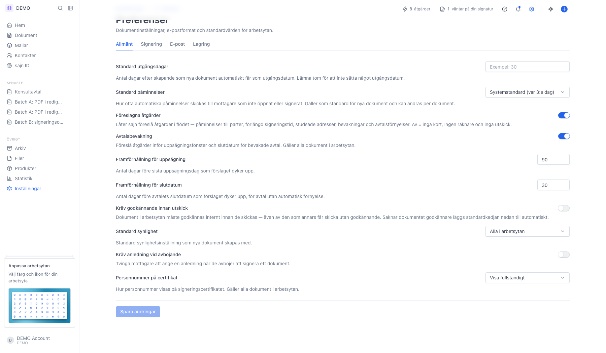

# Konfigurera attestflöde för ett dokument

<!--
slug: approval-workflow
audience: Alla användare, och arbetsyteadministratörer för det som gäller hela arbetsytan
last_verified: 2026-09-13
auto-generated from steps.json — edit the spec, then re-run the runner
-->

Ett attestflöde innebär att en kollega måste godkänna dokumentet internt innan det går ut till motparten. Det sätts per dokument i panelen Arbetsflöde, och kan göras obligatoriskt för hela arbetsytan.

## Innan du börjar

- Du är inloggad i sajn och har valt en arbetsyta.
- Dokumentet är i status Utkast — godkännare kan bara läggas till på ett utkast.
- Det finns minst en annan medlem i arbetsytan med behörigheten Godkänna dokument.

## Steg

### 1. Attesten sitter i panelen Arbetsflöde

Kedjan visar dokumentets väg från Utkast till Slutfört. Steget Internt godkännande ligger mellan Utkast och Skickat, och innehåller reglaget Kräv godkännande. Så länge det är avslaget går dokumentet direkt till parterna när du skickar.

### 2. Välj vilka kollegor som ska godkänna

Listan visar bara medlemmar vars roll har behörigheten Godkänna dokument. Har ingen den behörigheten står det Inga användare med behörighet att godkänna dokument, och då måste en arbetsyteadministratör dela ut den först. Med flera godkännare kopplar du ihop dem med och, eller och sedan för att bestämma om alla, någon eller en i taget ska godkänna.

### 3. Gör attesten obligatorisk för hela arbetsytan

Under Inställningar → Preferenser → Allmänt finns Kräv godkännande innan utskick. Slår du på den måste varje dokument i arbetsytan godkännas internt innan det skickas — även av den som annars får skicka utan godkännande. Saknar ett dokument godkännare läggs arbetsytans standardkedja till automatiskt.

---

*Senast verifierad: 2026-09-13. Generad av `scripts/guide-runner.ts`.*
