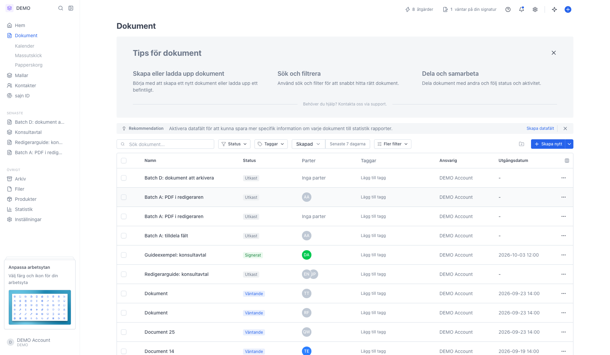
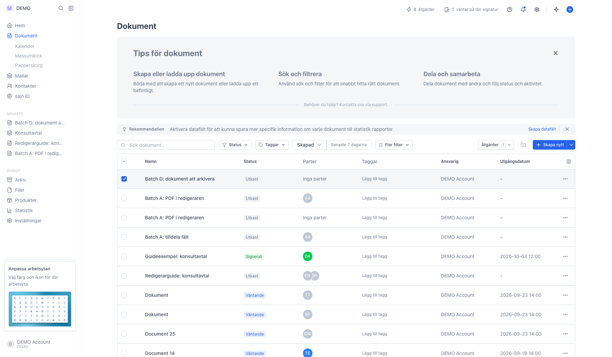
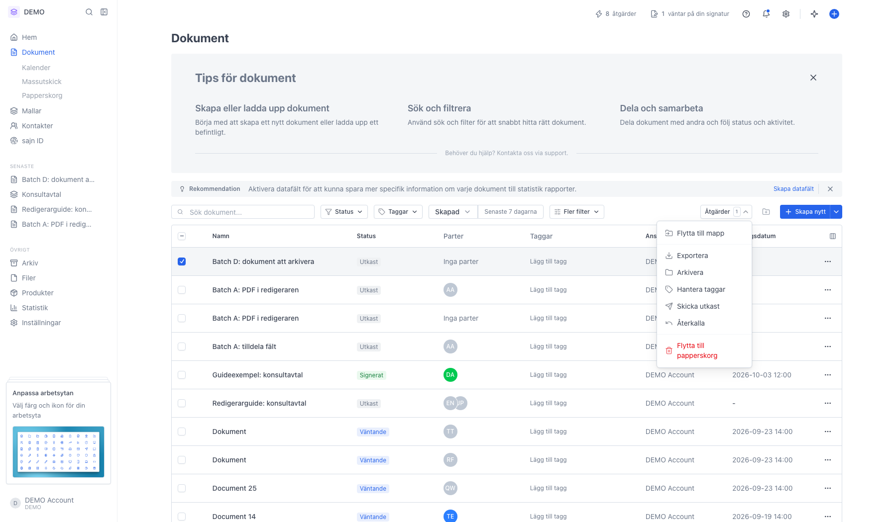
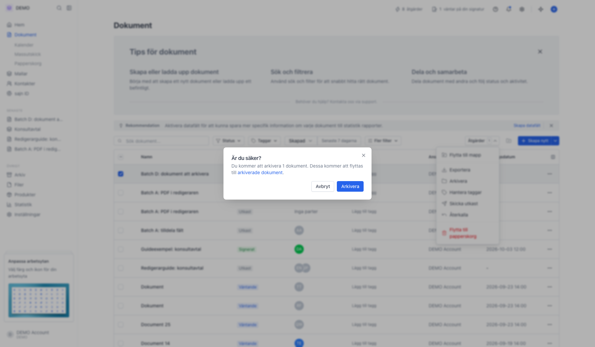
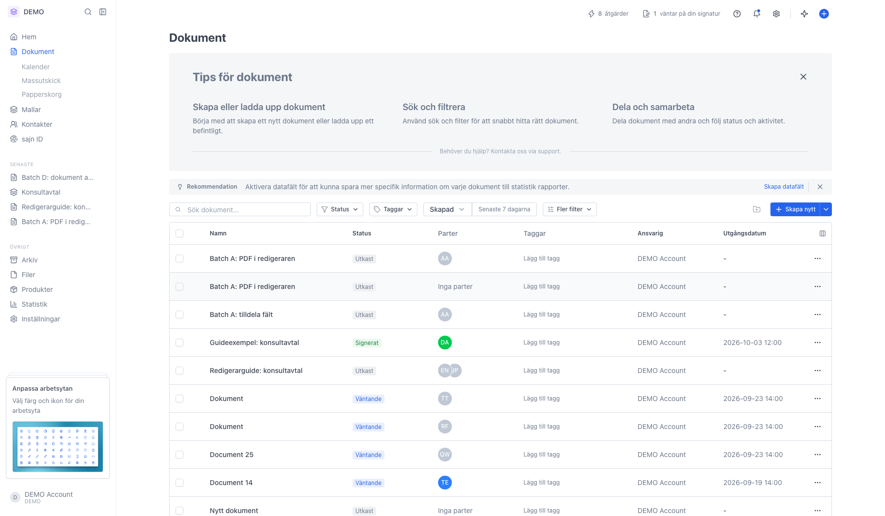
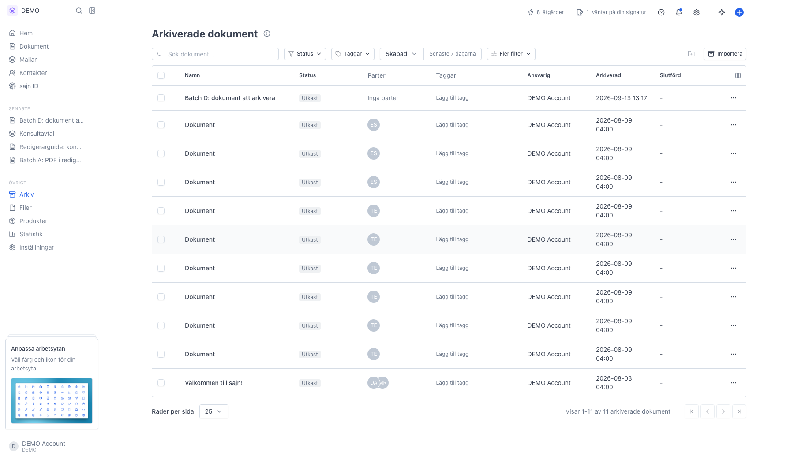
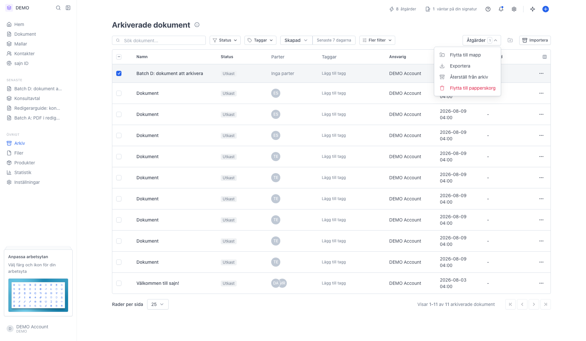

# Arkivera ett dokument

<!--
slug: archive-document
audience: Alla användare
last_verified: 2026-09-13
auto-generated from steps.json — edit the spec, then re-run the runner
-->

Arkivering flyttar ett dokument ur den aktiva listan utan att ta bort det. Allt går att öppna, ladda ner och plocka tillbaka.

## Innan du börjar

- Du är inloggad i en arbetsyta där du får hantera dokument.

## Steg

### 1. Leta upp dokumentet i listan Dokument

### 2. Bocka för dokumentet

### 3. Arkivera ligger i menyn Åtgärder

### 4. Dialogen länkar till arkivet

### 5. Raden försvinner ur den aktiva listan

### 6. Dokumentet ligger nu under Arkiv

### 7. Återställ från arkiv tar tillbaka dokumentet

---

*Senast verifierad: 2026-09-13. Generad av `scripts/guide-runner.ts`.*
