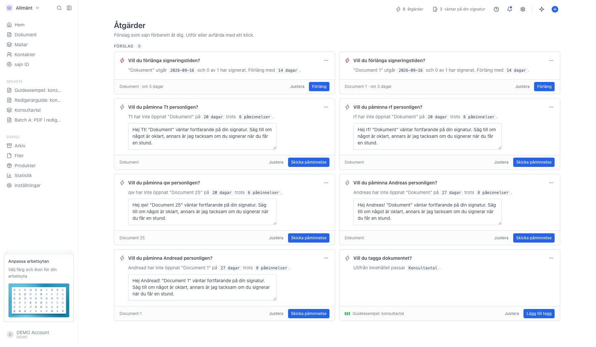
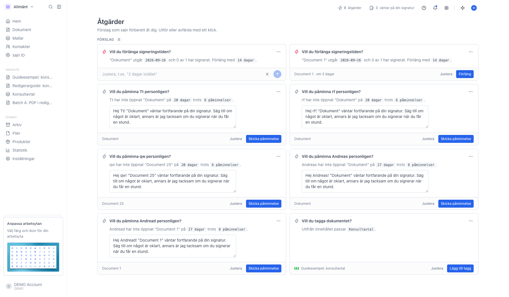
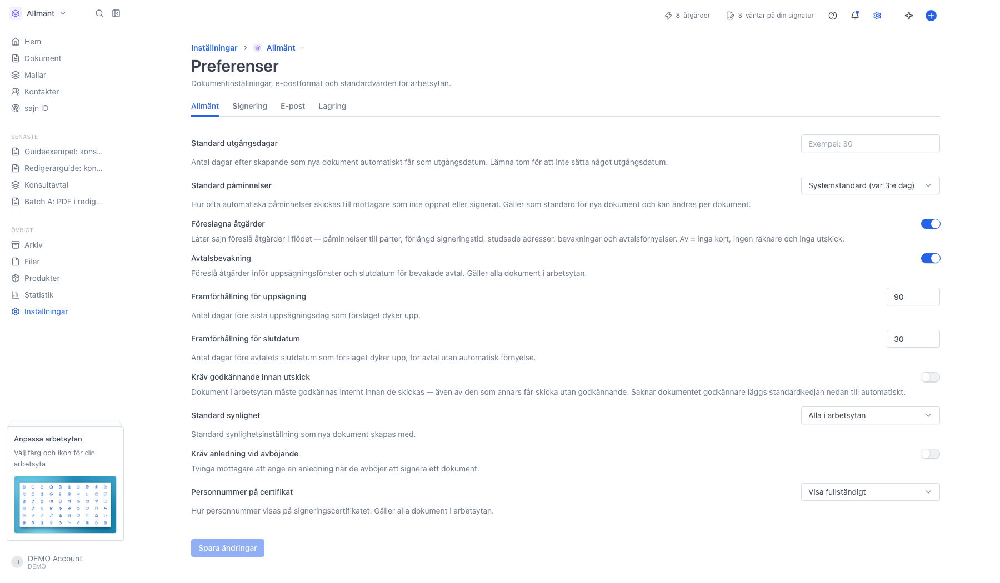
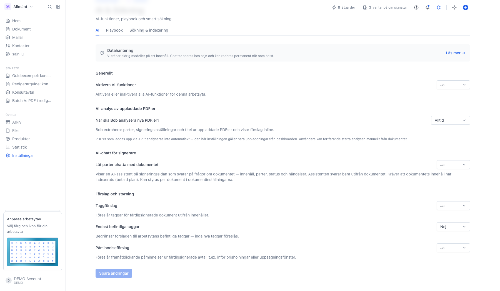

# Åtgärder

<!--
slug: atgarder
audience: Alla användare
last_verified: 2026-09-13
auto-generated from steps.json — edit the spec, then re-run the runner
-->

Åtgärder är sajns förberedda förslag: påminnelser till parter som inte signerat, förlängd signeringstid för dokument som håller på att gå ut, rättade e-postadresser som studsat och avtal som närmar sig uppsägning eller slutdatum. Varje förslag är ett kort du utför, justerar, skjuter upp eller avfärdar.

## Innan du börjar

- Du är inloggad i sajn och har valt en arbetsyta.
- Åtgärder kräver Solo eller högre.
- Föreslagna åtgärder är påslaget under arbetsytans inställningar.

## Steg

### 1. Öppna Åtgärder från blixtikonen i toppraden

Siffran bredvid blixten räknar hur många förslag som väntar. Varje kort säger vad sajn hittat, vilket dokument det gäller och vad som händer om du trycker på knappen till höger. Kort med en deadline får en färgad ikon när det börjar bli bråttom. Samma lista finns som widget på startsidan.

### 2. Skjut upp eller avfärda ett förslag

De tre prickarna uppe till höger på kortet öppnar menyn. Skjut upp lägger undan kortet till imorgon, om tre dagar eller om en vecka och tar sedan tillbaka det. Avfärda tar bort det för gott. Avfärdar du ett AI-förslag får du samtidigt frågan om du vill stänga av just den sortens förslag helt.

### 3. Justera innan du utför

Justera byter kortets nedre rad mot ett skrivfält. Skriv vad du vill ändra med egna ord, till exempel "2 dagar istället", och tryck Enter. Förslag som innehåller ett färdigt meddelande går också att redigera direkt i textrutan på kortet innan du skickar det.

### 4. Slå av eller på hela flödet per arbetsyta

Under Inställningar, Preferenser, fliken Allmänt styr Föreslagna åtgärder hela flödet: av betyder inga kort, ingen räknare och inga utskick. Avtalsbevakning styr de avtalsrelaterade förslagen, och de två fälten under bestämmer hur många dagar i förväg förslaget dyker upp inför sista uppsägningsdag respektive slutdatum.

### 5. Styr vilka AI-förslag som får dyka upp

Under Inställningar, AI & Sökning, fliken AI ligger rubriken Förslag och styrning. Taggförslag föreslår taggar utifrån innehållet i färdigsignerade dokument, och kan begränsas till taggar som redan finns i arbetsytan. Påminnelseförslag läser färdiga avtal och föreslår påminnelser framåt i tiden, till exempel inför en prishöjning eller ett uppsägningsfönster.

---

*Senast verifierad: 2026-09-13. Generad av `scripts/guide-runner.ts`.*
