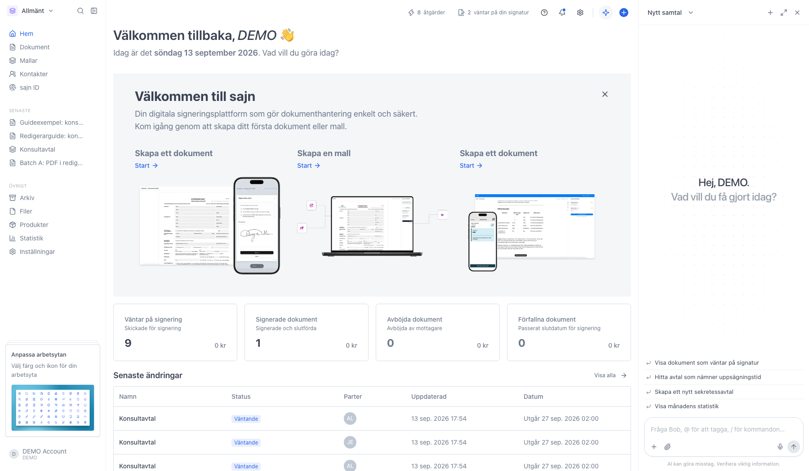
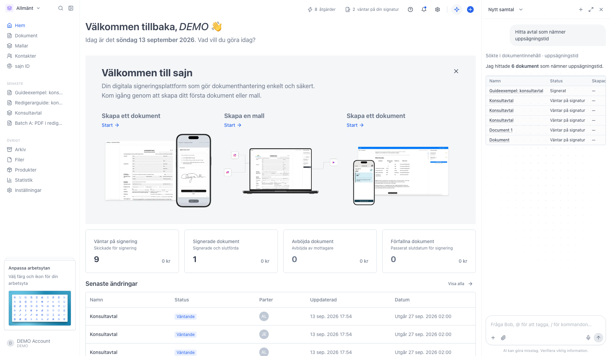
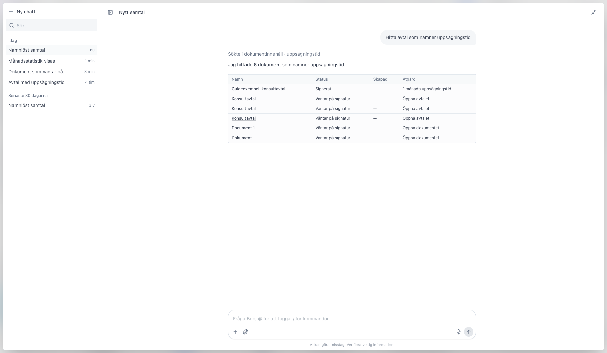
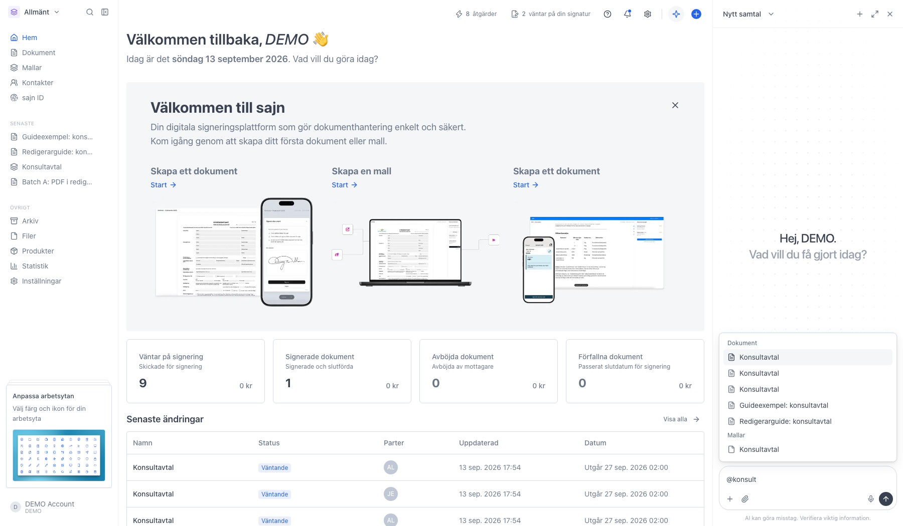
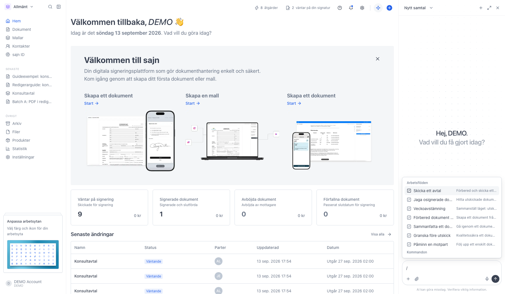
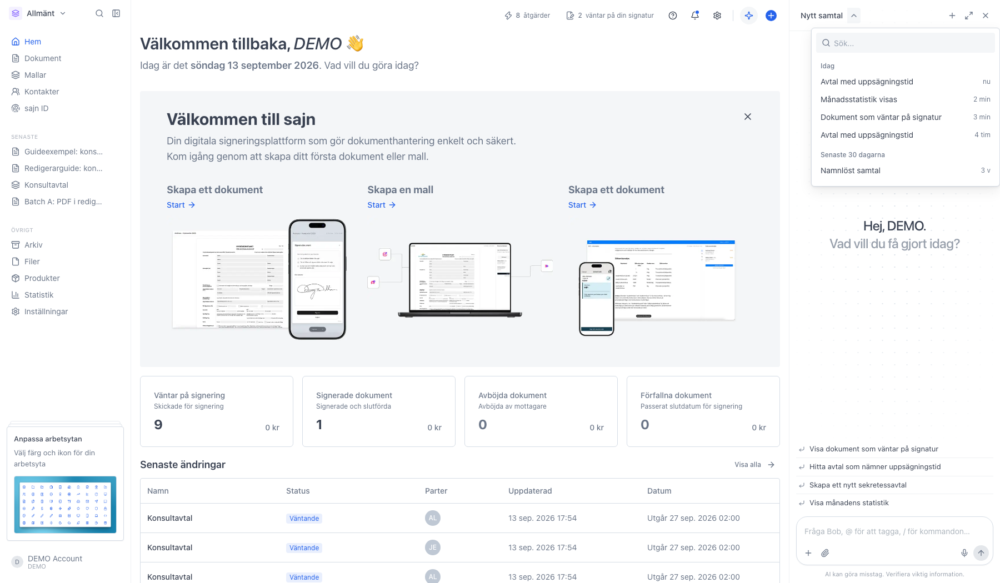
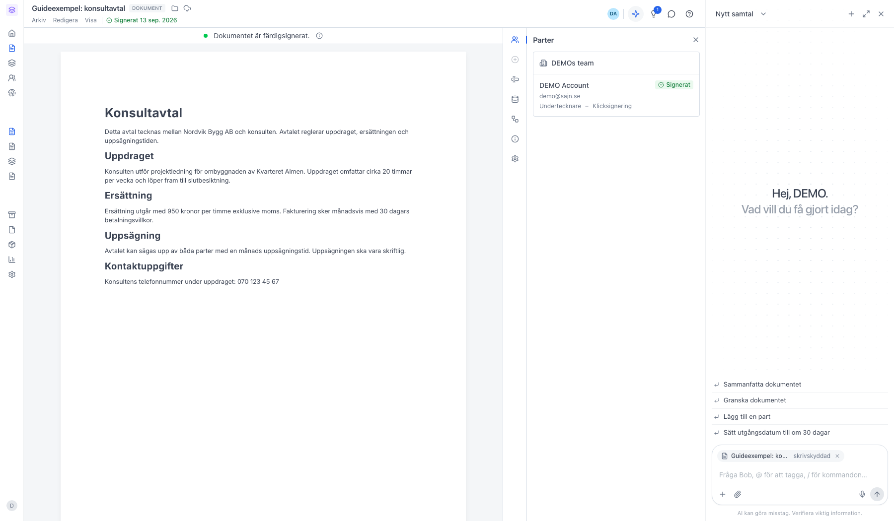

# Bob, din AI-assistent

<!--
slug: bob
audience: Alla användare
last_verified: 2026-09-13
auto-generated from steps.json — edit the spec, then re-run the runner
-->

Bob är assistenten som följer med överallt i sajn. Du öppnar den från ikonen uppe till höger, skriver på svenska och får svar som bygger på din egen arbetsyta.

## Innan du börjar

- Du är inloggad i sajn och har valt en arbetsyta.
- AI-funktioner är påslagna för arbetsytan.

## Steg

### 1. Öppna Bob från ikonen uppe till höger

Panelen lägger sig bredvid sidan du står på, så du tappar aldrig sammanhanget. Ovanför skrivfältet ligger förslag som byts ut beroende på var du är: på översikten handlar de om dokument och statistik, inne i ett dokument om just det dokumentet.

### 2. Bob visar vad den gör innan den svarar

Raden över svaret är steget Bob tog, till exempel Sökte i dokumentinnehåll. Klickar du på raden ser du vad steget gav. Svaret bygger på din arbetsyta och på det du själv får se, så en kollega med andra behörigheter kan få ett annat svar på samma fråga. Under svaret finns tummen upp och ner, en kopieringsknapp och förslag på följdfrågor.

### 3. Helskärm ger mer plats

Samma samtal, bredare yta och en lista med dina samtal till vänster. Escape tar dig tillbaka till panelen.

### 4. Skriv @ för att peka ut ett dokument, en mall eller en kontakt

Menyn söker medan du skriver och delar upp träffarna i Dokument, Mallar och Kontakter. Väljer du en träff vet Bob exakt vad du menar i stället för att behöva gissa utifrån namnet. Plusknappen nere till vänster i skrivfältet öppnar samma meny.

### 5. Skriv / för färdiga arbetsflöden

Under Arbetsflöden ligger vanliga uppgifter som redan är nedbrutna i steg, till exempel Skicka ett avtal och Jaga osignerade dokument. Du väljer ett och svarar på Bobs frågor på vägen. Under Kommandon ligger Ny chatt, som bara rensar samtalet.

### 6. Tidigare samtal ligger kvar

Varje samtal sparas med en rubrik som Bob sätter själv. Klicka på rubriken uppe till vänster för att döpa om det, och på papperskorgen i listan för att radera ett samtal permanent.

### 7. Inne i ett dokument vet Bob vilket dokument du menar

Dokumentet fästs som en etikett ovanför skrivfältet, så du kan be Bob sammanfatta dokumentet utan att nämna namnet. Krysset på etiketten kopplar loss dokumentet igen. Står det skrivskyddad kan Bob läsa dokumentet men inte ändra det.

---

*Senast verifierad: 2026-09-13. Generad av `scripts/guide-runner.ts`.*
