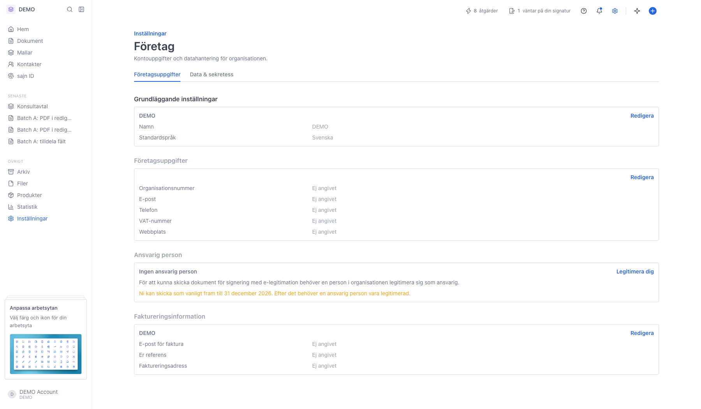
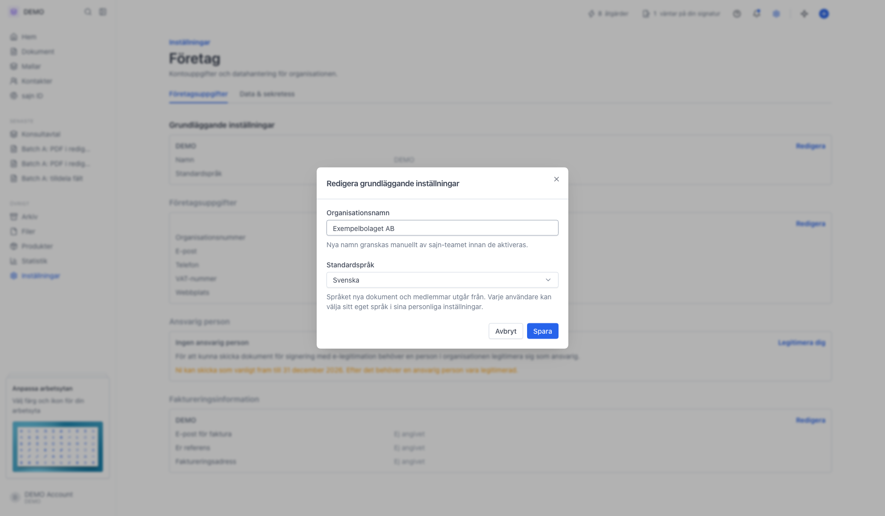

# Byt organisationens namn

<!--
slug: byt-organisationsnamn
audience: Organisationsadministratörer
last_verified: 2026-09-13
auto-generated from steps.json — edit the spec, then re-run the runner
-->

Organisationens namn ändras inte direkt. Du skickar en begäran som sajn granskar manuellt innan det nya namnet aktiveras.

## Innan du börjar

- Du är inloggad och har behörighet att ändra organisationens inställningar.

## Steg

### 1. Öppna Inställningar och välj Företag

Organisationens namn står högst upp under Grundläggande inställningar, på raden Namn.

### 2. Rutan Redigera grundläggande inställningar

Rutan innehåller två fält: Organisationsnamn och Standardspråk. Texten under namnfältet säger att detta är namnet som visas i applikationen.

### 3. Skriv det nya namnet

Så fort du ändrar namnet byter hjälptexten under fältet till en påminnelse om att nya namn granskas manuellt av sajn-teamet innan de aktiveras.

---

*Senast verifierad: 2026-09-13. Generad av `scripts/guide-runner.ts`.*
