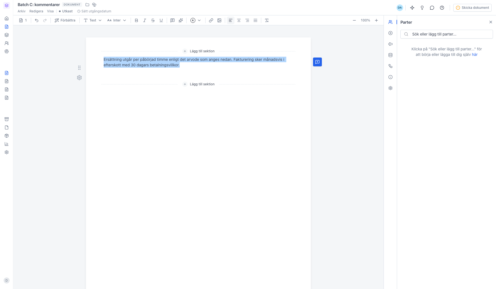
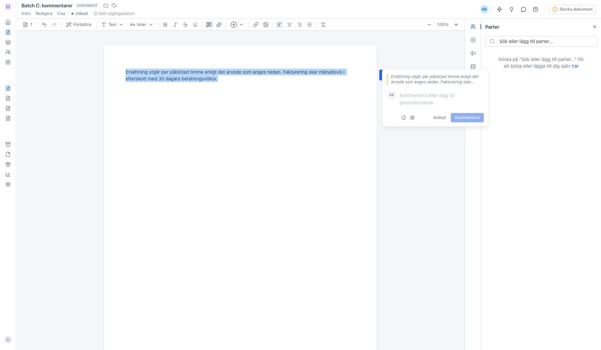
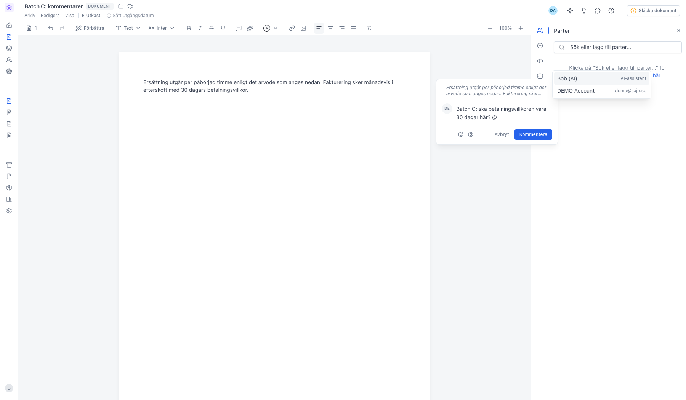
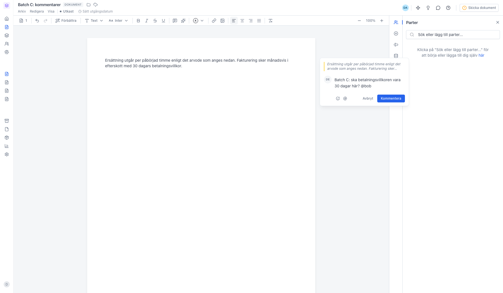

# Använd kommentarer och @-omnämnanden i ett dokument

<!--
slug: comments-mentions
audience: Alla användare
last_verified: 2026-09-13
auto-generated from steps.json — edit the spec, then re-run the runner
-->

Markera en passage i dokumentet, skriv en kommentar och tagga en kollega med @. Tråden hänger kvar vid texten och kollegan får en notis.

## Innan du börjar

- Du har ett dokument som är ett utkast eller väntar på signering.
- Dokumentet har minst en Text & bild-sektion att markera i.
- Den du vill tagga är medlem i samma arbetsyta.

## Steg

### 1. Markera den text du vill kommentera

Verktygsraden dyker upp ovanför sektionen så snart du står i en textsektion. Markeringen blir trådens förankring i dokumentet, så att den som svarar ser exakt vilket avsnitt diskussionen gäller.

### 2. Klicka på kommentarsikonen i verktygsraden

En ruta öppnas där du skriver kommentaren. Den markerade texten följer med som citat högst upp, så sammanhanget finns kvar även om dokumentet ändras senare.

### 3. Skriv @ för att tagga någon

Listan visar arbetsytans medlemmar och filtreras medan du skriver. Bläddra med piltangenterna och välj med Tab eller Enter, eller klicka på rätt person. Bob (AI) ligger överst om du hellre vill be AI-assistenten titta på avsnittet.

### 4. Välj personen och publicera med Kommentera

Omnämnandet skrivs in i texten och kollegan får en notis när kommentaren skickas. Du kan tagga flera i samma kommentar genom att skriva @ igen. Knappen Kommentera längst ner till höger publicerar, och Enter gör samma sak; Avbryt slänger utkastet. Ikonerna till vänster infogar en emoji respektive startar ett @-omnämnande. När kommentaren skickats öppnas tråden, där du kan svara, trycka Lös för att markera den som avklarad, och under Fler alternativ kopiera urvalet eller ta bort tråden.

---

*Senast verifierad: 2026-09-13. Generad av `scripts/guide-runner.ts`.*
