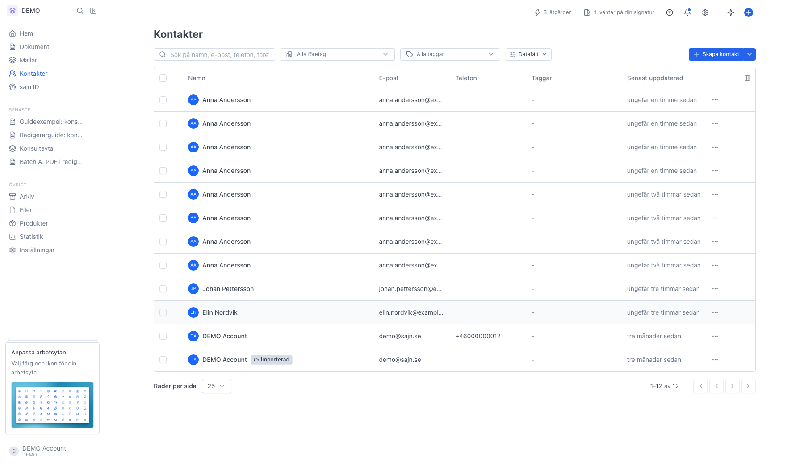
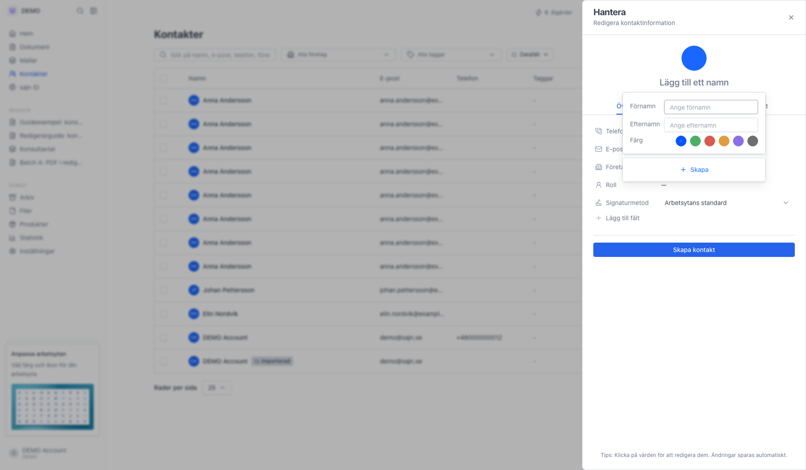
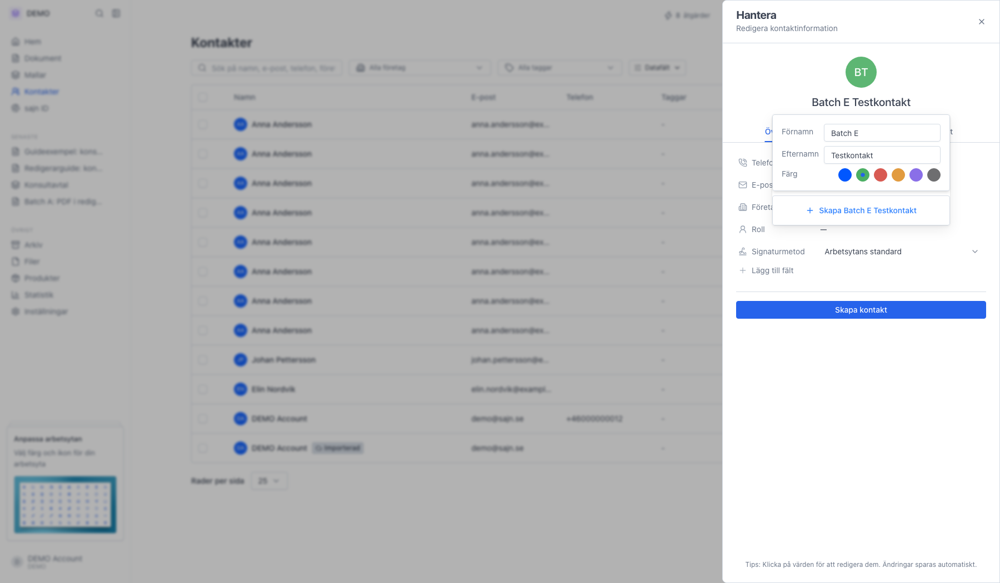
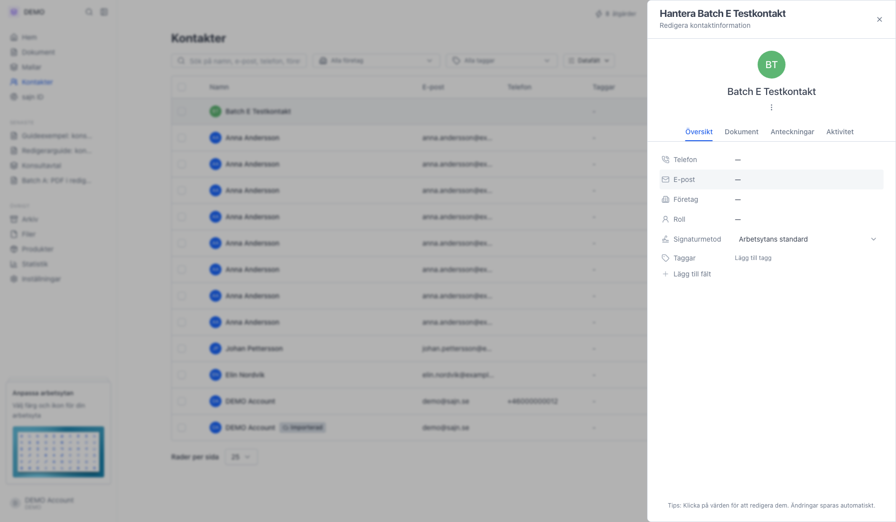
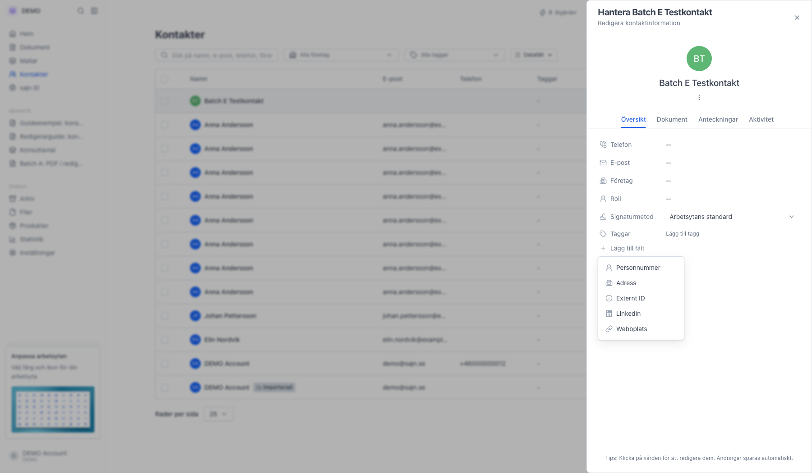
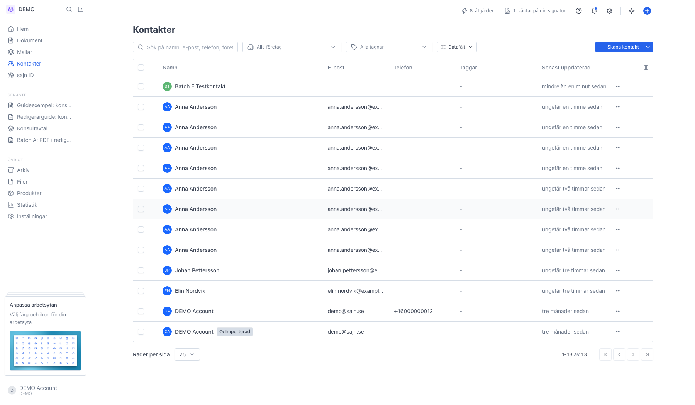

# Skapa en ny kontakt

<!--
slug: create-contact
audience: Alla användare
last_verified: 2026-09-13
auto-generated from steps.json — edit the spec, then re-run the runner
-->

Kontakter är personerna du skickar dokument till - mottagare, motparter, kunder och kollegor. Adressboken tillhör arbetsytan, så varje arbetsyta har sin egen lista. Så här lägger du till en kontakt manuellt.

## Innan du börjar

- Du är inloggad och står i den arbetsyta kontakten ska tillhöra.
- Du har behörighet att skapa kontakter i arbetsytan.

## Steg

### 1. Öppna Kontakter i sidomenyn

Tabellen visar namn, e-post, telefon, taggar och när kontakten senast uppdaterades. Överst söker du på namn, e-post, telefon eller företag och filtrerar per företag, tagg eller datafält. Ikonen längst till höger i tabellhuvudet väljer vilka kolumner som ska synas.

### 2. Klicka på Skapa kontakt

Panelen för den nya kontakten öppnas till höger, och en liten ruta ber om namnet direkt. Pilen bredvid knappen döljer i stället de sätt att lägga till många kontakter på en gång.

### 3. Fyll i förnamn, efternamn och välj en färg

Bara namnet behövs för att skapa kontakten. Färgen används i kontaktens avatar överallt där den syns, så att den blir lätt att känna igen. Knappen längst ner uppdateras med namnet du skriver.

### 4. Kontakten är skapad och panelen visar detaljerna

Panelen heter Hantera följt av kontaktens namn och har flikarna Översikt, Dokument, Anteckningar och Aktivitet. Under Översikt kompletterar du telefon, e-post, företag och roll genom att klicka på värdet. Ändringar sparas automatiskt. Signaturmetod bestämmer hur den här kontakten signerar när du lägger till den som part, och Arbetsytans standard betyder att den följer arbetsytans val.

### 5. Lägg till fält öppnar de övriga uppgifterna

Här finns personnummer, adress, externt ID, LinkedIn och webbplats, plus arbetsytans egna datafält. Ett fält försvinner ur listan när det redan syns i panelen.

### 6. Den nya kontakten ligger i listan

Klicka på raden för att öppna panelen igen. Menyn längst till höger på raden har kontaktens åtgärder, bland annat Skapa dokument och Ta bort.

---

*Senast verifierad: 2026-09-13. Generad av `scripts/guide-runner.ts`.*
