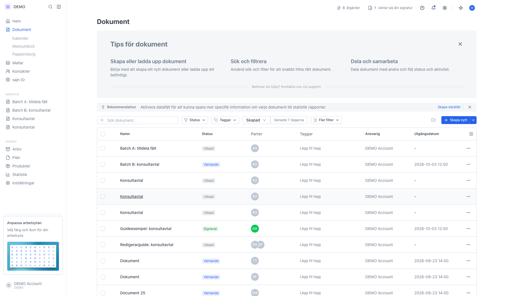
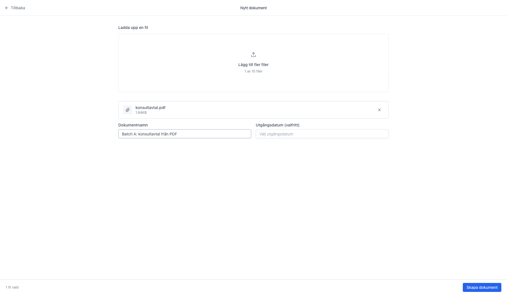
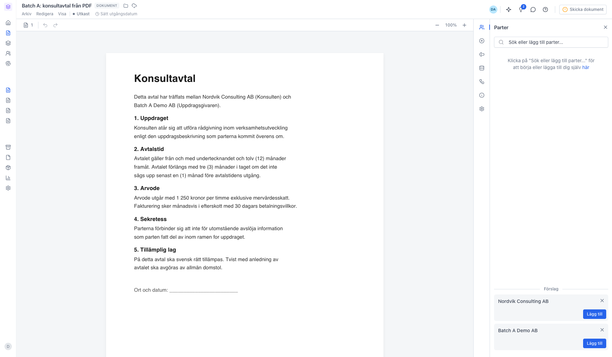

# Skapa ett dokument från en uppladdad PDF

<!--
slug: create-document-from-pdf
audience: Alla användare
last_verified: 2026-09-13
auto-generated from steps.json — edit the spec, then re-run the runner
-->

Har du redan ett färdigt avtal som PDF? Ladda upp filen från dokumentlistan, så blir den innehållet i ett nytt sajn-dokument — redo att förses med parter, fält och signering.

## Innan du börjar

- Du är inloggad i sajn och har valt en arbetsyta.
- Du har en PDF-fil sparad lokalt.
- Du har behörighet att skapa dokument i arbetsytan.

## Steg

### 1. Öppna Dokument i sidomenyn

Knappen Skapa nytt högst upp till höger är delad. Texten öppnar sidan Nytt dokument med en uppladdningsruta; pilen bredvid har genvägen Ladda upp fil som hoppar direkt till datorns filväljare.

### 2. Släpp filen i rutan högst upp

Dra och släpp filen i rutan, eller klicka för att välja den från datorn. PDF, Word, Excel, PowerPoint, CSV och TXT går bra, upp till 25 MB per fil. Du kan ladda upp flera filer samtidigt — de blir sidor i samma dokument.

### 3. Namnge dokumentet innan du skapar det

Den valda filen listas med sin storlek. Lämnar du Dokumentnamn tomt får dokumentet filens namn utan filändelse. Utgångsdatum är valfritt och sätter en sista dag för signering. Klicka Skapa dokument nere till höger.

### 4. PDF:en blir innehållet i ett nytt utkast

Dokumentet får statusen Utkast och PDF:en visas som en egen sektion i redigeraren. Härifrån lägger du till parter i panelen till höger och placerar signatur- och textfält ovanpå sidorna från panelen Innehåll.

---

*Senast verifierad: 2026-09-13. Generad av `scripts/guide-runner.ts`.*
