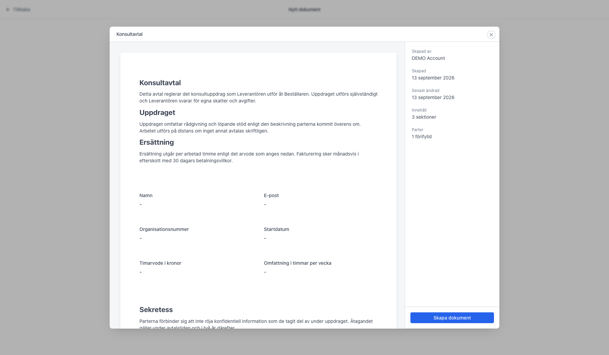
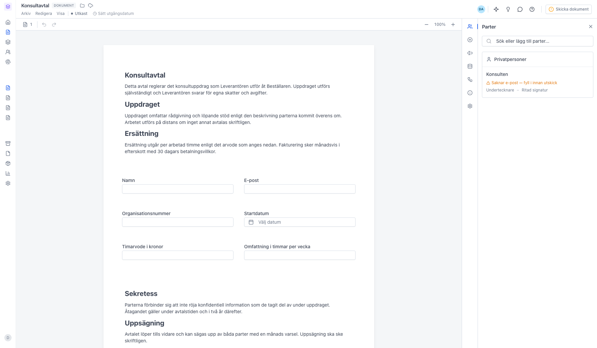
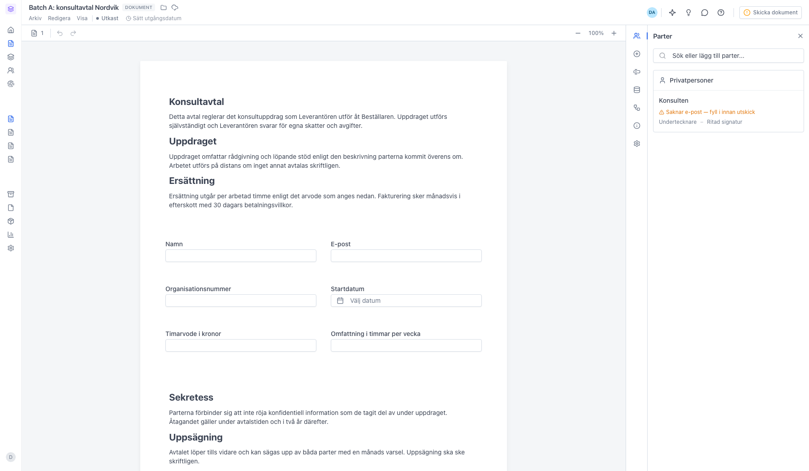

# Skapa ett dokument från en befintlig mall

<!--
slug: create-document-from-template
audience: Alla användare
last_verified: 2026-09-13
auto-generated from steps.json — edit the spec, then re-run the runner
-->

Mallar finns för att du inte ska behöva börja om från noll. Guiden visar hur du väljer en mall i arbetsytan och landar direkt i redigeraren med innehåll och parter förifyllda.

## Innan du börjar

- Du är inloggad i sajn och har valt en arbetsyta.
- Arbetsytan har minst en mall.
- Du har behörighet att skapa dokument i arbetsytan.

## Steg

### 1. Öppna Dokument i sidomenyn

Knappen Skapa nytt uppe till höger är delad. Texten öppnar sidan Nytt dokument, där mallarna ligger. Pilen bredvid är bara en genväg till ett tomt dokument eller en filuppladdning — den har inget mallval.

### 2. Mallarna ligger under Börja från en mall

Varje mall är ett kort med en miniatyr av första sidan, mallens namn och vem som skapade den. Flikarna delar upp dem: Mina mallar är dina egna, Delade med mig är kollegornas, och sajn collection är färdiga mallar från sajn. Sökfältet filtrerar korten medan du skriver, och har arbetsytan många mallar ligger resten bakom Visa fler längst ner. Första kortet, Tomt dokument, startar från ett blankt papper.

### 3. Förhandsgranska mallen innan du skapar dokumentet

För muspekaren över ett kort så dyker Förhandsgranska upp. Du ser hela mallen som den kommer att se ut. Klicka Skapa dokument när det är rätt mall — eller klicka bara på kortet direkt om du redan vet.

### 4. Dokumentet öppnas direkt i redigeraren

Det nya dokumentet ärver mallens namn och får statusen Utkast. Innehåll, fält och parter är redan på plats. Märket DOKUMENT bredvid titeln visar att du redigerar ett dokument och inte mallen — det du ändrar här påverkar inte originalet.

### 5. Döp om dokumentet så du hittar tillbaka

Eftersom dokumentet ärver mallens namn är det första du vill göra oftast att byta titel till något som beskriver ärendet — motpartens namn, eller avtalstyp och datum. Klicka på titeln längst upp till vänster, skriv det nya namnet och tryck Enter. Samma sak går att göra via Redigera och Byt namn.

---

*Senast verifierad: 2026-09-13. Generad av `scripts/guide-runner.ts`.*
