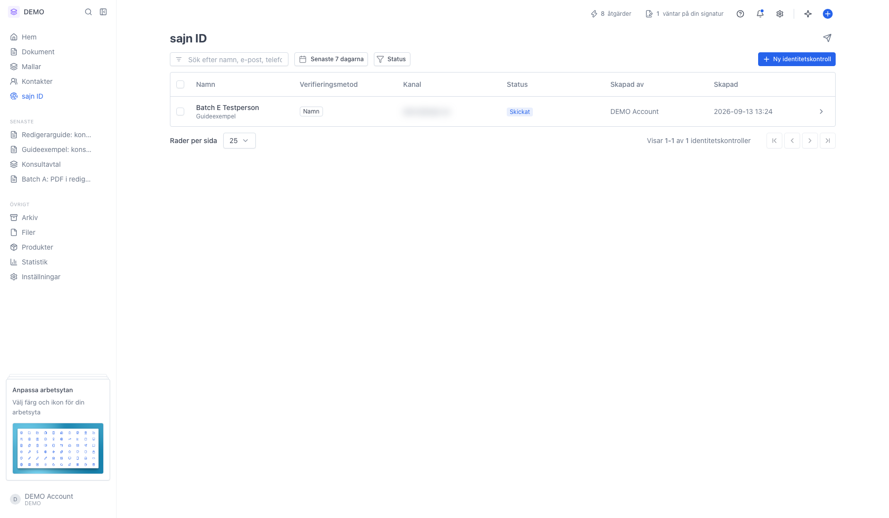
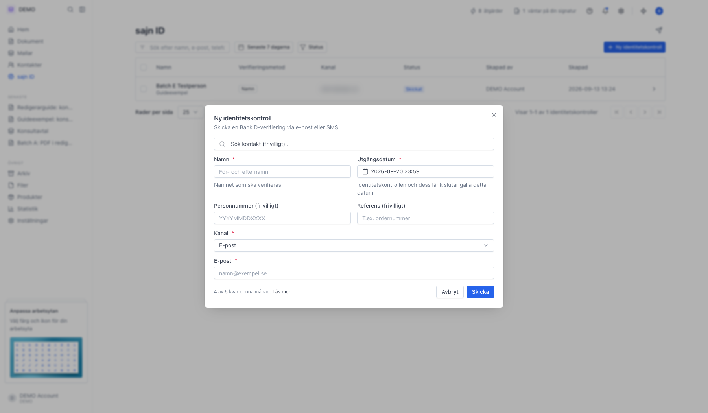
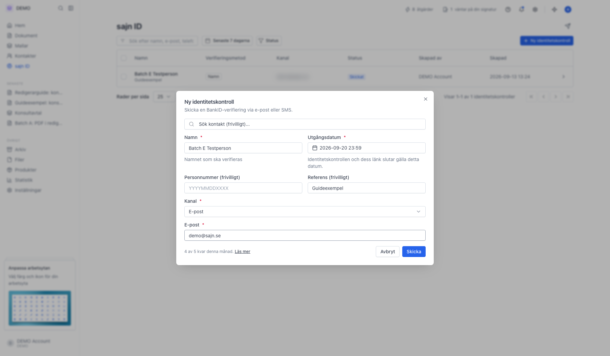
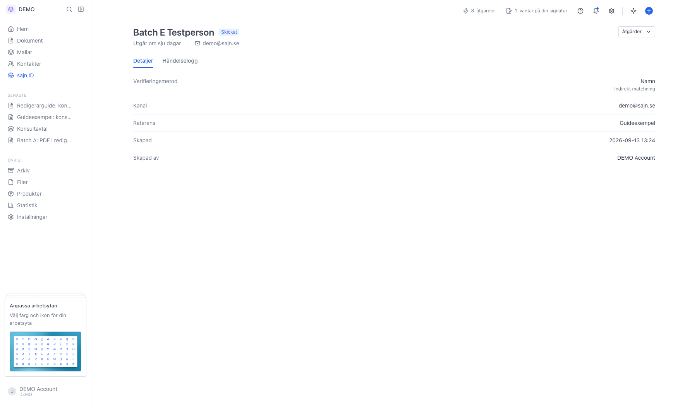

# Skapa en identitetskontroll med sajn ID

<!--
slug: create-sajn-id
audience: Användare med behörighet att hantera sajn-id
last_verified: 2026-09-13
auto-generated from steps.json — edit the spec, then re-run the runner
-->

Med sajn ID verifierar du någons identitet med BankID utan att skicka ett avtal. Du skickar en länk via e-post eller SMS, personen legitimerar sig, och resultatet landar i arbetsytan.

## Innan du börjar

- Du är inloggad och har valt en arbetsyta.
- Du har behörigheten Hantera sajn-id i arbetsytan.
- sajn ID kräver Solo eller högre. Varje plan har ett antal identitetskontroller per månad.

## Steg

### 1. Öppna sajn ID i sidomenyn

Listan visar arbetsytans identitetskontroller med namn, verifieringsmetod, kanal, status, vem som skapade den och när. Sök på namn, e-post, telefon eller referens, och filtrera på status eller datum. Datumfiltret står på Senaste 7 dagarna från början, så äldre kontroller syns först när du vidgar det. Knappen Ny identitetskontroll ligger till höger i filterraden.

### 2. Formuläret har tre obligatoriska fält

Namn, Utgångsdatum och Kanal måste fyllas i, plus e-postadress eller telefonnummer beroende på kanal. Utgångsdatum är förifyllt sju dagar fram men går att ändra fritt. Sök kontakt högst upp fyller i uppgifterna från en befintlig kontakt. Längst ner till vänster står hur många kontroller du har kvar den här månaden.

### 3. Fyll i namn, kanal och kontaktuppgift

Namn är det namn BankID-verifieringen matchas mot. Lämnar du personnummer tomt görs en indirekt matchning på namnet; fyller du i det blir matchningen direkt mot personnumret. Kanal styr om länken skickas med e-post eller SMS, och fältet under byter till telefonnummer om du väljer SMS. Referens är frivillig och syns i listan, praktiskt för att koppla kontrollen till ett ärende.

### 4. Kontrollen skickas direkt och hamnar överst i listan

Statusen är Skickat tills mottagaren öppnar länken. Klicka på raden för att öppna kontrollen.

### 5. Detaljsidan visar allt om kontrollen

Under Detaljer står namn, matchningstyp, kanal, referens, vem som skapade kontrollen och när länken slutar gälla. När verifieringen är klar visas resultatet från BankID här. Menyn Åtgärder uppe till höger har Skicka igen och Avbryt. Sidan uppdaterar sig själv, så du ser statusen ändras medan motparten legitimerar sig.

---

*Senast verifierad: 2026-09-13. Generad av `scripts/guide-runner.ts`.*
