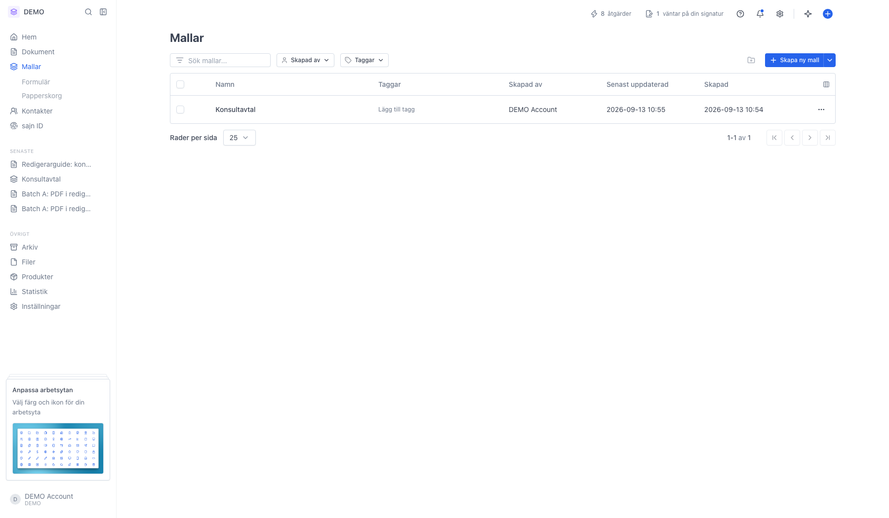
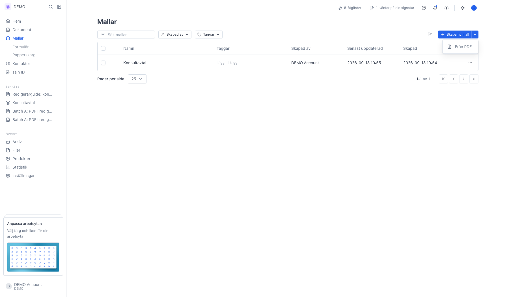
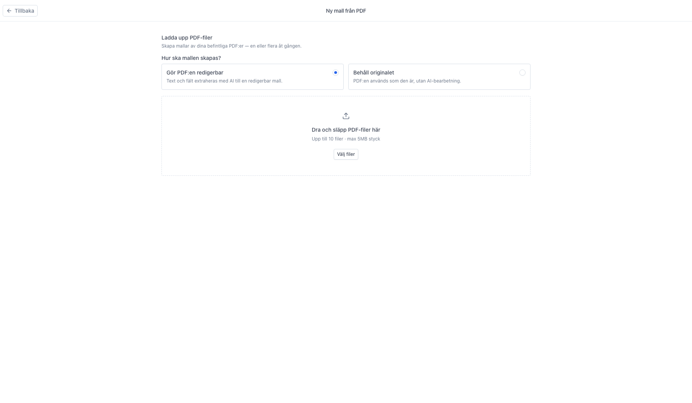
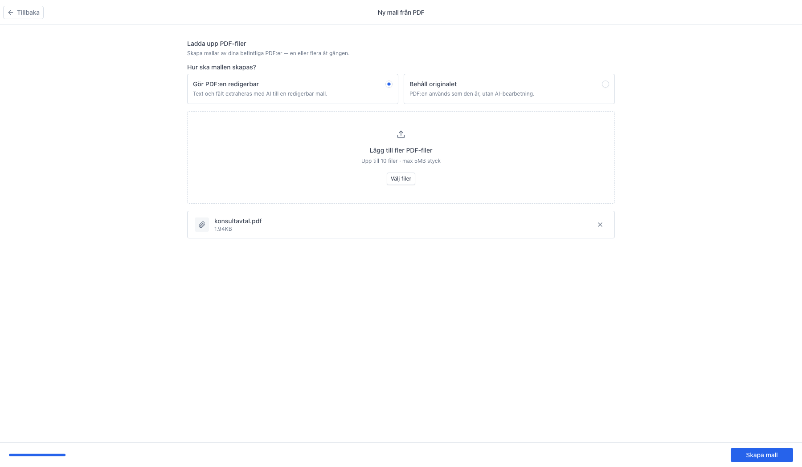
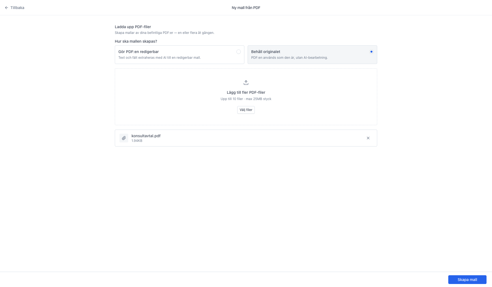
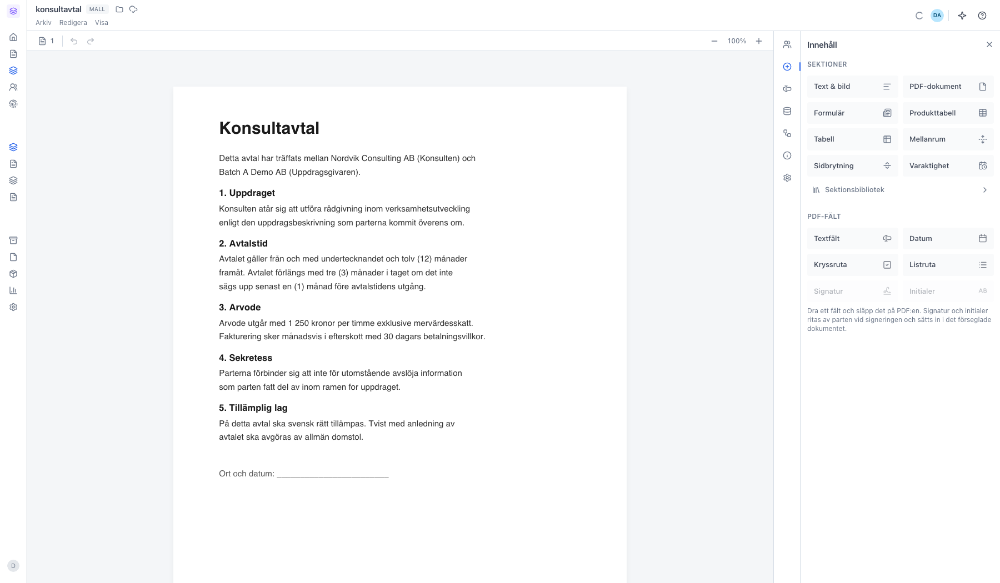

# Skapa en mall från en befintlig PDF

<!--
slug: create-template-from-pdf
audience: Alla som skapar mallar
last_verified: 2026-09-13
auto-generated from steps.json — edit the spec, then re-run the runner
-->

Har du redan avtalet som PDF kan du göra om det till en mall — antingen genom att låta AI:n bygga om innehållet till redigerbar text, eller genom att behålla PDF:en som den är.

## Innan du börjar

- Du är inloggad i en arbetsyta där du får skapa mallar.
- Du har en PDF att utgå från.

## Steg

### 1. Öppna Mallar

### 2. Från PDF ligger under nedåtpilen

### 3. Välj hur mallen ska byggas innan du laddar upp

### 4. Filen är vald och knappen Skapa mall dyker upp

### 5. Behåll originalet hoppar över AI-steget

### 6. Mallen öppnas med PDF:en som en sektion

---

*Senast verifierad: 2026-09-13. Generad av `scripts/guide-runner.ts`.*
