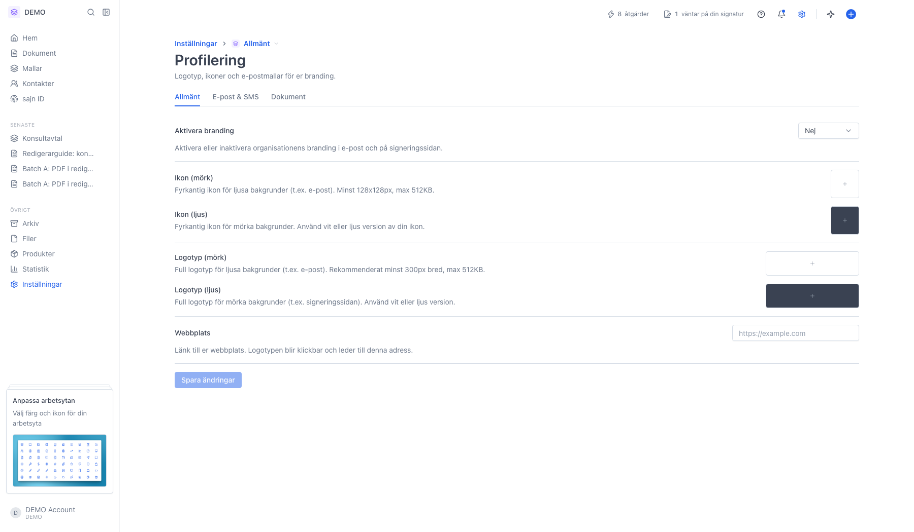
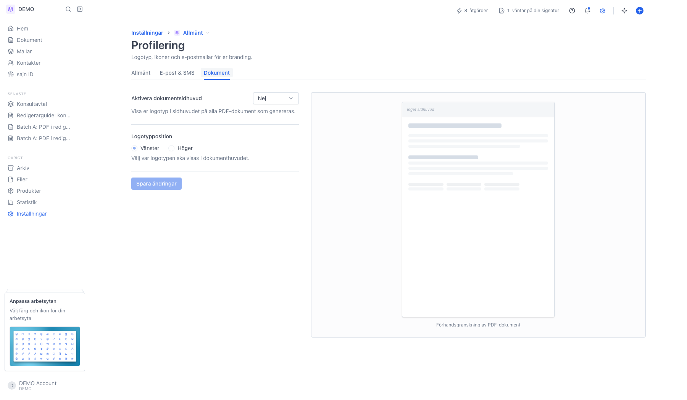

# Anpassa signeringssidan med din profilering

<!--
slug: custom-signing-page
audience: Arbetsyteadministratörer
last_verified: 2026-09-13
auto-generated from steps.json — edit the spec, then re-run the runner
-->

Vad mottagaren ser i sidhuvudet på signeringssidan, och var du styr det.

## Innan du börjar

- Du är inloggad och har behörighet att hantera arbetsytans inställningar.
- Profilering kräver Solo eller högre.

## Steg

### 1. Allt som syns på signeringssidan styrs från Profilering

Fliken Allmänt innehåller Aktivera branding, två ikoner, två logotyper och Webbplats. Det finns ingen separat sida för signeringssidans utseende.

### 2. Fliken Dokument gäller dokumentets sidhuvud, inte signeringssidans

Här slår du på ett sidhuvud i själva PDF:en och väljer var logotypen ska sitta. Det påverkar inte ramen runt dokumentet på signeringssidan.

---

*Senast verifierad: 2026-09-13. Generad av `scripts/guide-runner.ts`.*
