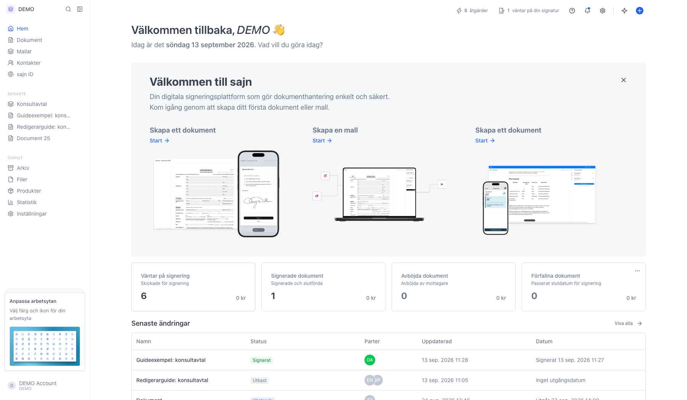
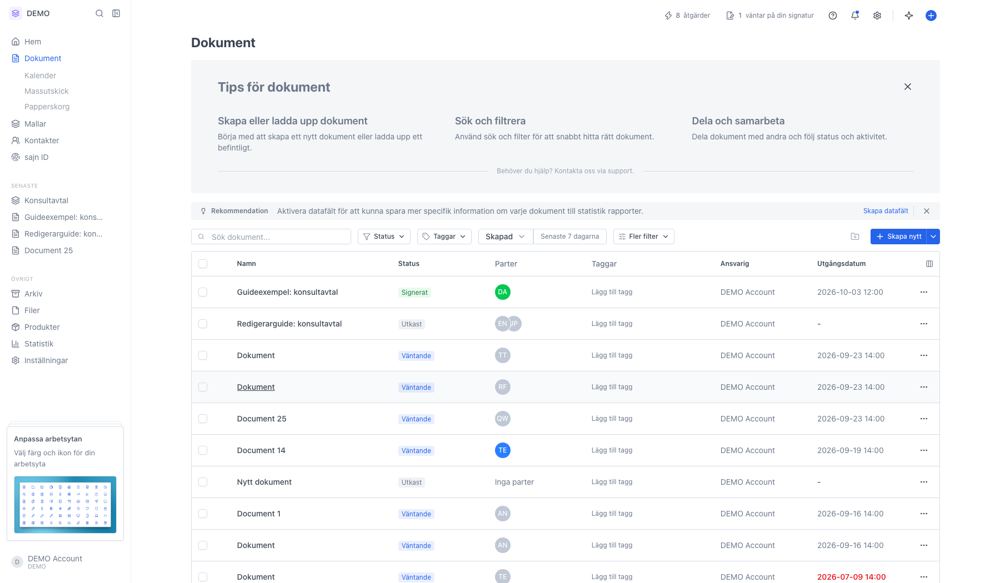
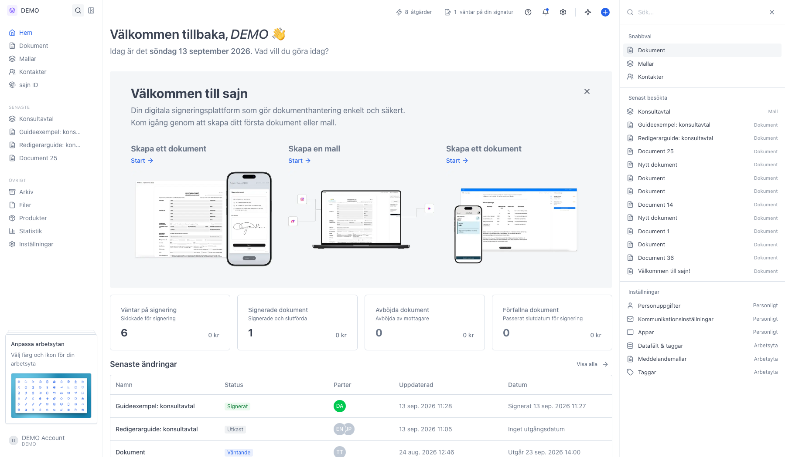
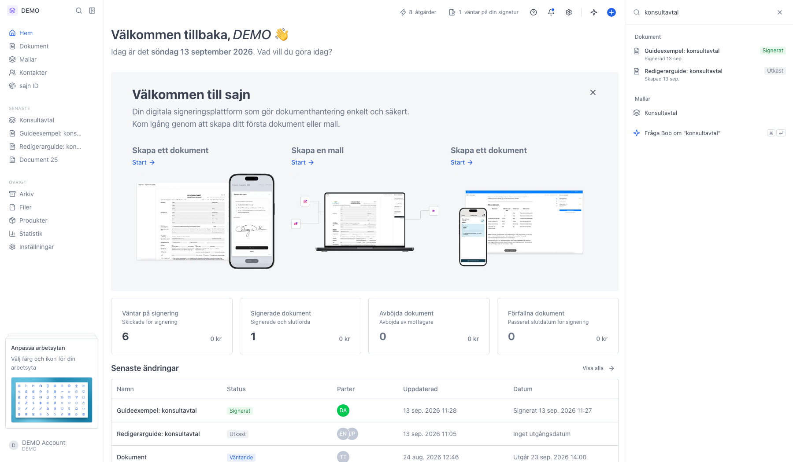
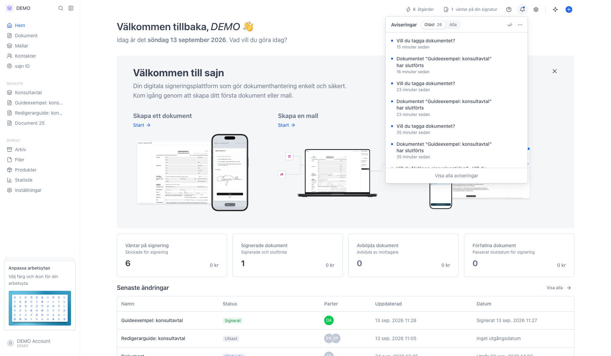
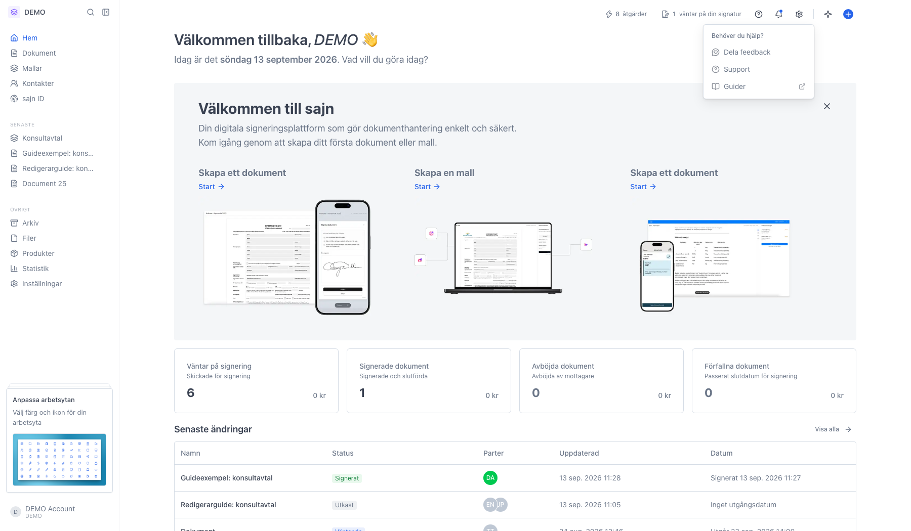
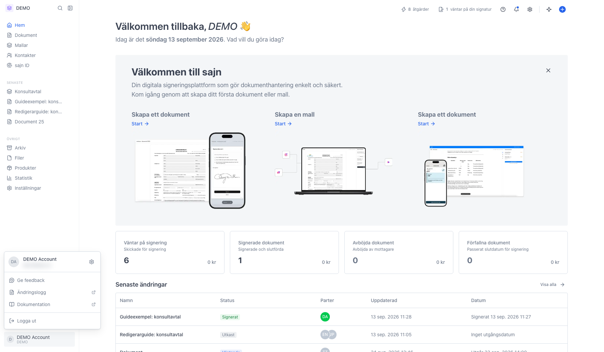

# Hitta rätt i sajn

<!--
slug: dashboard-tour
audience: Alla användare
last_verified: 2026-09-13
auto-generated from steps.json — edit the spec, then re-run the runner
-->

Den här guiden visar var saker ligger: sidomenyn till vänster, verktygsraden överst och menyerna bakom ikonerna. Vill du i stället ändra vad som visas på startsidan finns det i guiden om widgets.

## Innan du börjar

- Du är inloggad i sajn och har valt en arbetsyta.

## Steg

### 1. Så är sajn uppbyggt

Tre ytor: sidomenyn till vänster tar dig mellan vyerna, verktygsraden överst till höger samlar ikonerna, och mitten är startsidan. Väntar något på dig syns det som en siffra i verktygsraden, till exempel åtgärder eller dokument som väntar på din signatur. Klicka på siffran för att gå dit.

### 2. Sidomenyn tar dig till huvudvyerna

Överst ligger Hem, Dokument, Mallar och Kontakter. Under Övrigt ligger Arkiv, Filer, Produkter, Statistik och Inställningar. Den vy du står i fäller ut sina undersidor, så Dokument visar Kalender, Massutskick och Papperskorg. Under Senaste ligger det du öppnade sist.

### 3. Sök i hela arbetsytan

Förstoringsglaset bredvid arbetsytans namn öppnar sökningen i en panel till höger. Tangentbordsgenvägen ⌘K gör samma sak var du än står i appen. Innan du skrivit något visar panelen snabbval, det du besökte senast och genvägar till inställningarna.

### 4. Träffarna kommer medan du skriver

Sökningen tittar på dokument, mallar, sidor i appen och inställningar, och erbjuder att skicka frågan vidare till Bob. Klicka på en träff för att öppna den. Esc tömmer sökrutan, och en gång till stänger panelen.

### 5. Plusknappen skapar ett nytt dokument

Plusknappen längst till höger öppnar Nytt dokument. Härifrån laddar du upp en fil eller börjar från en mall. Tillbaka uppe till vänster stänger vyn utan att skapa något.

### 6. Klockan visar dina aviseringar

Här samlas det som hänt i dina dokument: signeringar, påminnelser och förslag. Oläst visar det du inte har öppnat, Alla visar hela listan. Klicka på en rad för att gå till dokumentet.

### 7. Frågetecknet leder till hjälpen

Härifrån når du guiderna, kontaktar supporten och delar feedback när något saknas eller inte fungerar.

### 8. Ditt konto ligger längst ner i sidomenyn

Namnet längst ner öppnar kontomenyn. Kugghjulet uppe till höger i rutan tar dig till dina kontoinställningar. Tillhör du flera organisationer byter du mellan dem här, och väntande inbjudningar dyker upp i samma ruta.

---

*Senast verifierad: 2026-09-13. Generad av `scripts/guide-runner.ts`.*
