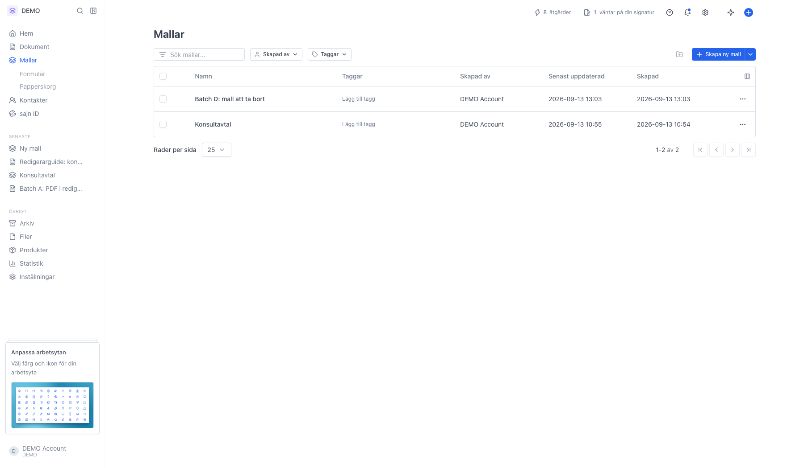
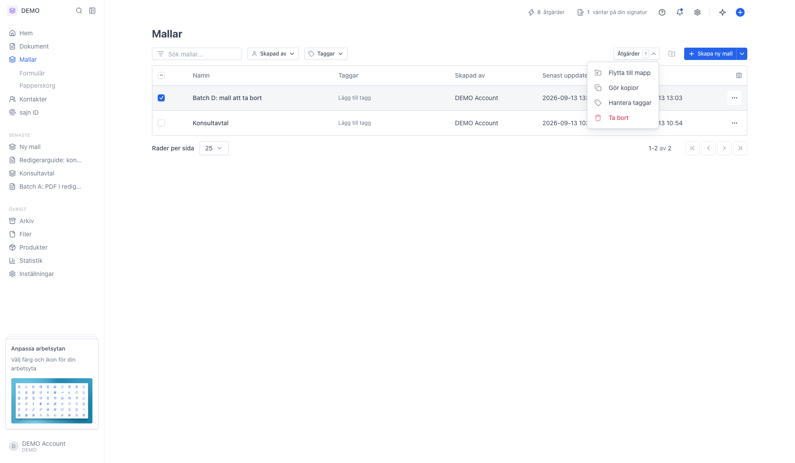
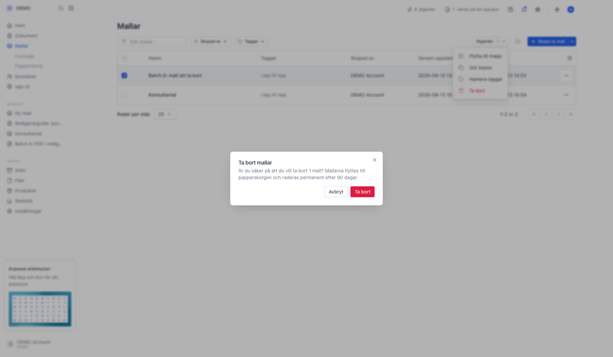
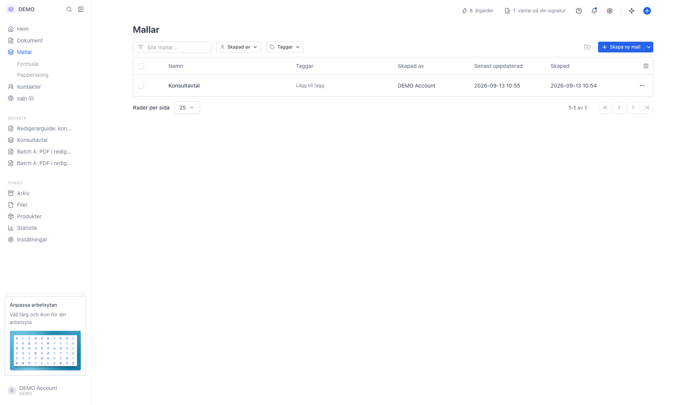
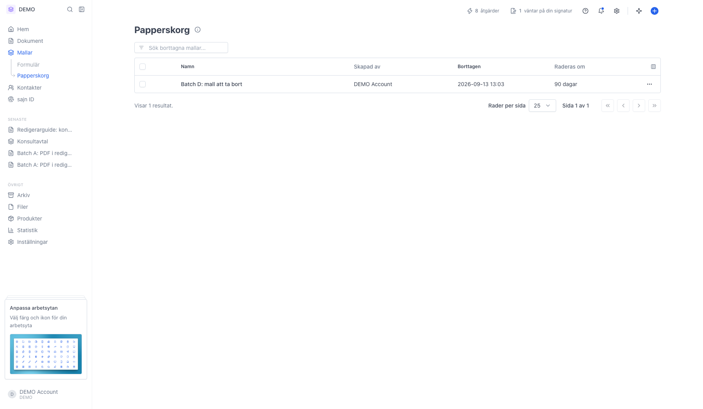
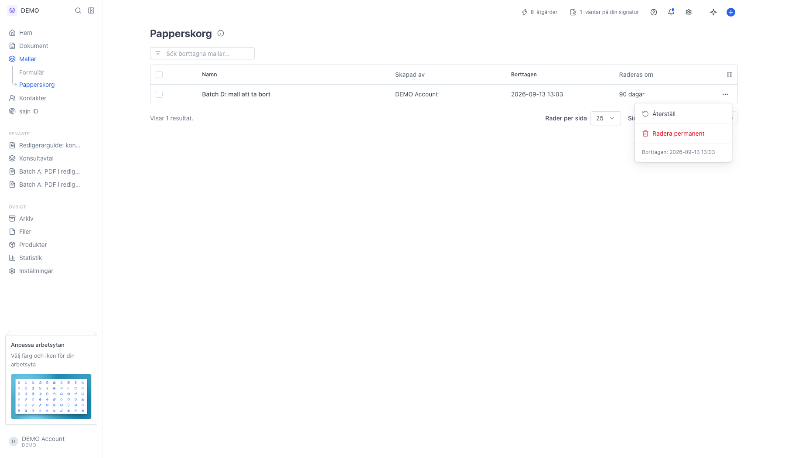

# Ta bort en mall

<!--
slug: delete-template
audience: Alla som hanterar mallar
last_verified: 2026-09-13
auto-generated from steps.json — edit the spec, then re-run the runner
-->

Att ta bort en mall flyttar den till mallarnas papperskorg. Den försvinner ur listan direkt, men går att återställa i 90 dagar.

## Innan du börjar

- Du är inloggad i en arbetsyta där du får hantera mallar.

## Steg

### 1. Hitta mallen du vill ta bort i listan

### 2. Bocka för mallen så dyker Åtgärder upp

### 3. Ta bort ligger längst ner i Åtgärder

### 4. Dialogen säger vart mallen tar vägen

### 5. Raden försvinner ur listan

### 6. Mallen ligger kvar i Papperskorg

### 7. Radmenyn har Återställ och Radera permanent

---

*Senast verifierad: 2026-09-13. Generad av `scripts/guide-runner.ts`.*
