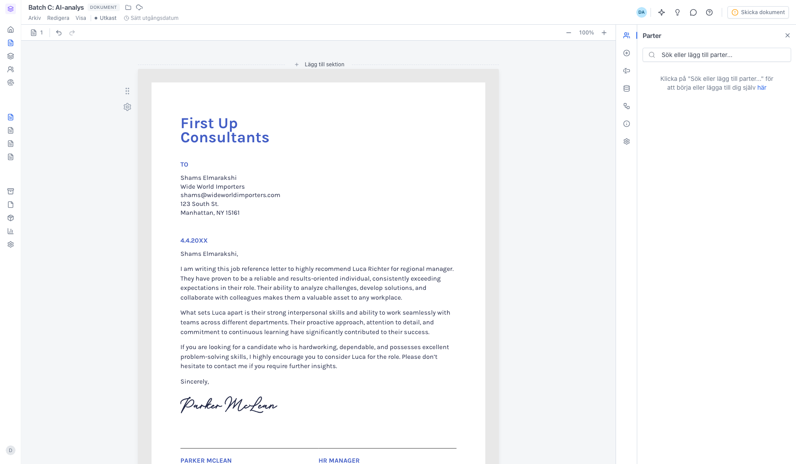
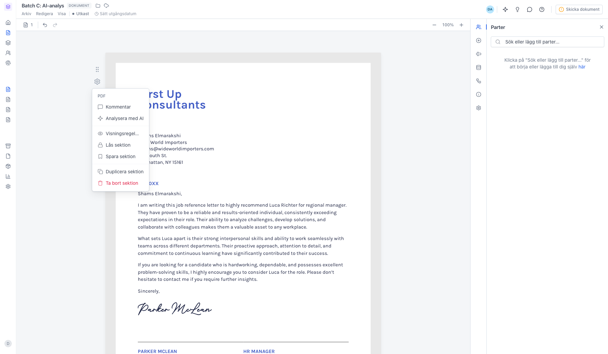
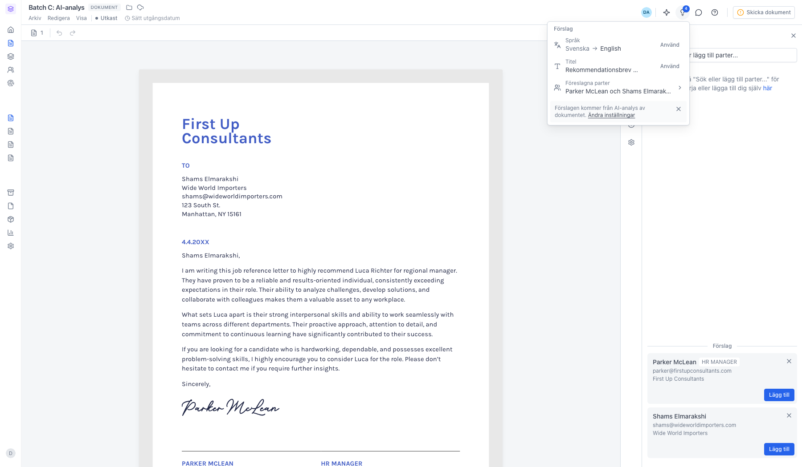
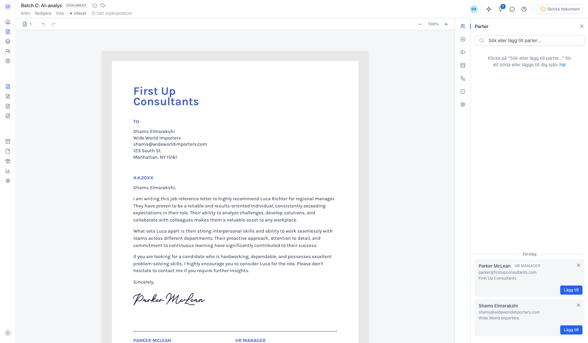

# Analysera en PDF-bilaga med AI

<!--
slug: document-ai-analysis
audience: Alla användare
last_verified: 2026-09-13
auto-generated from steps.json — edit the spec, then re-run the runner
-->

Bob läser igenom en PDF i dokumentet och föreslår parter, titel och inställningar. Du väljer själv vad du tar emot.

## Innan du börjar

- Du är inloggad i en arbetsyta på en betald plan.
- Dokumentet innehåller en PDF-sektion med en uppladdad fil.
- AI är påslaget för arbetsytan.

## Steg

### 1. PDF:en ligger som en egen sektion

Analysen körs på en PDF-sektion. Du kan lika gärna lägga till PDF:en i ett befintligt utkast — se guiden Lägg till en bilaga.

### 2. Starta analysen från kugghjulet på sektionen

Kommentar lämnar en instruktion till AI:n inför analysen. Analysera med AI startar den. På en gratisplan finns valet inte i menyn alls.

### 3. Glödlampan uppe till höger samlar förslagen

Siffran på ikonen räknar hur många förslag som väntar. Varje rad visar vad AI:n föreslår — titel, språk, signeringsordning, avtalsvärde, utgångsdatum eller dokumenttyp — med nuvarande värde till vänster om pilen. Använd tar emot förslaget, krysset avfärdar det. Ingenting ändras förrän du klickar Använd.

### 4. Partsförslagen ligger i panelen Parter

Raden Föreslagna parter hoppar hit. Under rubriken Förslag listas varje part AI:n hittat, med roll, e-post och organisation. Lägg till lägger in parten i dokumentet, krysset avfärdar förslaget. Hittar AI:n flera kontaktuppgifter för samma person dyker knappen Alternativ upp. Är det minst tre förslag finns Lägg till alla längst ner.

---

*Senast verifierad: 2026-09-13. Generad av `scripts/guide-runner.ts`.*
