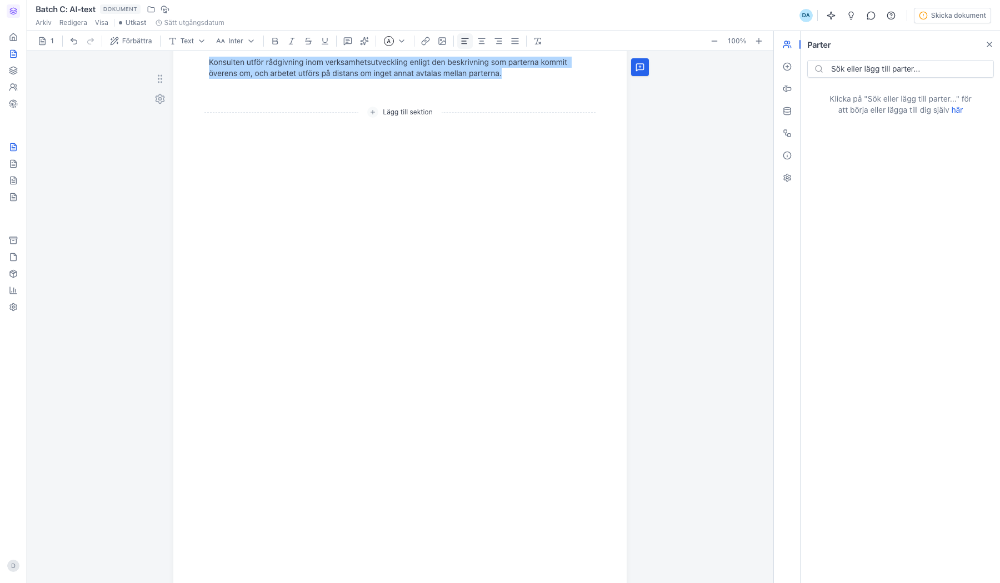
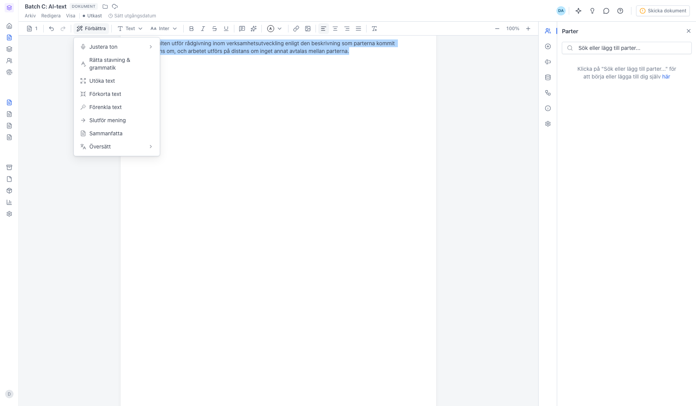
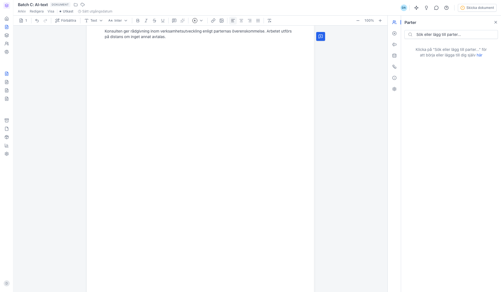

# Förbättra text i ett dokument med AI

<!--
slug: document-ai-text-edit
audience: Alla användare
last_verified: 2026-09-13
auto-generated from steps.json — edit the spec, then re-run the runner
-->

Markera en mening i dokumentet och låt AI-verktyget skriva om, förkorta eller rätta texten direkt i redigeraren.

## Innan du börjar

- Du har ett dokument som är ett utkast.
- Dokumentet har minst en Text & bild-sektion.
- AI är påslaget för arbetsytan.

## Steg

### 1. Markera den text du vill bearbeta

Trippelklicka på ett stycke för att markera hela meningen, eller dra över texten. Förbättra ligger längst till vänster i verktygsraden.

### 2. Klicka på Förbättra och välj en åtgärd

Justera ton fäller ut ett tjugotal tonlägen, från Formell till Avslappnad. Översätt fäller ut svenska, engelska, norska, danska, finska, tyska, franska och spanska. Resten arbetar direkt på markeringen. Har du ingen markering säger sajn till.

### 3. Texten byts ut mot AI-versionen

Den markerade texten ersätts på plats. Blir resultatet inte som du tänkt ångrar du med Cmd/Ctrl + Z. Markeringen får vara högst 3 000 tecken.

---

*Senast verifierad: 2026-09-13. Generad av `scripts/guide-runner.ts`.*
