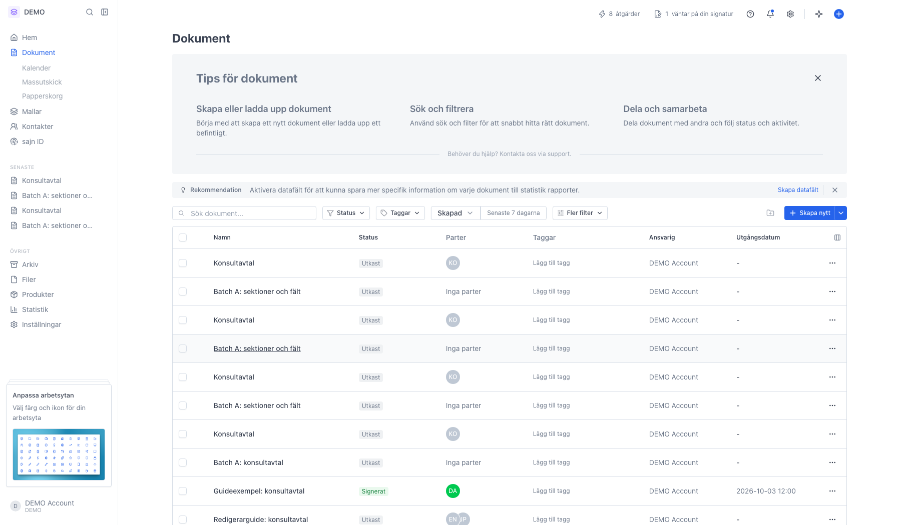
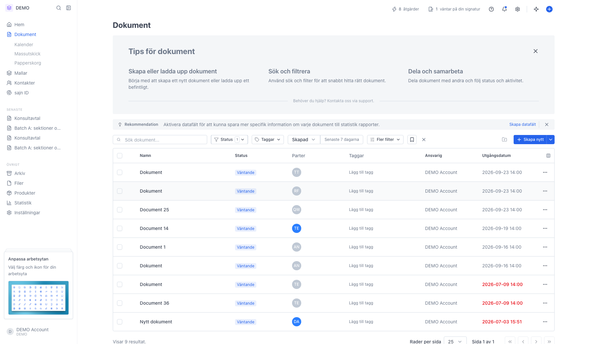
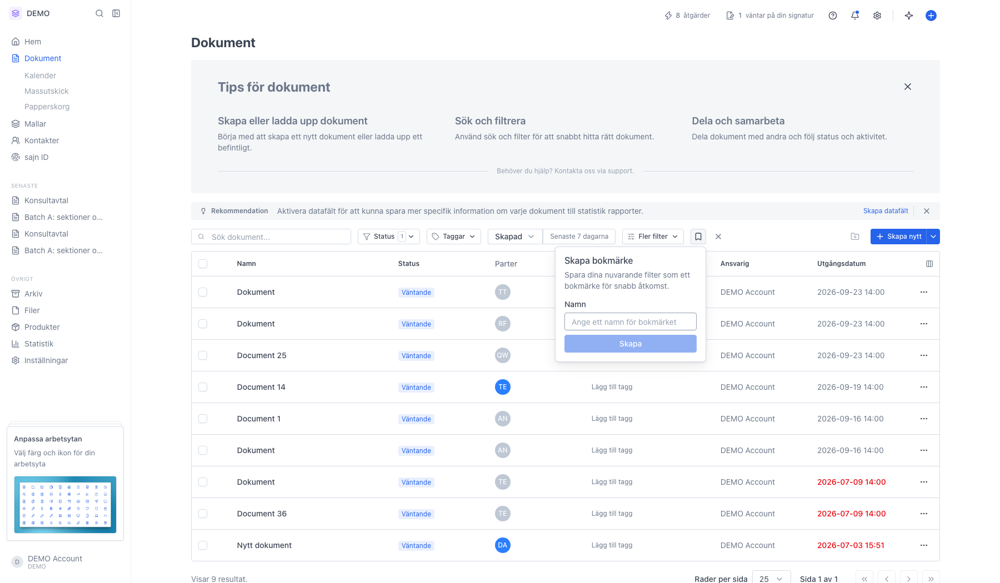
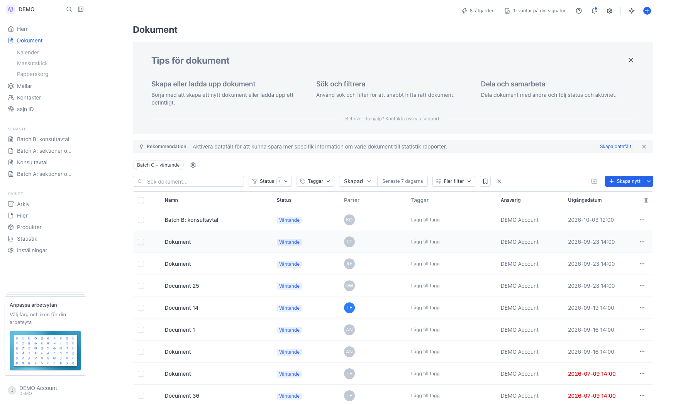
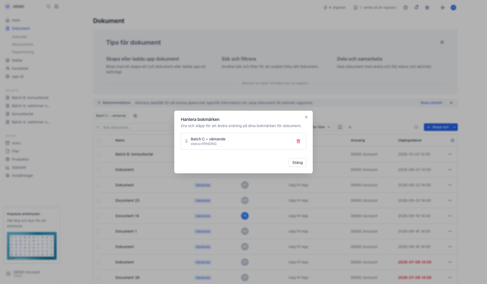

# Bokmärk dokument du återkommer till

<!--
slug: document-bookmarks
audience: Alla användare
last_verified: 2026-09-13
auto-generated from steps.json — edit the spec, then re-run the runner
-->

Ett bokmärke sparar filterurvalet i dokumentlistan, inte enskilda dokument. Nästa gång tar du dig tillbaka till samma vy med ett klick.

## Innan du börjar

- Du är inloggad i sajn och har valt en arbetsyta.
- Arbetsytan har minst ett dokument att filtrera fram.

## Steg

### 1. Öppna Dokument i sidomenyn

Filterraden överst har Status, Taggar, datumfiltret och Fler filter.

### 2. Ställ in filtret du vill kunna återkomma till

Här är listan filtrerad på status Väntande. Så fort minst ett filter är aktivt dyker en bokmärkesikon upp i filterraden.

### 3. Klicka på bokmärkesikonen i filterraden

Rutan Skapa bokmärke öppnas. Namnet är det enda du fyller i — filtren sparas med automatiskt.

### 4. Bokmärket hamnar ovanför filterraden

Ett klick på etiketten återställer hela filterurvalet. Bokmärken är personliga och gäller den arbetsyta du står i.

### 5. Kugghjulet öppnar Hantera bokmärken

Dra i handtaget till vänster för att ändra ordningen — samma ordning gäller ovanför listan. Papperskorgen längst till höger raderar ett bokmärke direkt, utan bekräftelse.

---

*Senast verifierad: 2026-09-13. Generad av `scripts/guide-runner.ts`.*
