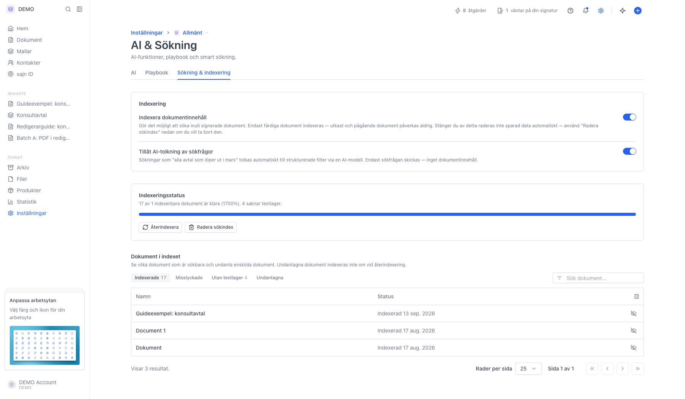
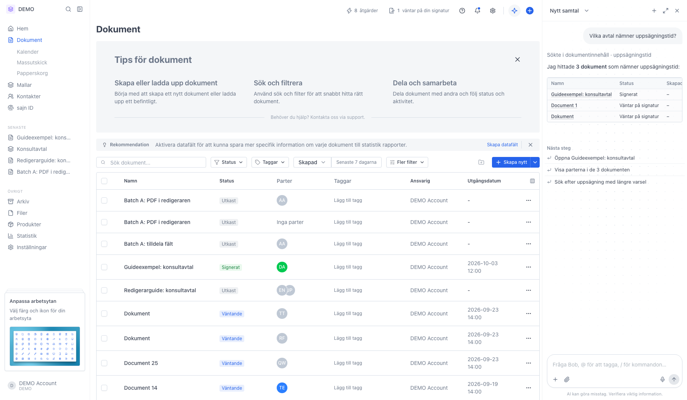

# Sök i innehållet av dokument

<!--
slug: document-content-search
audience: Arbetsyteadministratörer
last_verified: 2026-09-13
auto-generated from steps.json — edit the spec, then re-run the runner
-->

Indexera arbetsytans signerade dokument och låt Bob hitta avtal på vad som faktiskt står i dem.

## Innan du börjar

- Du är inloggad och har behörighet att hantera arbetsytans inställningar.
- Innehållsindexering kräver Solo eller högre.
- Det finns minst ett färdigsignerat dokument med ett textlager.

## Steg

### 1. Slå på indexering under AI & Sökning

Fliken Sökning & indexering har två strömbrytare, en statusruta och en lista över dokumenten i indexet.

### 2. Svaret länkar till dokumenten med ett textutdrag

Varje träff är en länk till dokumentet, med dess status och ett kort utdrag ur texten.

---

*Senast verifierad: 2026-09-13. Generad av `scripts/guide-runner.ts`.*
