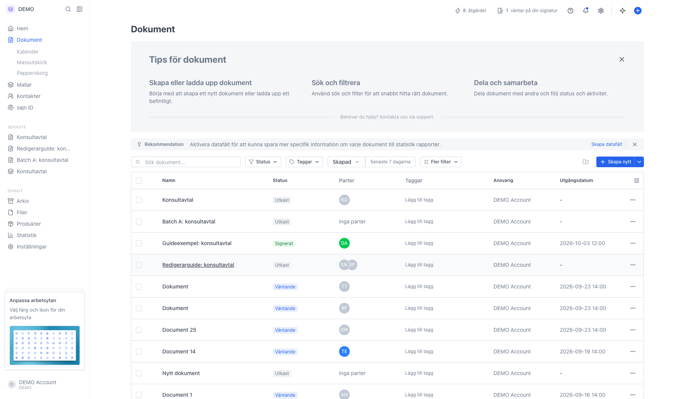
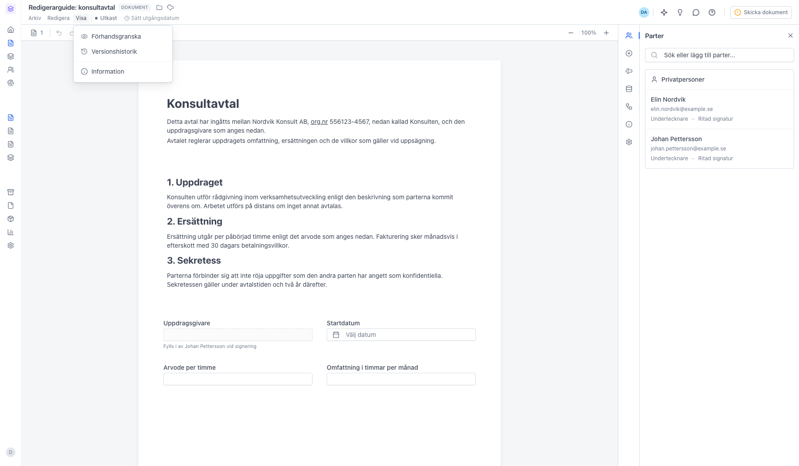
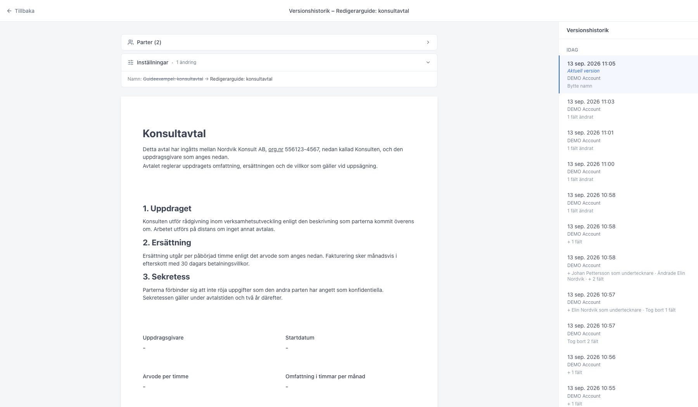
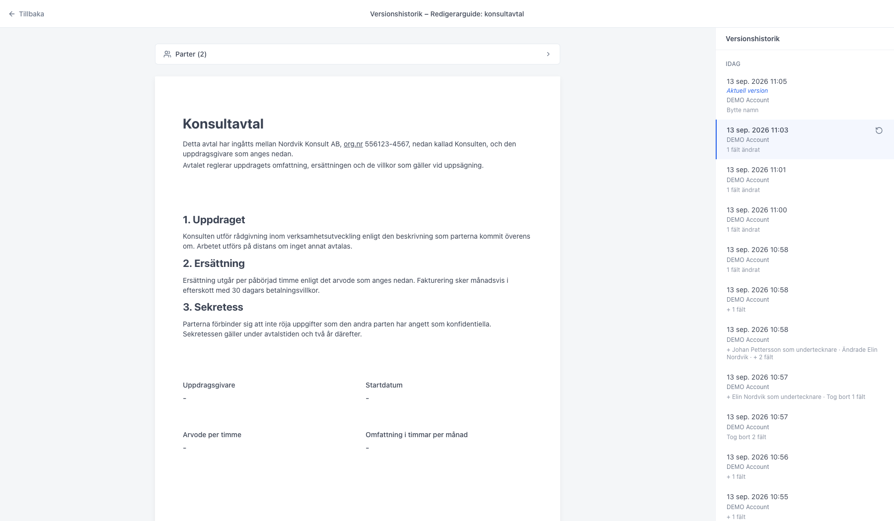
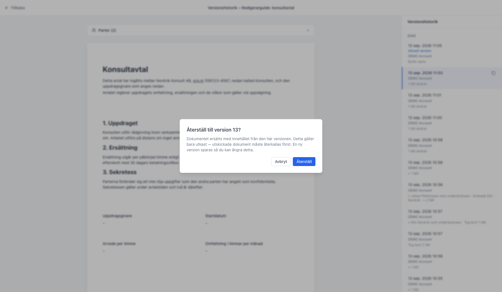

# Se versionshistorik för ett dokument

<!--
slug: document-version-history
audience: Alla användare
last_verified: 2026-09-13
auto-generated from steps.json — edit the spec, then re-run the runner
-->

Varje gång ett dokument redigeras sparar sajn en ny version. Versionshistoriken visar hur dokumentet såg ut tidigare, och om något blivit fel kan du återställa en tidigare version.

## Innan du börjar

- Du är inloggad i sajn och har valt en arbetsyta.
- Du har ett dokument som redigerats minst en gång.

## Steg

### 1. Öppna dokumentet från listan

Versionshistoriken finns för alla dokument, oavsett status.

### 2. Öppna Visa-menyn i redigeraren

Versionshistorik ligger under Visa, tillsammans med Förhandsgranska och Information.

### 3. Versionerna listas till höger

Listan grupperas på Idag, Igår, Tidigare denna månad och Äldre.

### 4. Klicka på en version för att se hur dokumentet såg ut då

Den valda raden markeras och innehållet visas till vänster. Överst sammanfattas vad som skiljer versionen från den aktuella — parter och inställningar, med det gamla värdet överstruket. Återställningspilen dyker upp längst till höger på raden.

### 5. Återställ ersätter dokumentet med den valda versionen

Du får bekräfta först. Återställning fungerar bara på utkast och importerade dokument — är dokumentet utskickat måste du återkalla det först, och signerade dokument kan inte återställas. En ny version sparas när du återställer, så du kan alltid gå tillbaka.

---

*Senast verifierad: 2026-09-13. Generad av `scripts/guide-runner.ts`.*
