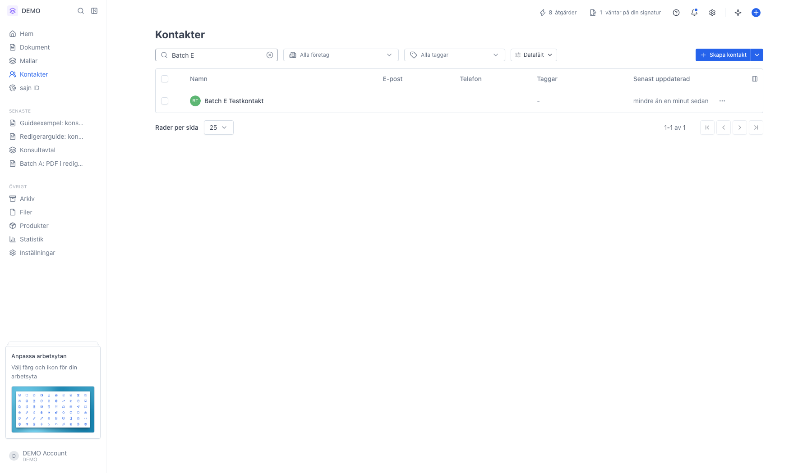
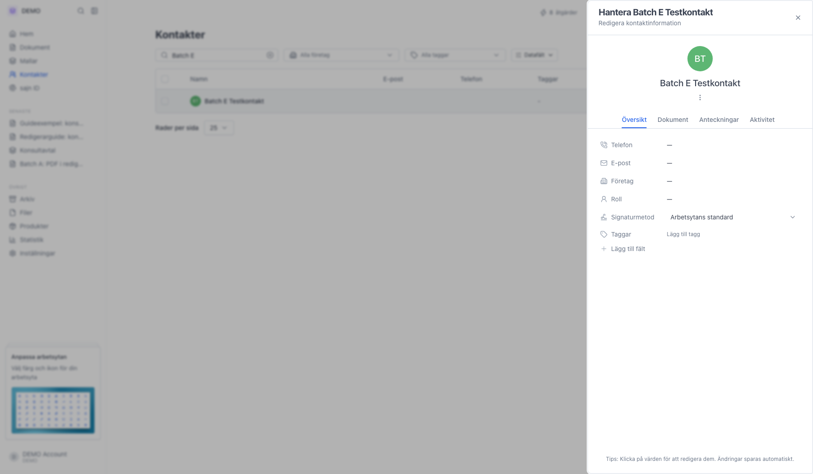
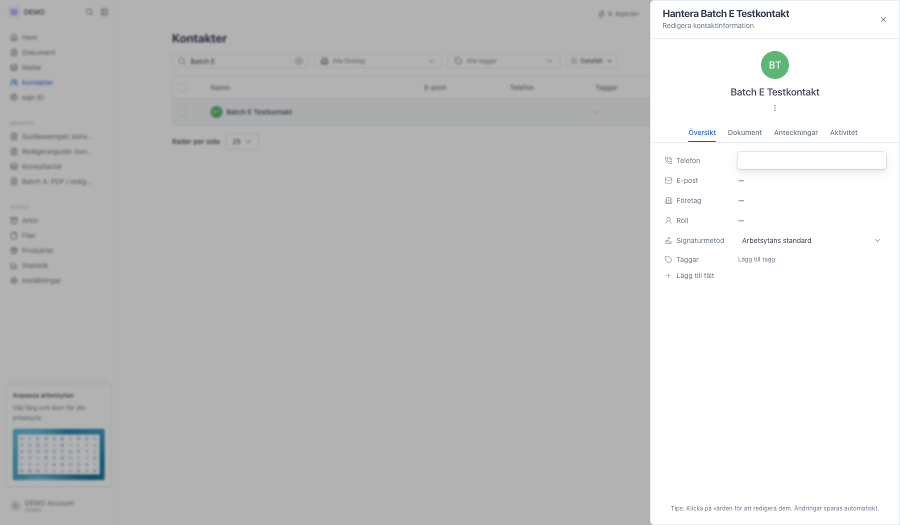
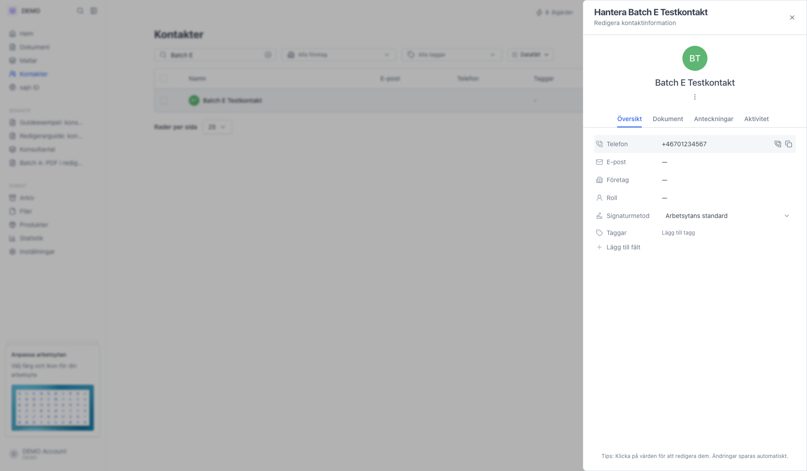

# Redigera en kontakts uppgifter

<!--
slug: edit-contact
audience: Alla användare
last_verified: 2026-09-13
auto-generated from steps.json — edit the spec, then re-run the runner
-->

Alla uppgifter på en kontakt redigeras direkt i panelen. Du klickar på värdet, skriver det nya och stänger rutan - ändringen sparas automatiskt. Det finns ingen spara-knapp.

## Innan du börjar

- Du är inloggad i en arbetsyta där du får redigera kontakter.
- Det finns minst en kontakt i arbetsytans lista.

## Steg

### 1. Sök fram kontakten och klicka på raden

Sökfältet matchar namn, e-post, telefon och företag. Klicka var som helst på raden för att öppna kontaktens panel till höger.

### 2. Panelen öppnas med fliken Översikt

Översikt visar de redigerbara fälten: Telefon, E-post, Företag, Roll, Signaturmetod och Taggar. Längst ner står påminnelsen Klicka på värden för att redigera dem. Ändringar sparas automatiskt.

### 3. Klicka på värdet bredvid Telefon

En liten ruta med ett textfält läggs över värdet. Skriv det nya numret. Enter eller ett klick utanför sparar, Esc avbryter och behåller det gamla värdet.

### 4. Skriv in det nya värdet

Värdet uppdateras i rutan medan du skriver. Inget sparas förrän du stänger den.

### 5. Det nya numret syns direkt i panelen

Samma mönster gäller E-post, Företag, Roll och arbetsytans datafält. Vill du tömma ett fält klickar du på det igen och rensar innehållet innan du stänger rutan. Företag öppnar i stället en väljare där du kopplar kontakten till ett företag, och Signaturmetod är en lista.

---

*Senast verifierad: 2026-09-13. Generad av `scripts/guide-runner.ts`.*
