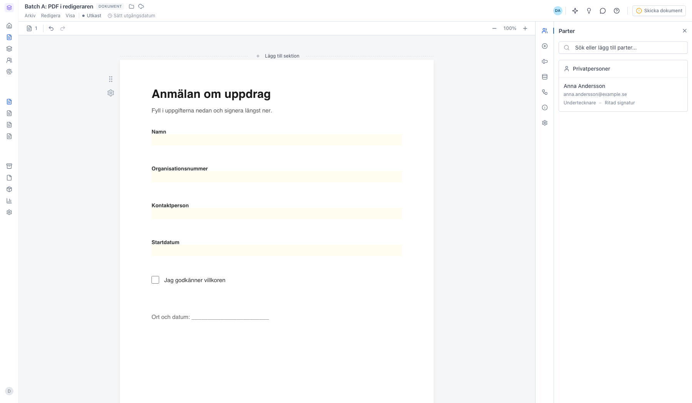
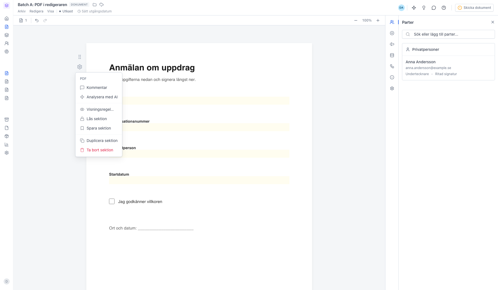
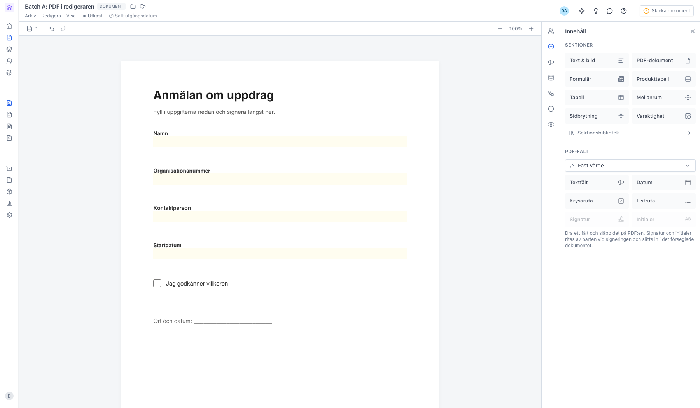
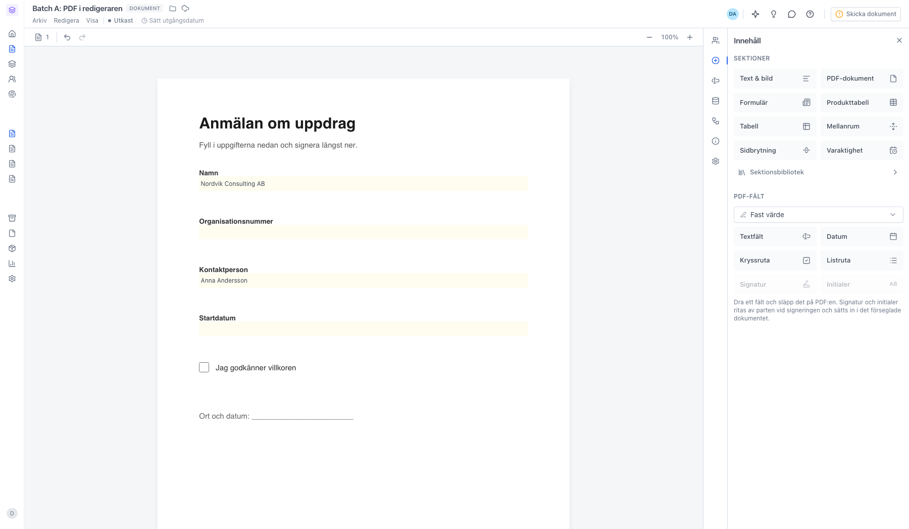

# Redigera en PDF i redigeraren

<!--
slug: edit-pdf-in-editor
audience: Alla användare
last_verified: 2026-09-13
auto-generated from steps.json — edit the spec, then re-run the runner
-->

En PDF ligger i dokumentet som en egen sektion. Du ändrar inte texten i filen, men du kan placera fält ovanpå sidorna, fylla i de formulärfält PDF:en redan har och hantera sektionen som vilken annan sektion som helst.

## Innan du börjar

- Du är inloggad i sajn och har valt en arbetsyta.
- Du har ett utkast som innehåller en PDF-sektion.
- Du har behörighet att redigera dokumentet.

## Steg

### 1. PDF:en ligger som en egen sektion

Sidorna renderas i full bredd som en egen sektion. Själva texten i filen går inte att ändra — vill du byta ut innehållet tar du bort sektionen och lägger in en ny PDF. Sektionen går bara att ändra så länge dokumentet är ett utkast; när det skickats för signering låses innehållet.

### 2. Kugghjulet samlar sektionens åtgärder

För muspekaren över sektionen så dyker kugghjulet upp till vänster. Kommentar sätter en instruktionstext som visas i uppladdningsrutan så länge sektionen är tom — användbart i mallar. Analysera med AI låter Bob läsa igenom PDF:en och föreslå parter, datum och nyckelvärden. Visningsregel styr när sektionen ska visas, Lås sektion hindrar andra från att ändra den, Spara sektion lägger PDF:en i sektionsbiblioteket, och Duplicera och Ta bort gäller hela sektionen.

### 3. PDF-fält placerar fält ovanpå sidorna

Under PDF-fält i panelen Innehåll ligger sex fälttyper: Textfält, Datum, Kryssruta, Listruta, Signatur och Initialer. Välj först i menyn ovanför vem fältet ska tillhöra — Fast värde om du fyller i det själv, annars en part. Dra sedan fälttypen till den plats på sidan där den ska ligga. Signatur och Initialer är släckta tills du valt en part som ska signera.

### 4. Fält som redan finns i PDF:en går att fylla i

Är PDF:en gjord som ett ifyllbart formulär läser sajn ut fälten automatiskt — text, kryssrutor, rullgardiner och radioknappar. De blir ifyllbara rutor direkt ovanpå sidan, svagt gultonade och tydligare när du för muspekaren över. Värdena sparas med dokumentet och följer med när det skickas. En vanlig platt PDF har inga sådana rutor; där placerar du fälten själv från PDF-fält.

---

*Senast verifierad: 2026-09-13. Generad av `scripts/guide-runner.ts`.*
