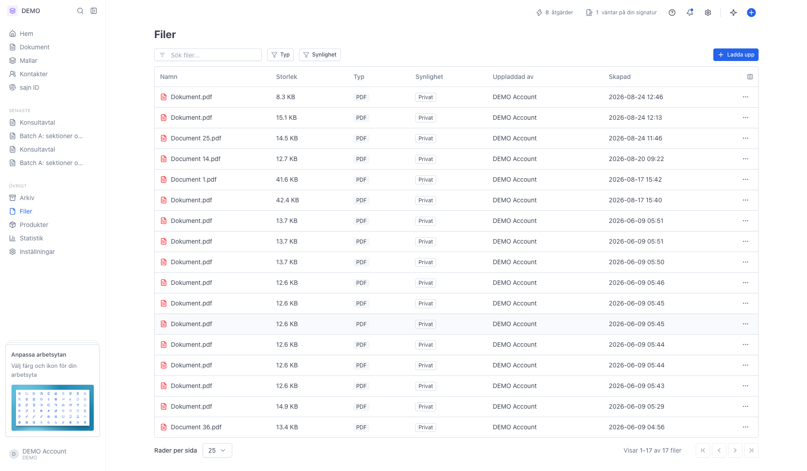
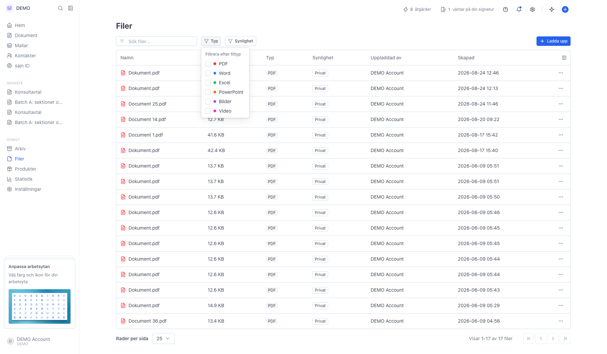
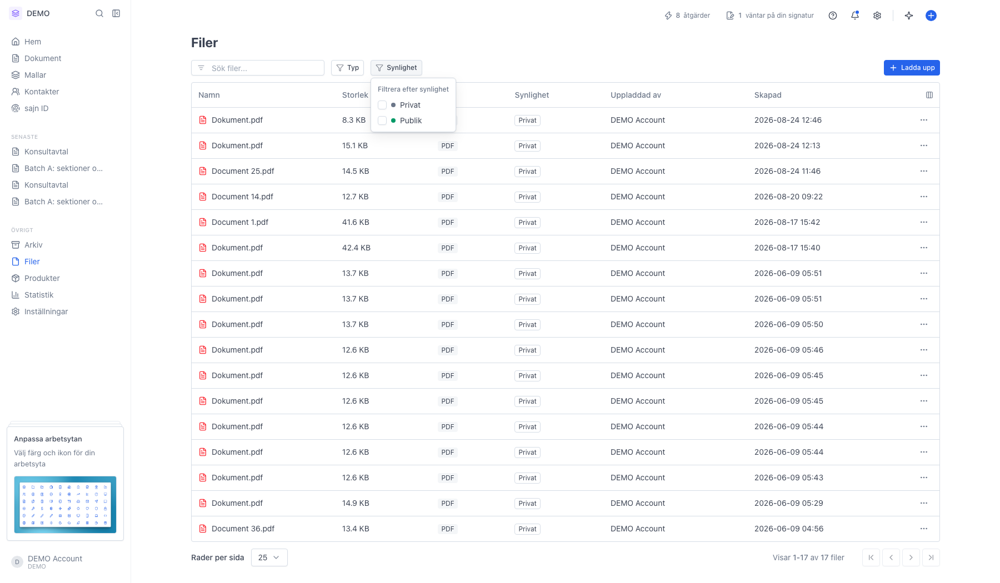
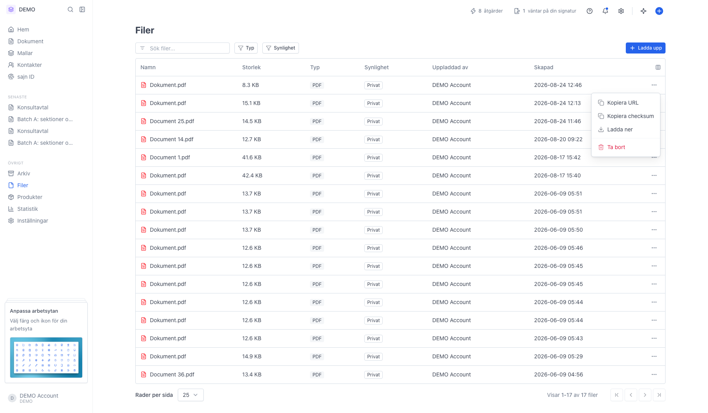
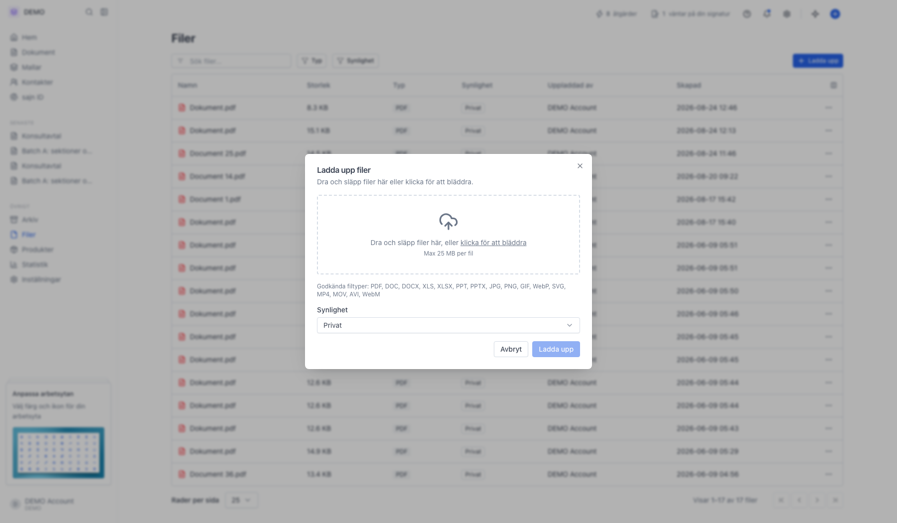

# Hantera filer på sidan Filer

<!--
slug: files-overview
audience: Alla användare
last_verified: 2026-09-13
auto-generated from steps.json — edit the spec, then re-run the runner
-->

Sidan Filer samlar arbetsytans fristående filuppladdningar — separat från dokumenten i Dokument-listan.

## Innan du börjar

- Du är inloggad i en arbetsyta där du får se filer.
- Arbetsytan har Solo eller högre. Filer saknas på Basic.

## Steg

### 1. Öppna Filer i sidomenyn

Tabellen visar namn, storlek, typ, synlighet, vem som laddade upp filen och när. Överst finns sökfältet och filtren Typ och Synlighet, och till höger knappen Ladda upp.

### 2. Typ begränsar listan till en filkategori

Kryssa i PDF, Word, Excel, PowerPoint, Bilder eller Video. Flera kategorier går att välja samtidigt.

### 3. Synlighet skiljer privata filer från publika

Privat betyder att nedladdning kräver en signerad länk från arbetsytan. Publik betyder att vem som helst med länken kommer åt filen utan att logga in.

### 4. Menyn på raden ger åtgärderna per fil

Kopiera URL ger en länk till filen, Kopiera checksum ger filens kontrollsumma, och Ladda ner sparar en kopia. Ta bort visas bara om du får radera filer. Det finns ingen förhandsgranskning i listan — ladda ner filen för att se innehållet.

### 5. Ladda upp tar emot flera filer åt gången

Dra in filerna eller klicka för att bläddra. Godkända filtyper står under rutan och varje fil får väga högst 25 MB. Synlighet längst ner avgör om filerna blir privata eller publika, och den gäller alla filer i uppladdningen.

---

*Senast verifierad: 2026-09-13. Generad av `scripts/guide-runner.ts`.*
