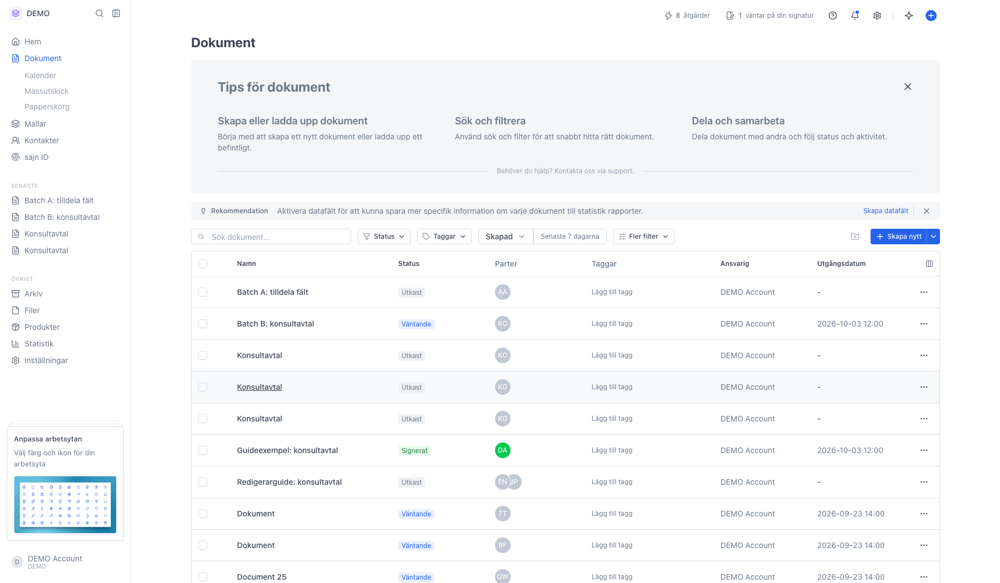
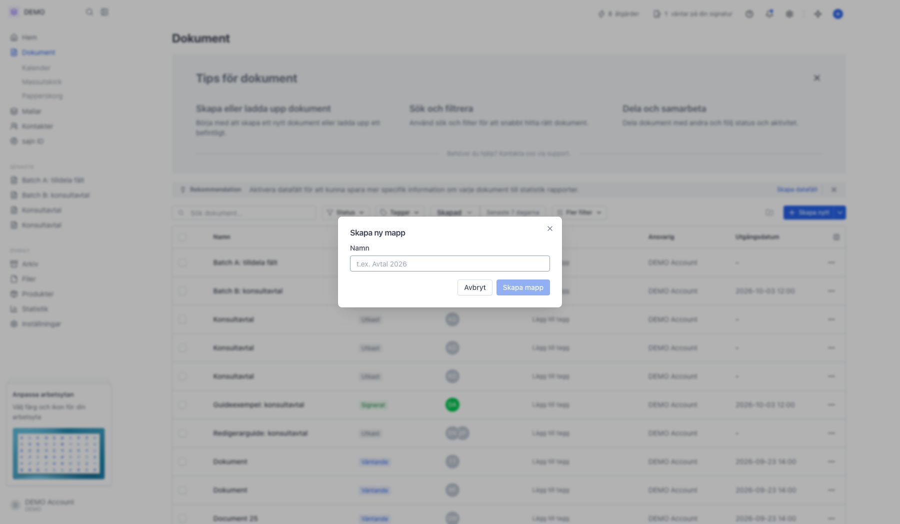
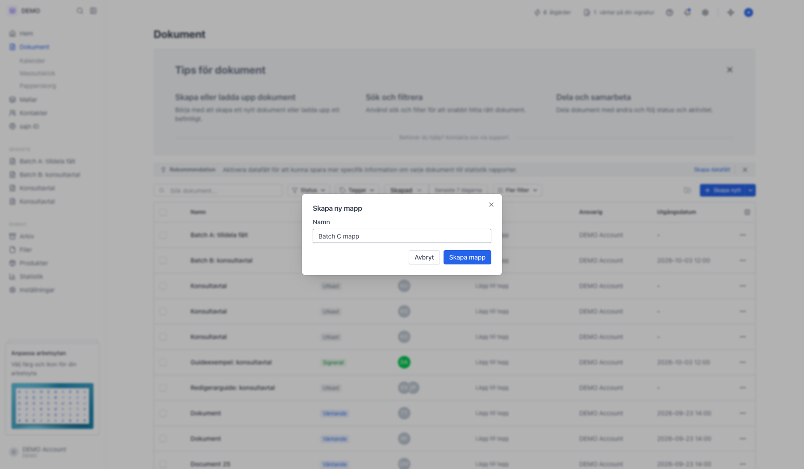
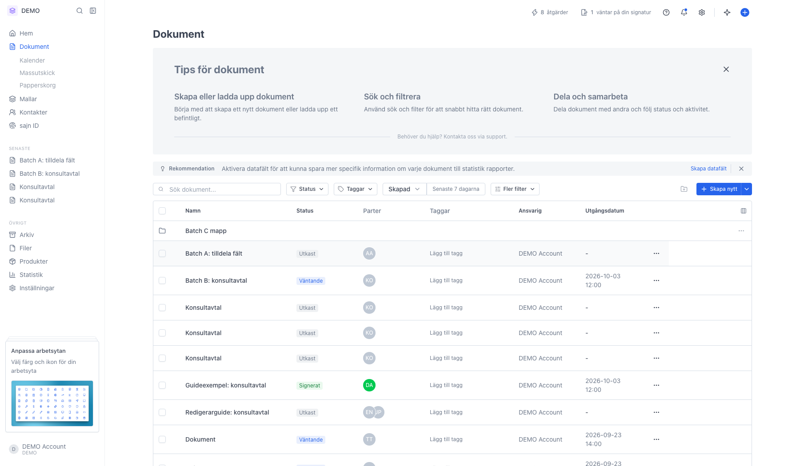
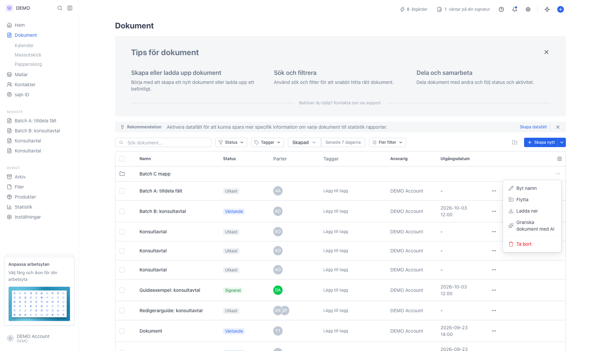
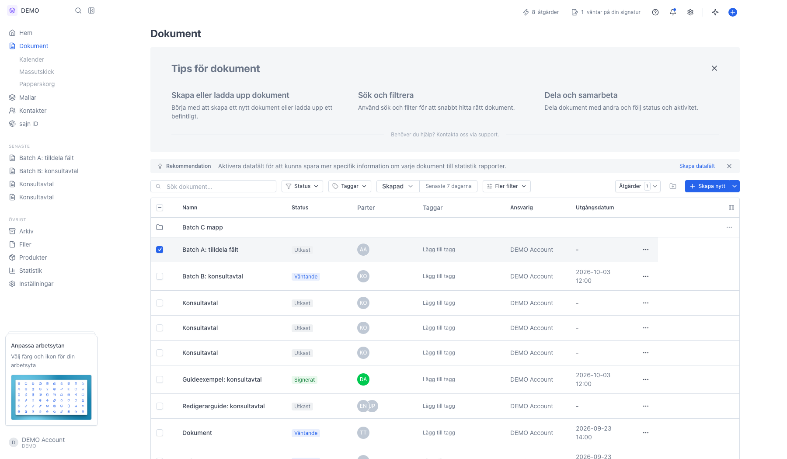
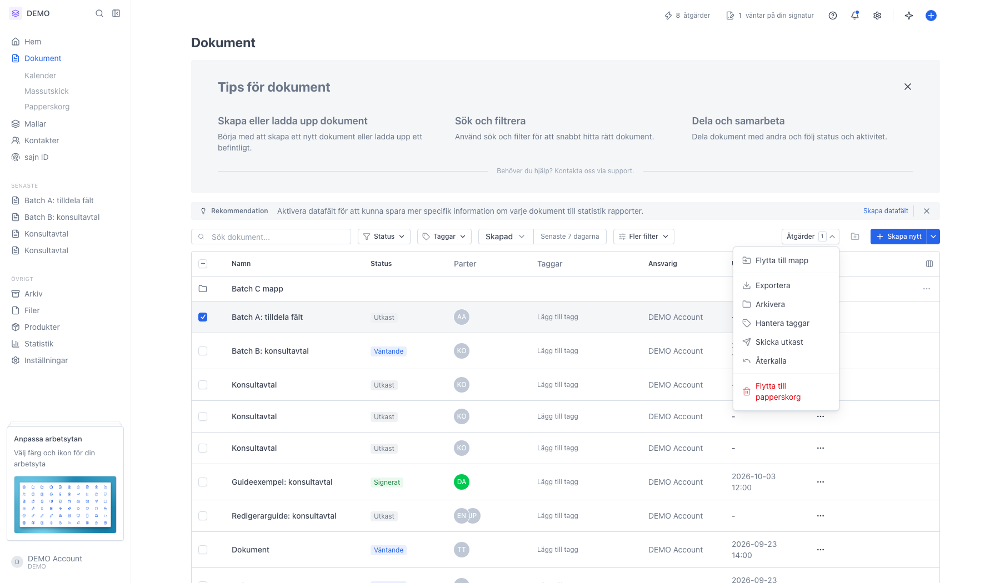
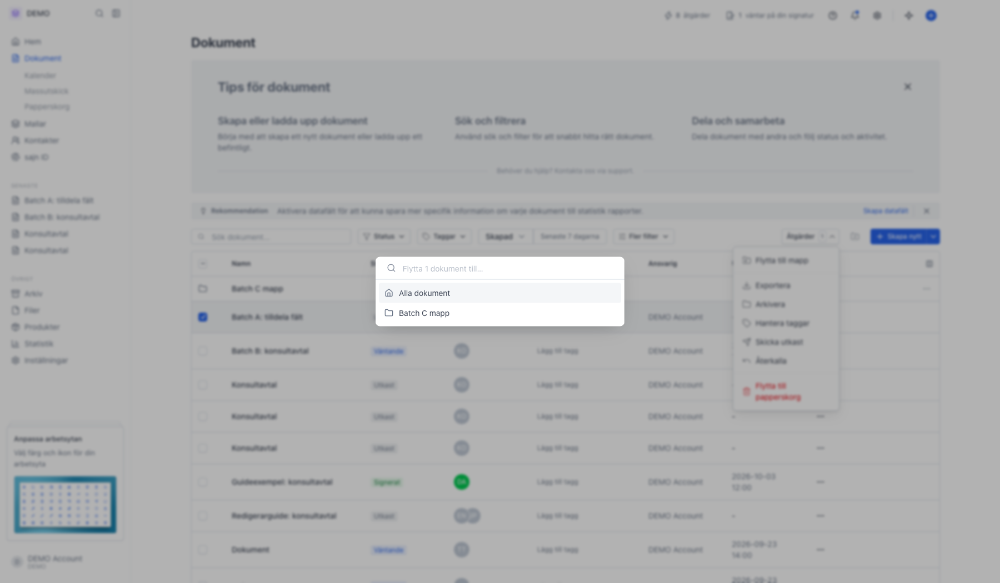

# Organisera dokument och filer i mappar

<!--
slug: folders
audience: Alla användare
last_verified: 2026-09-13
auto-generated from steps.json — edit the spec, then re-run the runner
-->

Mappar håller ihop Dokument- och Mallar-listorna när antalet objekt växer. En mapp lever i en arbetsyta och fungerar ungefär som en mapp på datorn.

## Innan du börjar

- Du är inloggad i en arbetsyta som har minst ett dokument i listan.
- Du har behörighet att skapa dokument i arbetsytan.

## Steg

### 1. Mappar bor inuti Dokument-listan

Det finns ingen egen Mappar-vy i sidomenyn. Mallar har en parallell mapphierarki på sin egen sida.

### 2. Mapp-plus-ikonen skapar en ny mapp

Ikonknappen ligger strax till vänster om Skapa nytt. Mappen hamnar på den nivå du står på — är du redan inne i en mapp blir den nya en undermapp.

### 3. Ge mappen ett namn

Namn är det enda fältet. Mappnamn får innehålla bokstäver, siffror, mellanslag, punkt, bindestreck och understreck, upp till 120 tecken. Mappar bär inga taggar eller behörigheter — de är rent organisatoriska, och åtkomsten styrs av arbetsytan och av varje enskilt dokument.

### 4. Mappar ligger alltid högst upp i tabellen

Klicka på raden för att gå in i mappen — rubriken blir då en brödsmula och tabellen visar bara mappens innehåll. För muspekaren över mappikonen längst till vänster för att få fram kryssrutan, så kan du markera flera mappar samtidigt.

### 5. Menyn på mappraden

Byt namn, Flytta (öppnar samma väljare som för dokument), Ladda ner (zippar mappen och mailar dig en länk), Granska dokument med AI och Ta bort. En mapp måste vara tom för att kunna tas bort — flytta ut undermappar, dokument och mallar först.

### 6. Markera dokumenten du vill flytta

När minst en rad är markerad dyker knappen Åtgärder upp uppe till höger.

### 7. Åtgärder samlar allt som går att göra på flera rader

Flytta till mapp, Exportera, Arkivera, Hantera taggar, Skicka utkast, Återkalla och Flytta till papperskorg. Ska du flytta ett enda dokument finns samma val i trepunktsmenyn ute till höger på dokumentraden.

### 8. Välj målmappen i listan

Sökfältet högst upp filtrerar mappträdet. Alla dokument överst flyttar tillbaka till rotnivån, och varje mapp visar sin sökväg till höger. Du bekräftar inte separat — klicket flyttar. Skriver du ett namn som inte finns kan du skapa mappen och flytta dit i samma klick.

---

*Senast verifierad: 2026-09-13. Generad av `scripts/guide-runner.ts`.*
