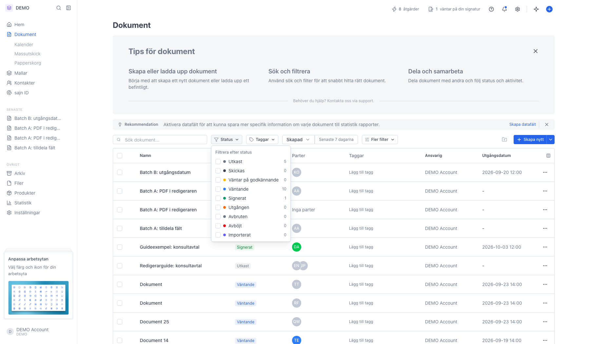
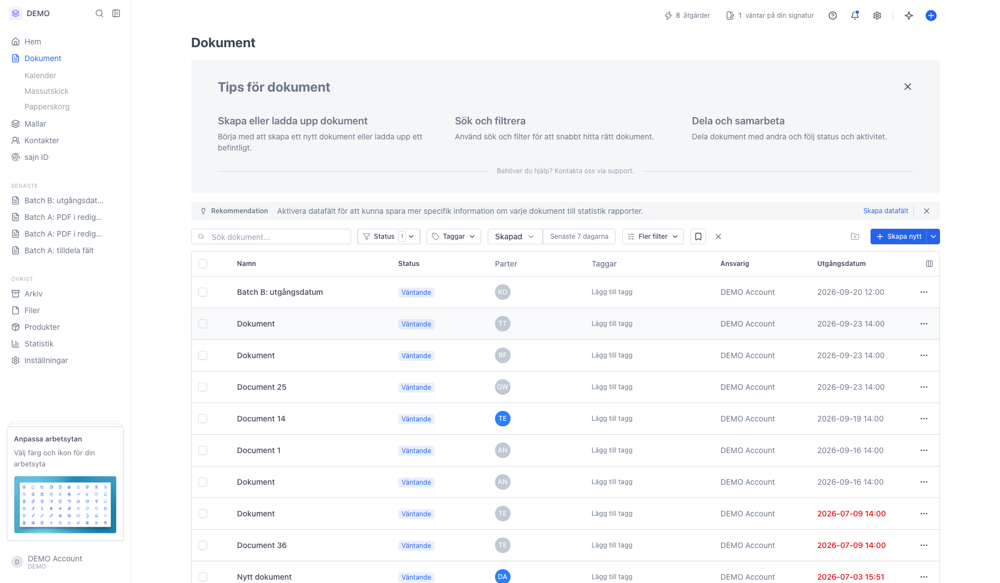
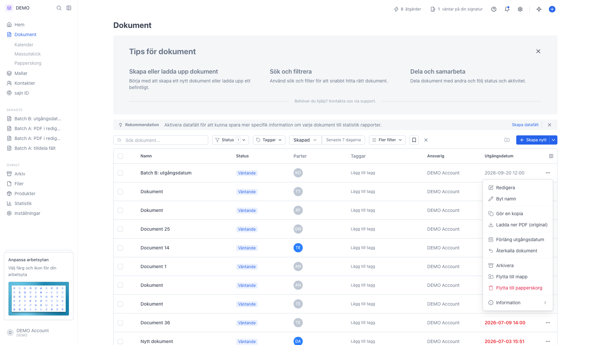
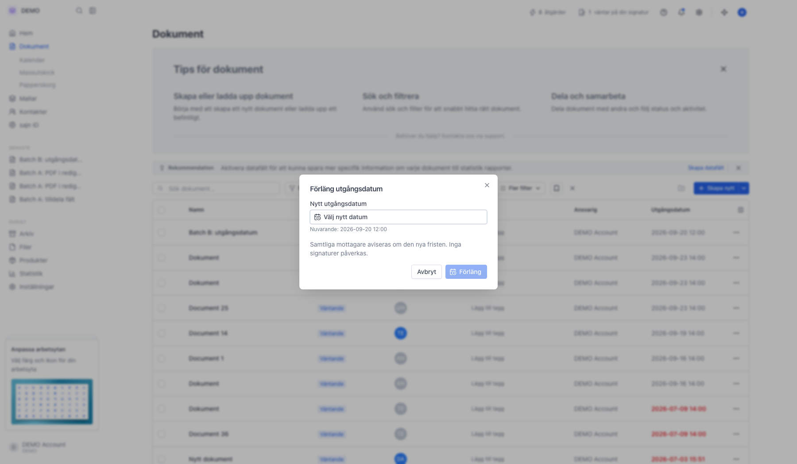
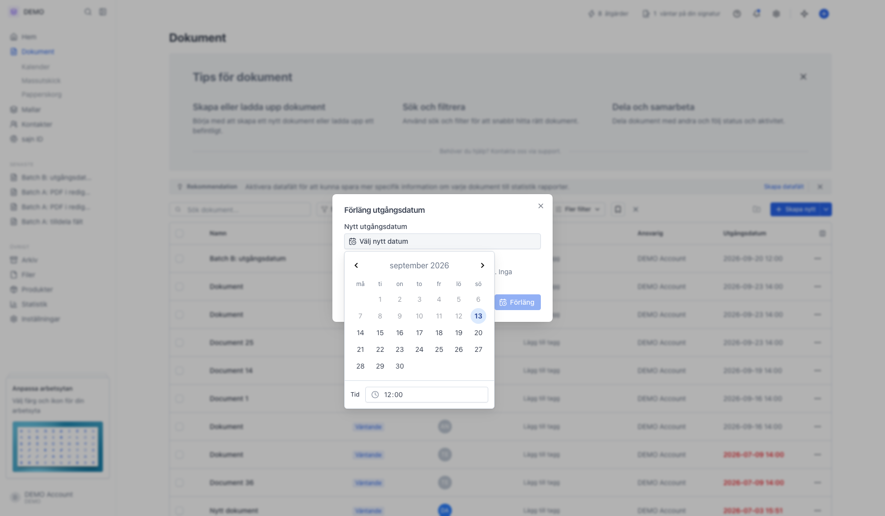
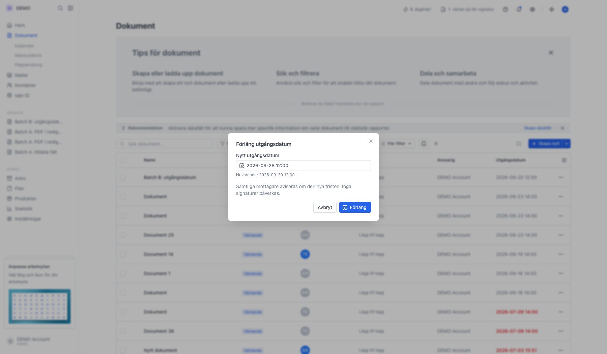

# Förläng utgångsdatum för ett dokument

<!--
slug: forlang-utgangsdatum
audience: Alla användare
last_verified: 2026-09-13
auto-generated from steps.json — edit the spec, then re-run the runner
-->

Ett utskickat dokument som är på väg att gå ut kan få en ny frist utan att skickas om. Guiden utgår från ett dokument i status Väntande.

## Innan du börjar

- Du har minst ett dokument i status Väntande eller Utgången.
- Dokumentet är inte arkiverat.
- Du har behörighet att redigera dokument i arbetsytan.

## Steg

### 1. Filtrera listan på Väntande

Knappen Status högst upp i listan öppnar filtret. Bara dokument i status Väntande eller Utgången går att förlänga — för utkast, signerade, avbrutna och avböjta dokument visas inte alternativet.

### 2. Listan visar bara väntande dokument

Kolumnen Utgångsdatum visar fristen för varje dokument. Ett datum som redan passerat visas i rött.

### 3. Öppna åtgärdsmenyn på dokumentraden

Trepunktsmenyn längst till höger på raden samlar dokumentets åtgärder. För ett väntande dokument finns Förläng utgångsdatum och Återkalla dokument här.

### 4. Dialogen visar nuvarande frist

Raden Nuvarande visar det utgångsdatum som gäller i dag. Knappen Förläng är släckt tills du har valt ett datum som ligger senare än det.

### 5. Välj ett nytt datum i kalendern

Datum som redan har passerat är släckta. Ett datum som ligger före den nuvarande fristen går däremot att klicka på — då säger dialogen till att datumet måste vara senare än det nuvarande. Tiden sätts till kl. 12:00 om du inte ändrar den i fältet Tid.

### 6. Bekräfta med Förläng

Klicka på Förläng för att spara den nya fristen. Samtliga mottagare får ett e-postmeddelande om det nya datumet, även de som redan har signerat.

### 7. Det nya datumet syns i listan

Dokumentet behåller status Väntande och de signaturer som redan finns. Ett dokument som hunnit gå ut går tillbaka till Väntande när du förlänger det.

---

*Senast verifierad: 2026-09-13. Generad av `scripts/guide-runner.ts`.*
