# Skapa ett formulär från en ny mall

<!--
slug: formular-fran-mall
audience: Arbetsyteadministratörer
last_verified: 2026-10-09
auto-generated from steps.json — edit the spec, then re-run the runner
-->

Från tom mall till publicerad länk. Du bygger en mall med fält, gör ett formulär av den, väljer frågorna, publicerar och ser sidan som besökaren möter.

## Innan du börjar

- Du är inloggad i en arbetsyta där du får skapa mallar och hantera formulär.
- Formulär kräver Solo eller högre.

## Steg

### 1. Öppna Mallar och skapa en ny mall

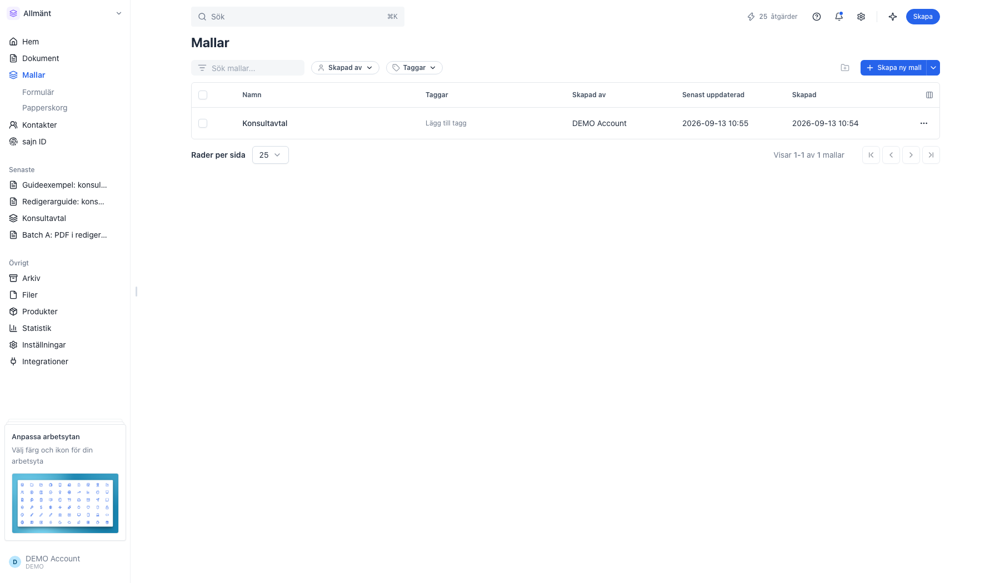

### 2. Ge mallen ett namn

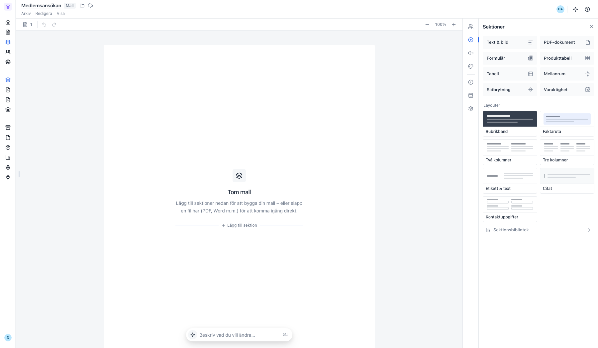

### 3. Lägg till parten som ska fylla i och signera

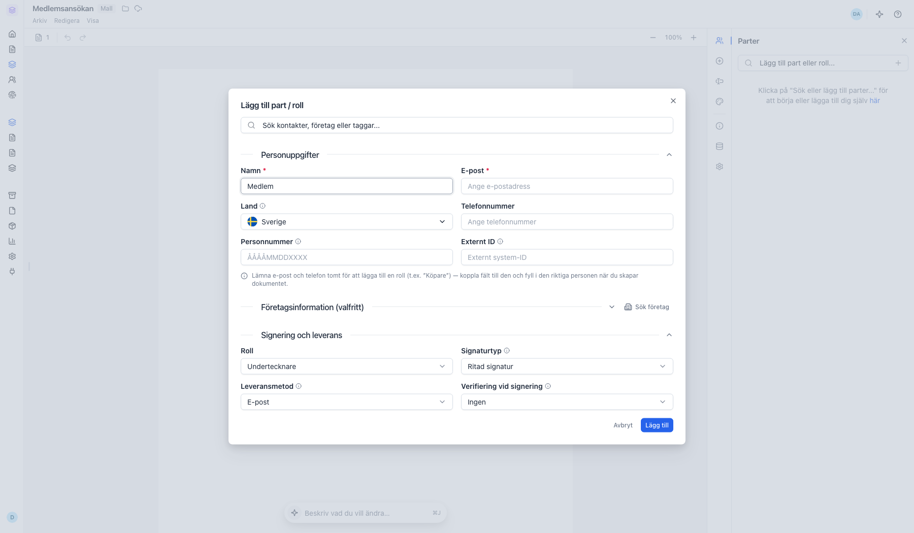

### 4. Lägg till en Formulär-sektion

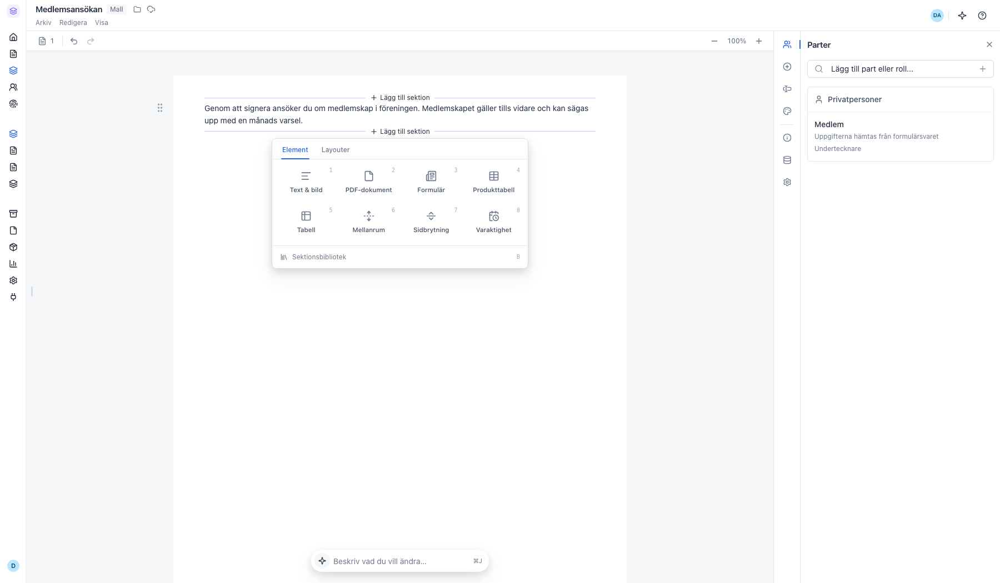

### 5. Etiketten blir fältets nyckel

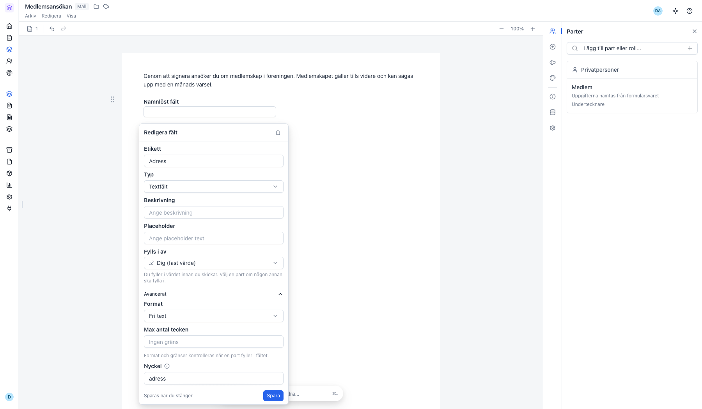

### 6. Mallen är klar

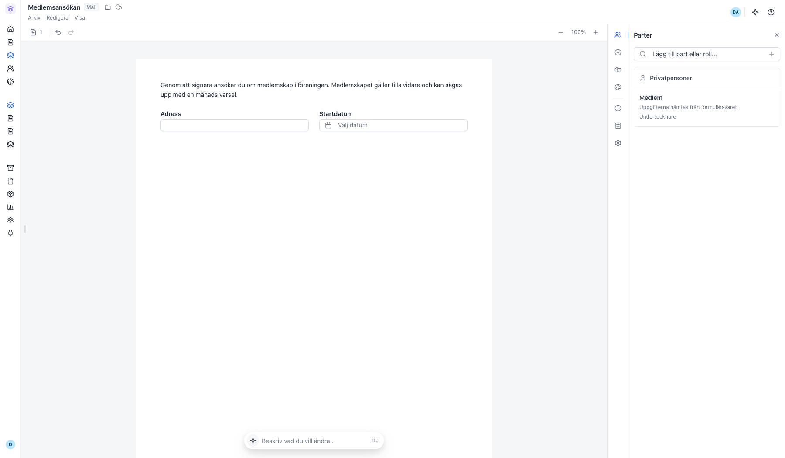

### 7. Öppna Formulär under Mallar

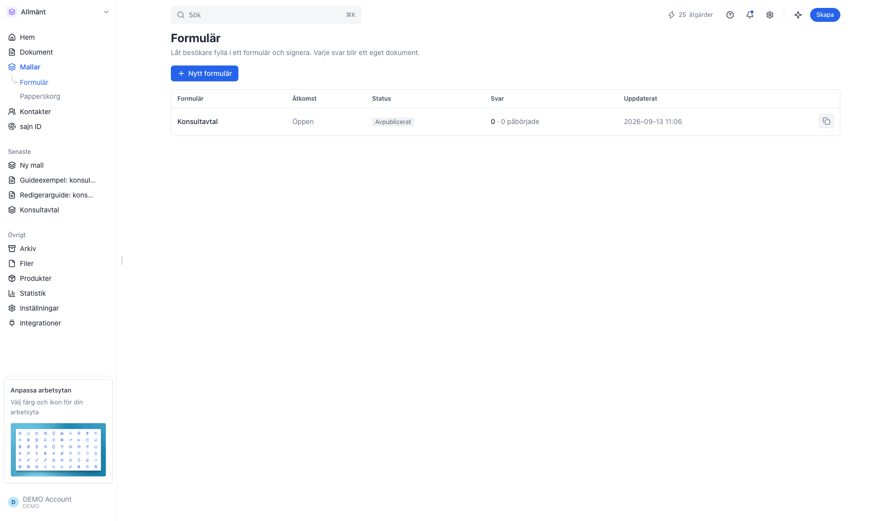

### 8. Välj mallen du just skapade

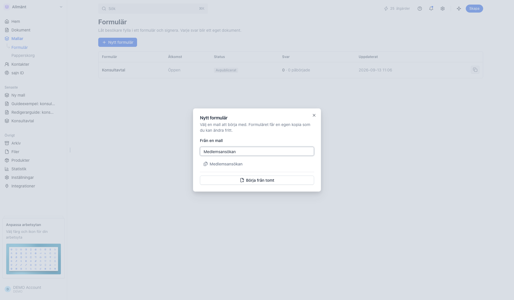

### 9. Översikten visar dokumentet och formuläret

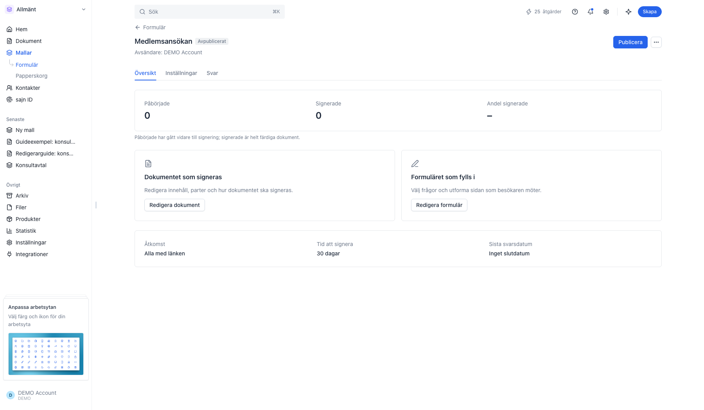

### 10. Mallens fält väntar i formulärbyggaren

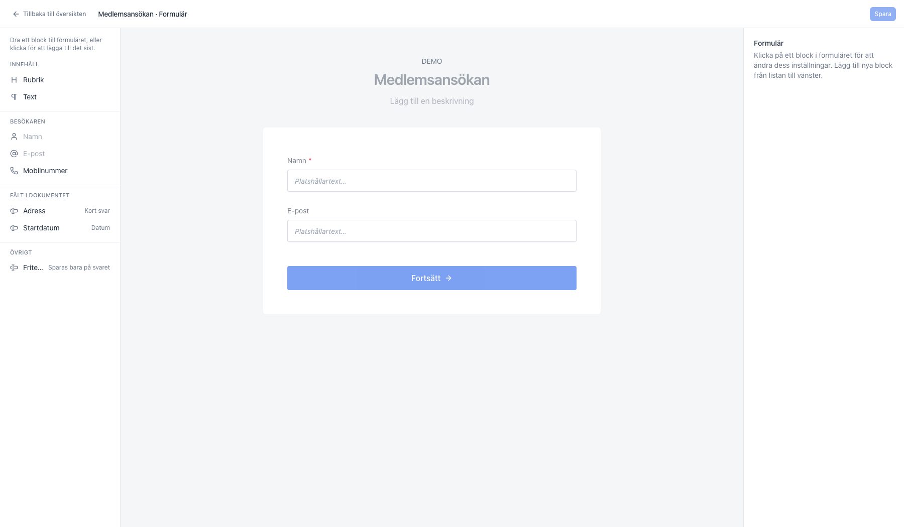

### 11. Klicka på fälten för att lägga till frågorna

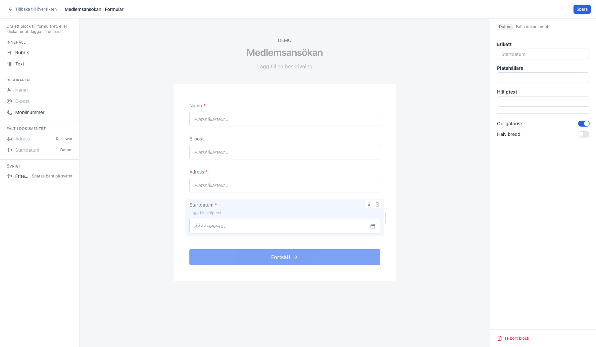

### 12. Publicera och kopiera länken

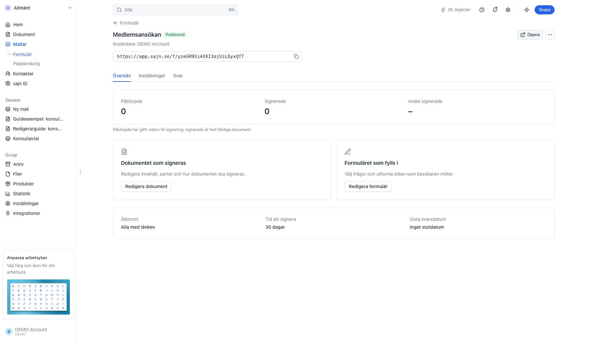

### 13. Så ser formuläret ut för besökaren

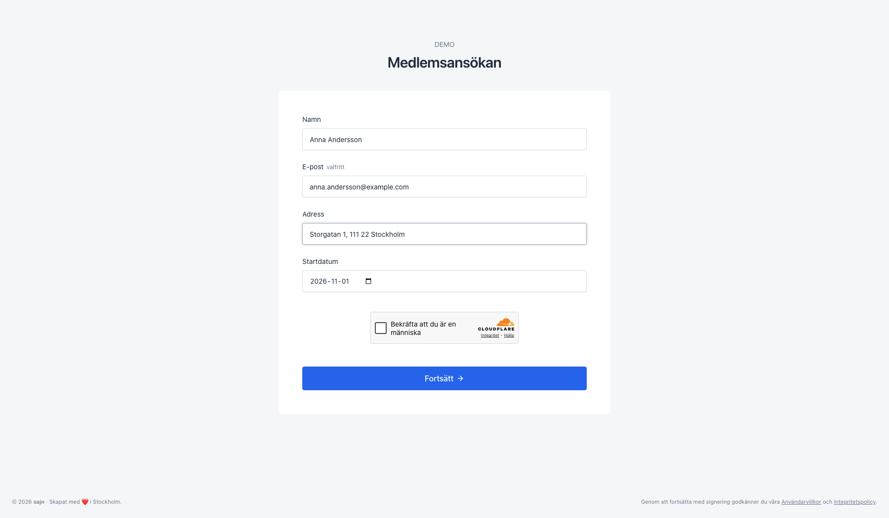

---

*Senast verifierad: 2026-10-09. Generad av `scripts/guide-runner.ts`.*
