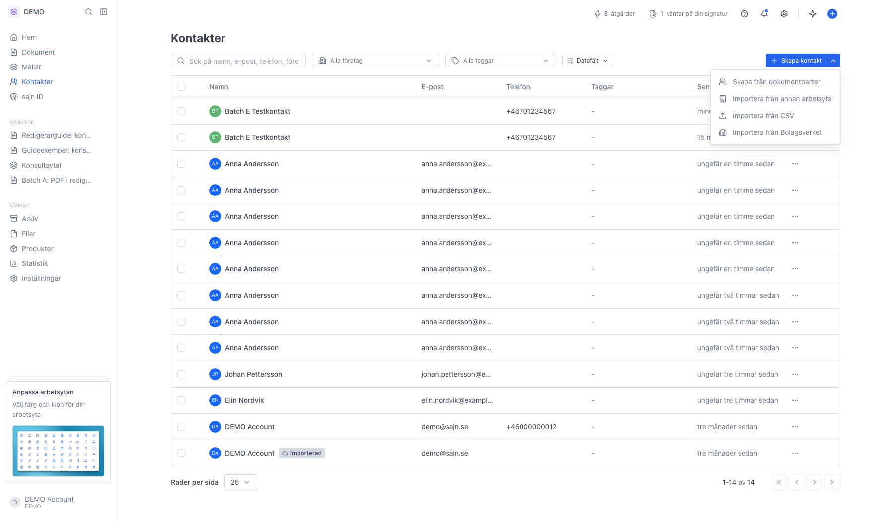
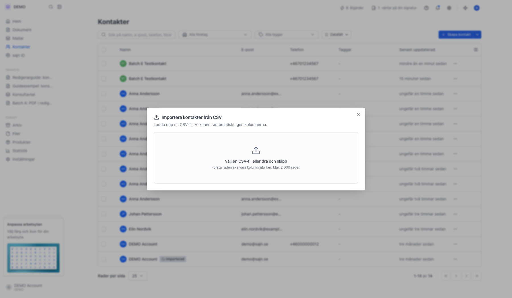
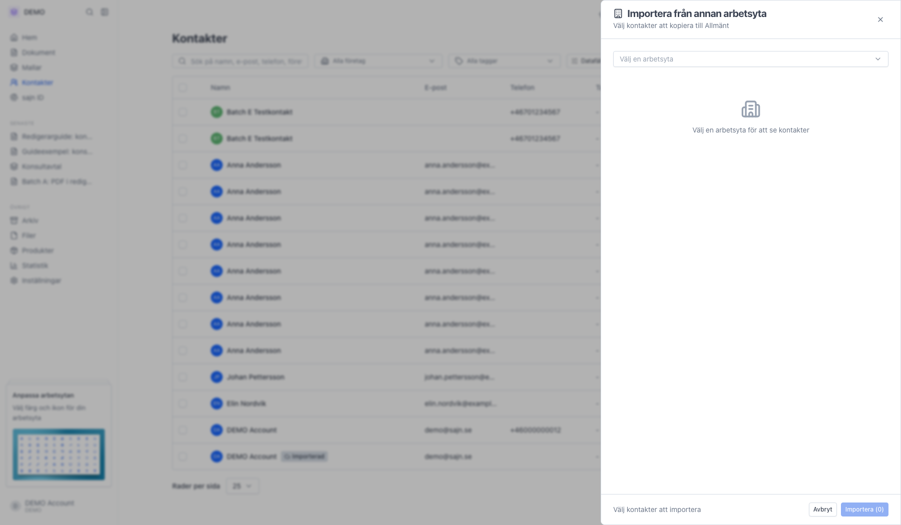
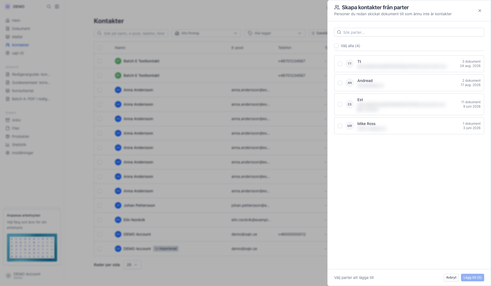
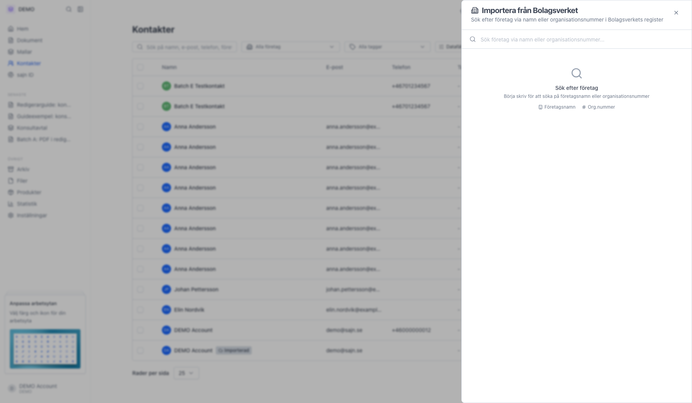

# Importera flera kontakter samtidigt

<!--
slug: import-contacts
audience: Alla användare
last_verified: 2026-09-13
auto-generated from steps.json — edit the spec, then re-run the runner
-->

Ska du fylla en ny arbetsyta eller flytta in ett befintligt register lägger du till kontakterna i klump i stället för en och en. Alla källor sitter i menyn bakom pilen vid Skapa kontakt.

## Innan du börjar

- Du är inloggad och står i arbetsytan som ska ta emot kontakterna.
- Du har behörighet att skapa kontakter i arbetsytan.

## Steg

### 1. Öppna menyn bakom pilen vid Skapa kontakt

Menyn samlar alla sätt att lägga till många kontakter. Överst listas varje installerad integration som har kontakter, till exempel ett CRM. Under dem ligger de fyra källorna som alltid finns.

### 2. Importera från CSV

Du väljer en fil och går igenom två steg: först matchar du filens kolumner mot kontaktfälten, sedan förhandsgranskar du raderna innan importen körs.

### 3. Importera från annan arbetsyta

Först väljer du källarbetsytan, sedan laddas dess kontakter och du kryssar de du vill ha. Bara arbetsytor i samma organisation går att importera från, och kontakter med en e-postadress som redan finns hoppas över automatiskt. Har du inga andra arbetsytor står det här.

### 4. Skapa från dokumentparter

Den här källan plockar upp personer som redan varit parter på era dokument men aldrig sparats som kontakter. Praktiskt när adressboken släpar efter dokumenten.

### 5. Importera från Bolagsverket

Här söker du upp ett företag på namn eller organisationsnummer och lägger till dess företrädare som kontakter. Det är ingen massimport i egentlig mening, men en snabb väg till rätt person på rätt bolag.

---

*Senast verifierad: 2026-09-13. Generad av `scripts/guide-runner.ts`.*
