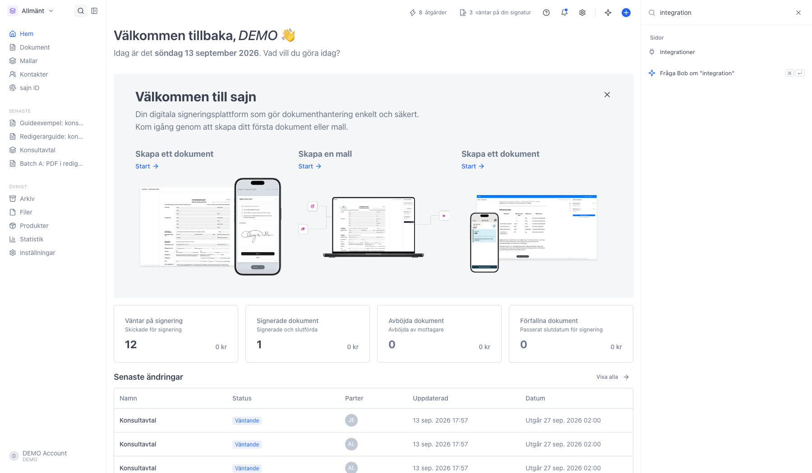
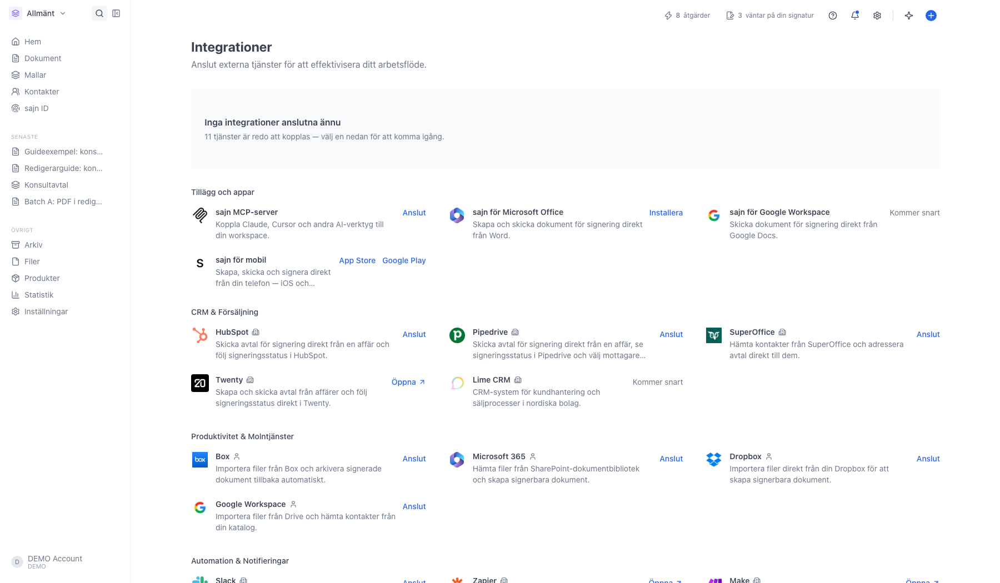
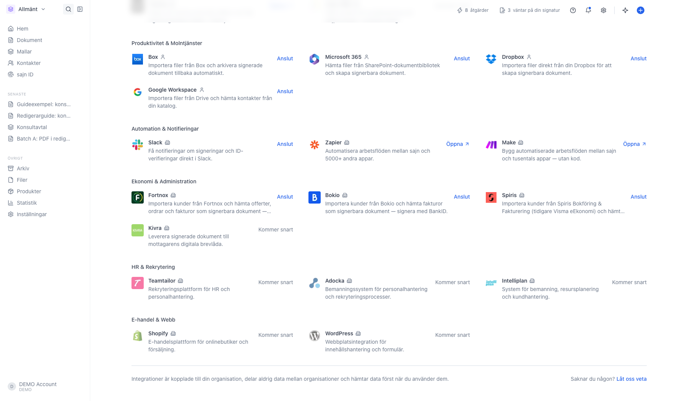
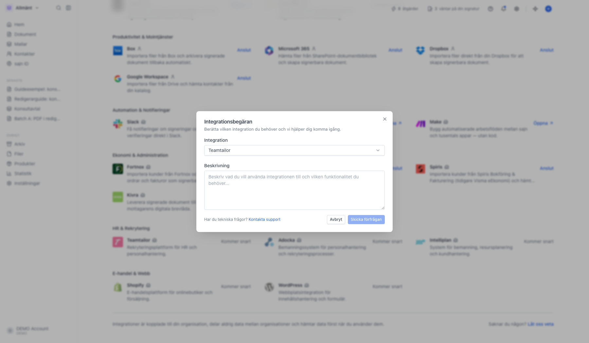
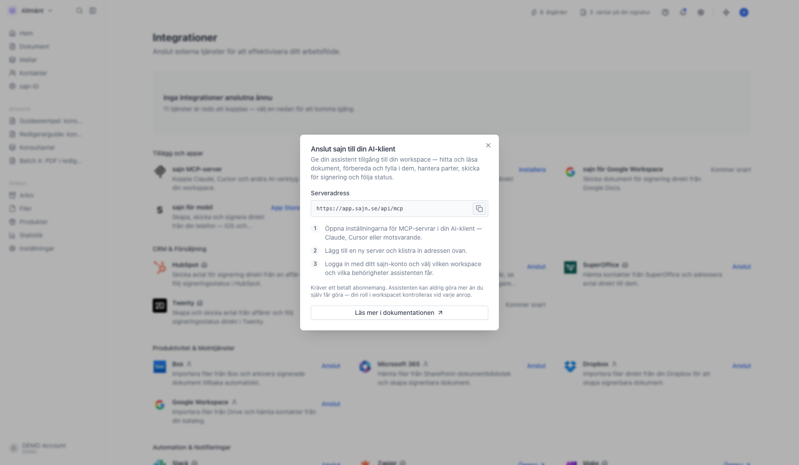
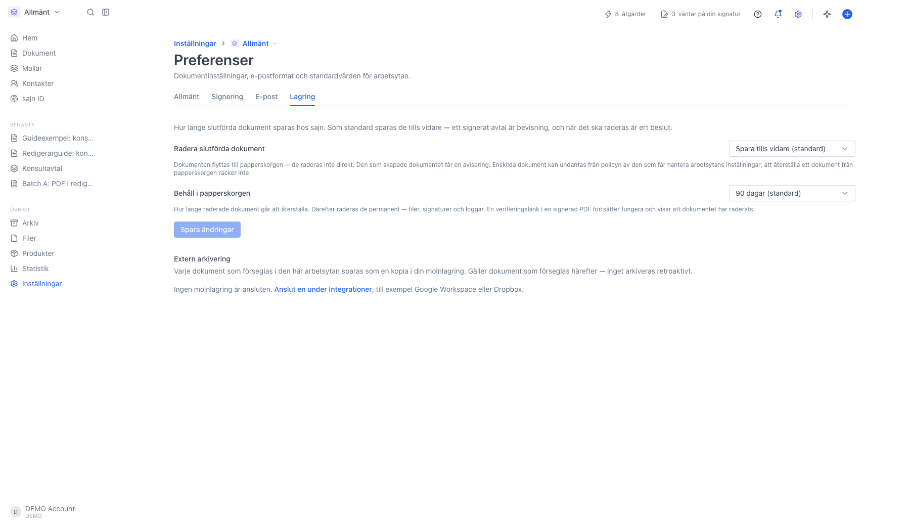

# Anslut en integration

<!--
slug: integrationer
audience: Organisationsadministratörer och medlemmar
last_verified: 2026-09-13
auto-generated from steps.json — edit the spec, then re-run the runner
-->

En integration kopplar ihop sajn med en tjänst du redan använder: ett CRM, en molnlagring, ett bokföringsprogram eller Slack. När kopplingen finns kan du hämta kontakter och filer därifrån i stället för att ladda upp dem manuellt.

Guiden går igenom katalogen, skillnaden mellan en personlig och en organisationsgemensam anslutning, och vad som händer när du klickar Anslut.

## Innan du börjar

- Du är inloggad i sajn och har valt en arbetsyta.
- Integrationer kräver Solo eller högre.
- För att koppla en tjänst som delas av hela organisationen behöver du behörigheten Hantera integrationer.

## Steg

### 1. Hitta Integrationer via sökrutan

Integrationer har ingen egen rad i sidomenyn. Klicka på förstoringsglaset bredvid arbetsytans namn, eller tryck Cmd+K, och skriv integration. Sidan ligger under Sidor i träfflistan.

### 2. Katalogen visar allt du kan koppla på

Rutan högst upp är dina anslutna tjänster. Är den tom står det i stället hur många tjänster som är redo att kopplas. Under den ligger Tillägg och appar, som är sajn inuti andra program, och därefter katalogen sorterad i kategorier.

### 3. Ikonen bakom namnet säger vem kopplingen gäller

En liten figur betyder personlig anslutning: varje medlem kopplar sitt eget konto och ser bara sina egna filer. En byggnad betyder att kopplingen delas av hela organisationen, och då räcker det att någon med behörigheten Hantera integrationer kopplar den en gång. Molntjänsterna är personliga, CRM-systemen och ekonomisystemen är gemensamma.

Rader märkta Kommer snart är inte byggda än, och Öppna betyder att tjänsten kopplas från sin egen sida i stället för härifrån.

### 4. Saknas tjänsten kan du begära den

För muspekaren över en rad märkt Kommer snart så byts märkningen mot Begär. Tjänsten är redan ifylld i rutan. Skriv vad du vill använda den till och klicka Skicka förfrågan. Längst ner på katalogsidan finns Låt oss veta för tjänster som inte står i listan alls.

### 5. MCP-servern kopplas med en adress, inte via katalogen

Kopiera serveradressen och klistra in den i din AI-klient. Du loggar in med ditt sajn-konto och väljer vilken arbetsyta och vilka behörigheter assistenten får. Assistenten kan aldrig göra mer än du själv får göra.

### 6. Molnlagring kan också ta emot färdiga dokument

Har du kopplat en molnlagring kan varje dokument som förseglas i arbetsytan sparas som en kopia där. Det ställs in under Inställningar, Arbetsyta, Preferenser, fliken Lagring. Det gäller framåt: inget arkiveras i efterhand.

---

*Senast verifierad: 2026-09-13. Generad av `scripts/guide-runner.ts`.*
