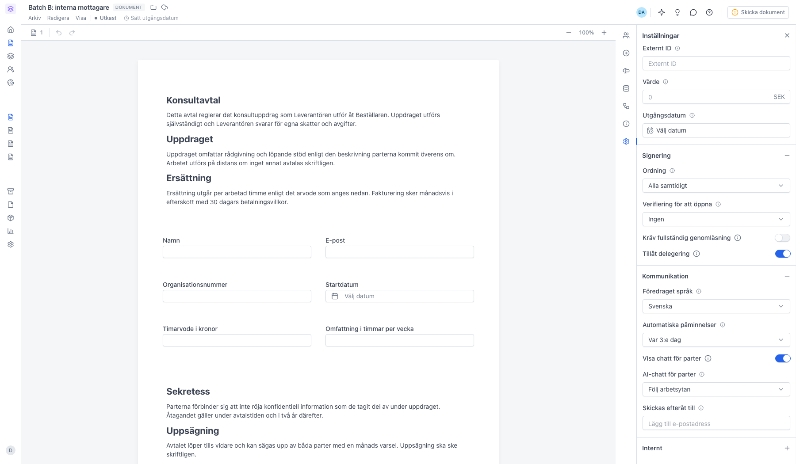
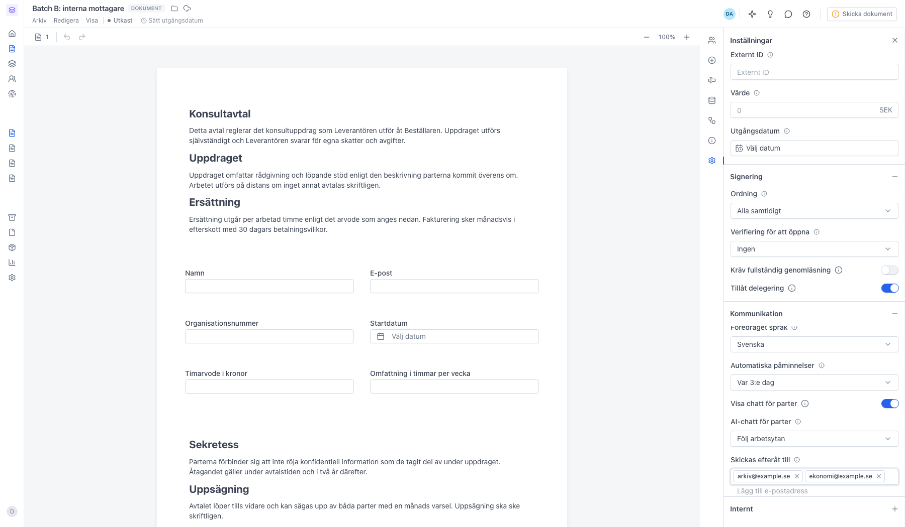

# Lägg till interna mottagare som behöver granska men inte signera

<!--
slug: internal-recipients
audience: Alla användare
last_verified: 2026-09-13
auto-generated from steps.json — edit the spec, then re-run the runner
-->

Interna mottagare får det färdigsignerade dokumentet automatiskt, utan att själva signera. Inställningen heter Skickas efteråt till och ligger i panelen Inställningar.

## Innan du börjar

- Du är inloggad i sajn och har valt en arbetsyta.
- Du har behörighet att redigera dokument i arbetsytan.
- Dokumentet är i status Utkast.

## Steg

### 1. Skickas efteråt till ligger under Kommunikation

Sektionen Kommunikation i panelen Inställningar är hopfälld från start. Fältet Skickas efteråt till är sist i sektionen, under språk, påminnelser och chattinställningar.

### 2. Varje adress blir en egen etikett

Skriv en e-postadress och tryck Enter. Adressen läggs till som en etikett i fältet och sparas automatiskt. Krysset på etiketten tar bort adressen igen. Du kan ha högst fem interna mottagare per dokument.

---

*Senast verifierad: 2026-09-13. Generad av `scripts/guide-runner.ts`.*
