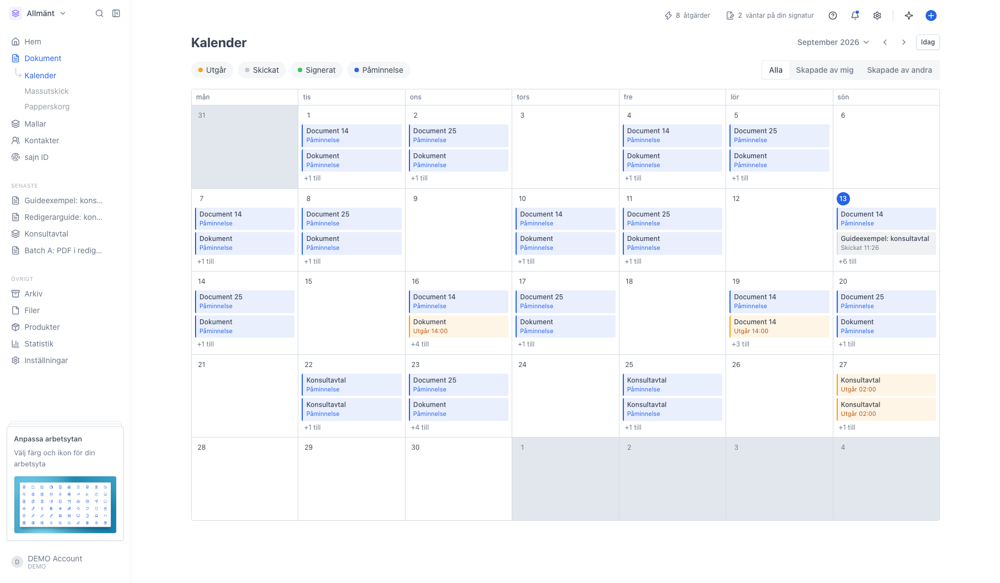
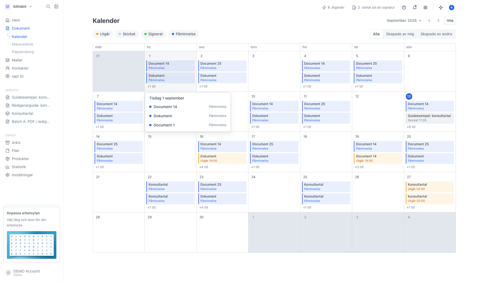
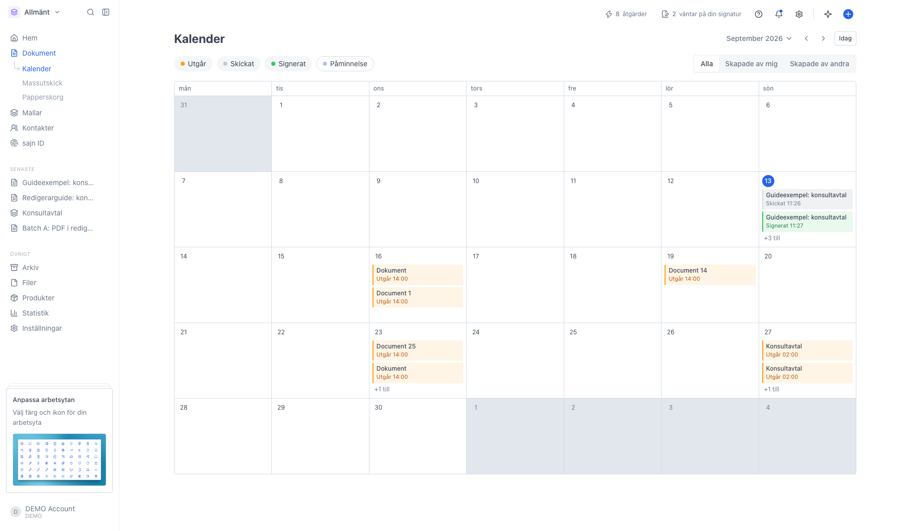
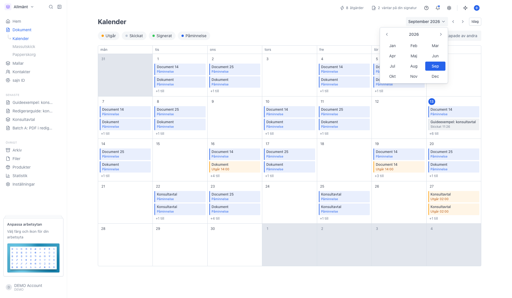

# Kalendern

<!--
slug: kalender
audience: Alla som arbetar med dokument i arbetsytan
last_verified: 2026-09-13
auto-generated from steps.json — edit the spec, then re-run the runner
-->

Kalendern visar arbetsytans dokument som händelser i en månadsvy: när ett dokument skickades, när det signerades, när nästa påminnelse går ut och vilken dag det slutar gälla. Den svarar på frågan vad som händer den här månaden, medan dokumentlistan svarar på vad som finns.

## Innan du börjar

- Du är inloggad i sajn och har valt en arbetsyta.
- Arbetsytan har skickade dokument. Utkast syns inte i kalendern.

## Steg

### 1. Öppna Kalender under Dokument

Varje ruta i månaden är en dag, och varje färgad rad är en händelse på ett dokument. Dagens datum är markerat. Klicka på en händelse för att öppna dokumentet.

Färgen säger vilken sorts händelse det är: grått för skickat, grönt för signerat, blått för påminnelse och gult för sista dag. Ett utgångsdatum som redan passerat blir rött.

### 2. Dagar med många händelser öppnas i en ruta

En dagruta visar två händelser. Finns det fler står det plus så och så många till längst ner. Klicka på dagen så listas allt som händer den dagen, med tid och dokumentnamn.

### 3. Släck de händelsetyper du inte vill se

Knapparna överst tänder och släcker en typ i taget. Påminnelser är ofta flest, så att släcka dem gör månaden lättläst när du vill se vad som signerats eller vad som går ut.

Till höger väljer du vems dokument som ska visas: alla i arbetsytan, bara dina egna eller bara andras. Kalendern visar aldrig dokument du inte har rätt att se, så en kollegas privata dokument syns inte här.

### 4. Hoppa till en annan månad

Klicka på månadsnamnet för att välja månad och år direkt. Pilarna bläddrar en månad i taget och Idag tar dig tillbaka till den här månaden.

---

*Senast verifierad: 2026-09-13. Generad av `scripts/guide-runner.ts`.*
