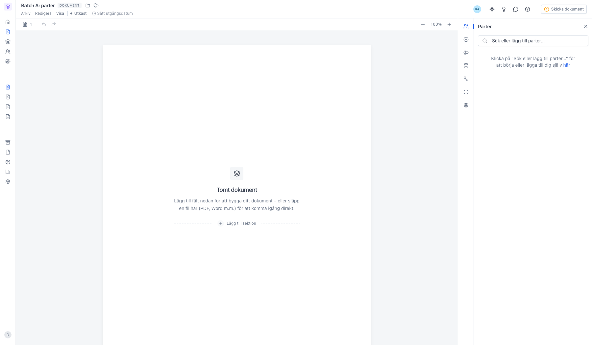
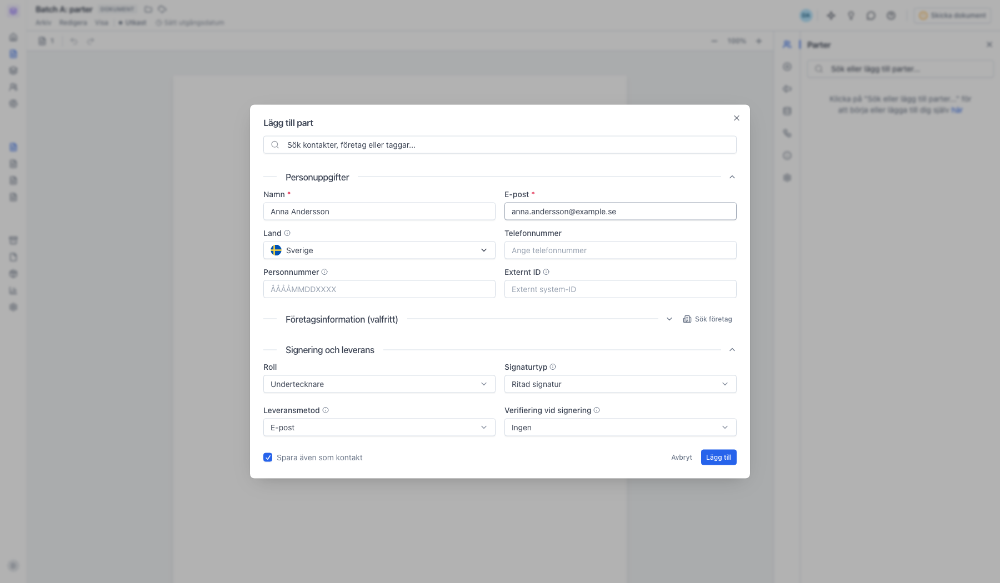
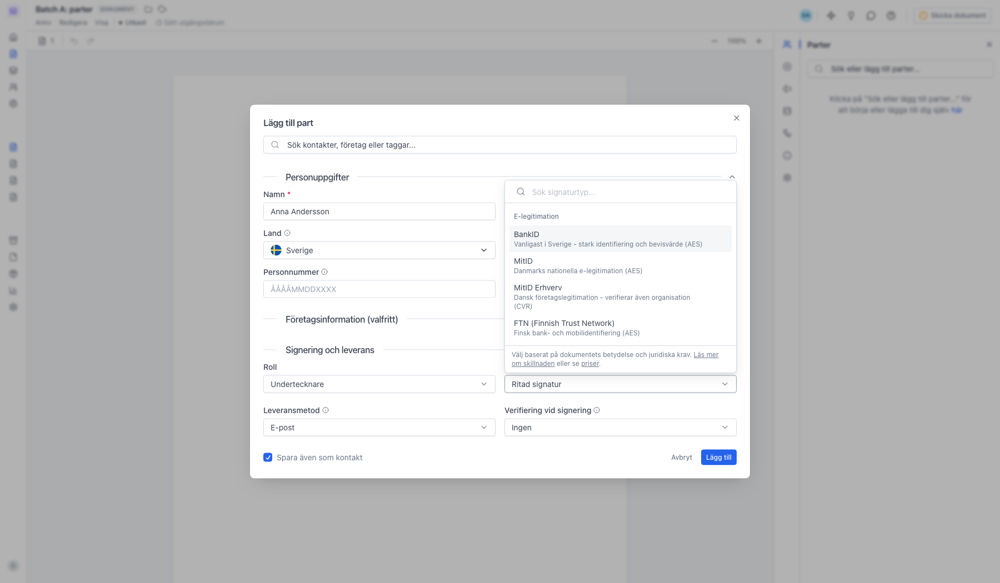
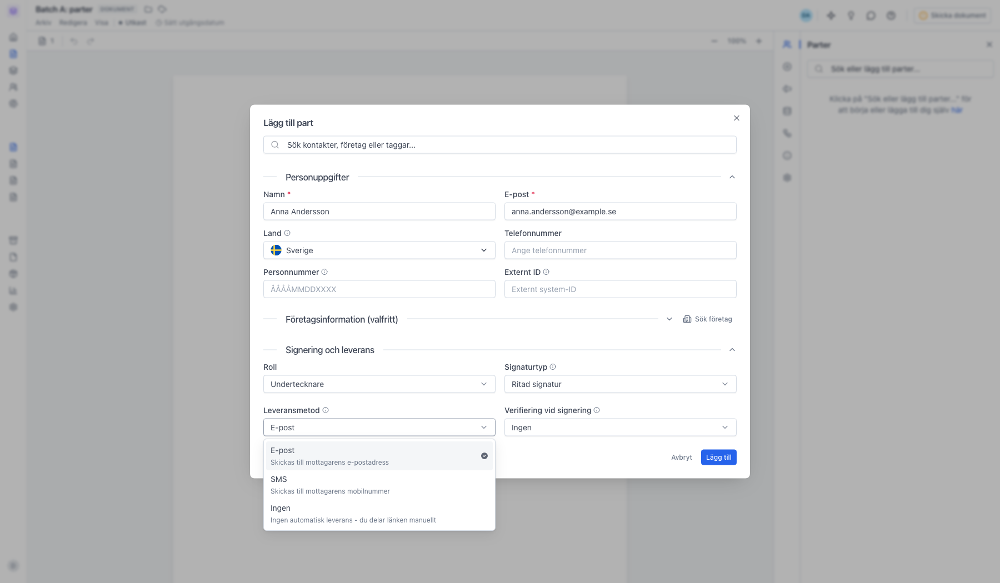
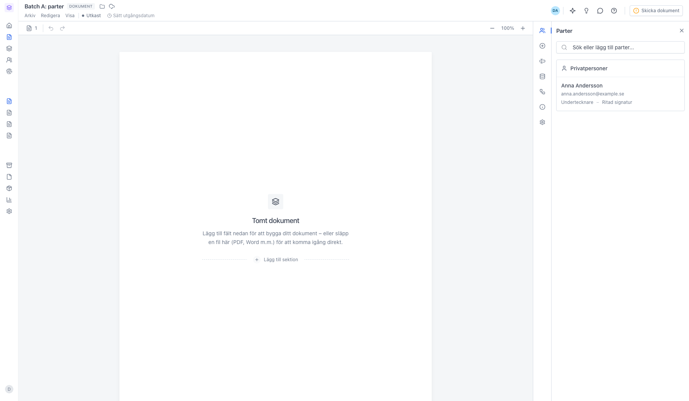
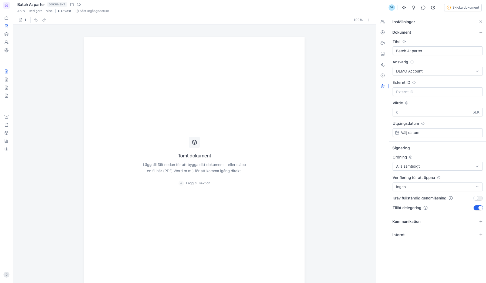

# Lägg till en part

<!--
slug: lagg-till-part
audience: Alla användare
last_verified: 2026-09-13
auto-generated from steps.json — edit the spec, then re-run the runner
-->

En part är någon som ska signera, godkänna, granska eller bara få en kopia av dokumentet. Parterna lägger du till i panelen Parter medan dokumentet är ett utkast.

## Innan du börjar

- Du är inloggad i sajn och har valt en arbetsyta.
- Du har ett dokument i status Utkast.

## Steg

### 1. Parter ligger i panelen till höger

Redigeraren öppnas på Parter. Parterna går bara att ändra så länge dokumentet är ett utkast. Klicka på Sök eller lägg till parter… för att komma igång, eller på här för att lägga till dig själv.

### 2. Fyll i partens uppgifter

Namn och e-post är det enda som krävs. Sökfältet högst upp hämtar en befintlig kontakt, ett företag eller en hel tagg. Under Personuppgifter finns också land, telefonnummer, personnummer och ett externt ID för egna system. Företagsinformation är valfritt — där kan du hämta uppgifterna via Sök företag på organisationsnummer.

### 3. Signaturtyp avgör hur parten skriver under

Listan är uppdelad i två grupper. Under E-legitimation ligger BankID för Sverige, MitID för Danmark, FTN för Finland och motsvarigheterna i övriga länder — signeraren identifierar sig med sin e-legitimation. Längre ner i listan ligger Enkel signatur med Klicksignering och Ritad signatur, som är snabbare men ger en enklare signatur. Vilka val som finns beror på arbetsytans regler och din plan.

### 4. Leveransmetod styr hur länken når parten

E-post skickar signeringslänken till adressen du fyllt i, SMS skickar den till telefonnumret, och Ingen betyder att du själv delar länken. Leveransmetod och signaturtyp är två olika saker: en part kan få länken via SMS och ändå signera med BankID.

### 5. Parten visas med roll och signaturtyp

Raden visar namn, e-post, roll och vald signaturtyp. Klicka på parten för att ändra uppgifterna, eller lägg till fler på samma sätt. Hur många parter du får bjuda in per dokument beror på din plan.

### 6. Signeringsordningen sätts på dokumentet

Ordningen är inte en partsinställning utan en dokumentinställning. Under Signering väljer du om alla parter ska kunna signera samtidigt eller i tur och ordning. Med ordning påslagen får nästa part sin länk först när föregående har signerat, och då kan du dra parterna i rätt ordning i panelen Parter.

---

*Senast verifierad: 2026-09-13. Generad av `scripts/guide-runner.ts`.*
