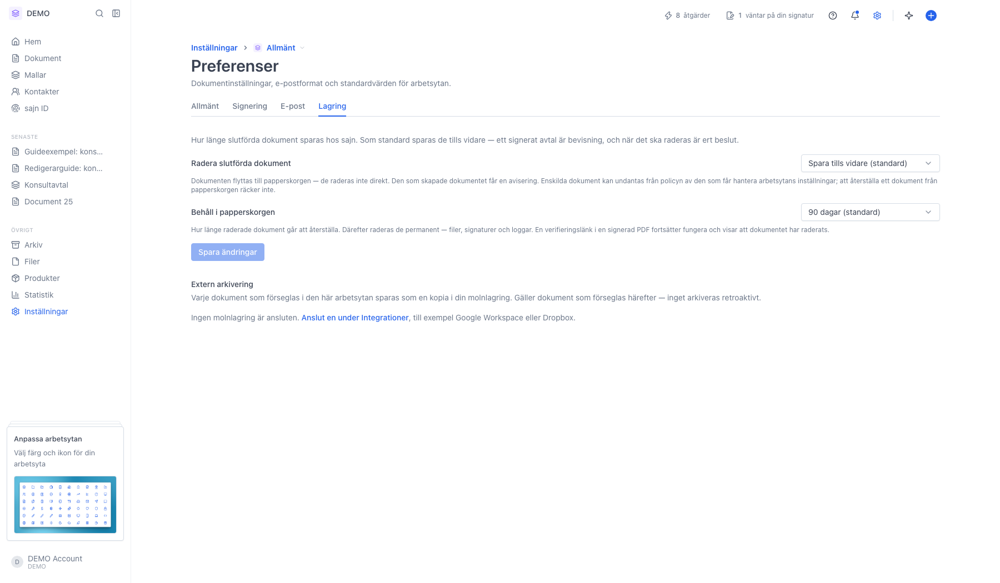
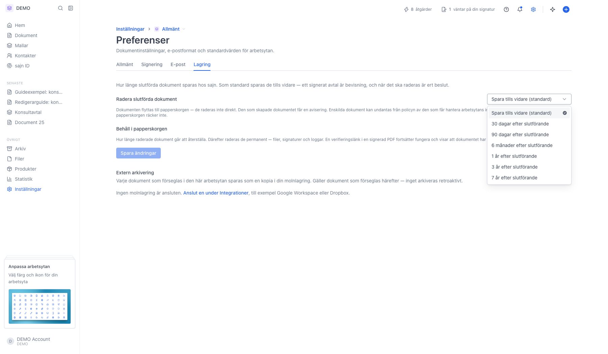
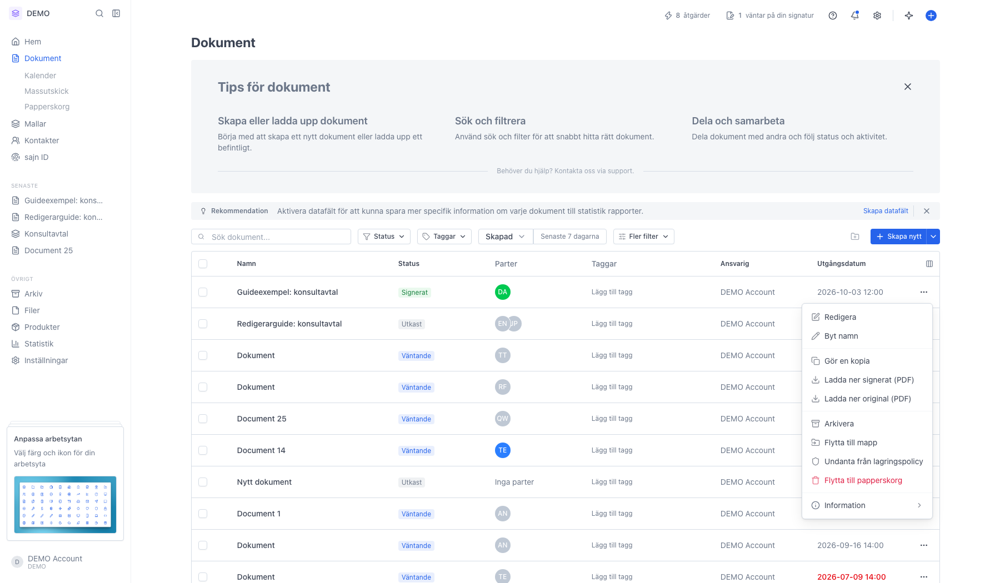

# Lagring och radering av dokument

<!--
slug: lagring-och-radering
audience: Arbetsyteadministratörer
last_verified: 2026-09-13
auto-generated from steps.json — edit the spec, then re-run the runner
-->

Skärmdumpar till guiden Lagring och radering av dokument: fliken Lagring under Preferenser, valen av lagringstid, och undantaget som skyddar ett enskilt dokument från policyn. Körningen sparar ingenting.

## Innan du börjar

- Du är inloggad i en arbetsyta där du får hantera arbetsytans inställningar.

## Steg

### 1. Fliken Lagring under Preferenser

Lagringspolicyn ligger under Inställningar, Preferenser och fliken Lagring. Sidan har två tider: hur länge slutförda dokument sparas, och hur länge de ligger kvar i papperskorgen efteråt.

### 2. Välj hur länge slutförda dokument ska sparas

Spara tills vidare är standard. De övriga tiderna räknas från att dokumentet slutfördes, och flyttar dokumentet till papperskorgen när tiden gått ut.

### 3. Undanta ett enskilt dokument från policyn

Radens meny i dokumentlistan har Undanta från lagringspolicy på slutförda dokument. Ett undantaget dokument sparas tills vidare, oavsett vad policyn säger.

---

*Senast verifierad: 2026-09-13. Generad av `scripts/guide-runner.ts`.*
