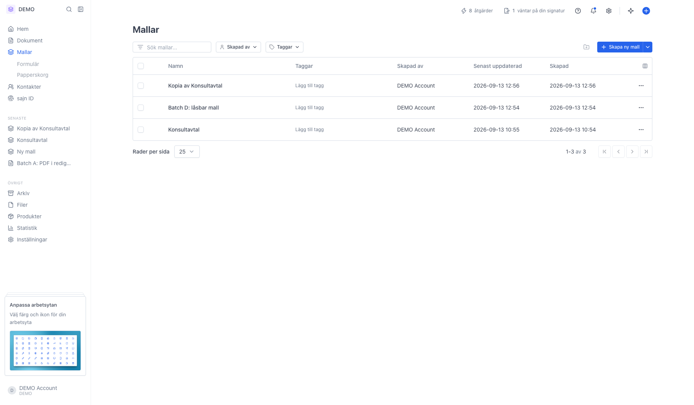
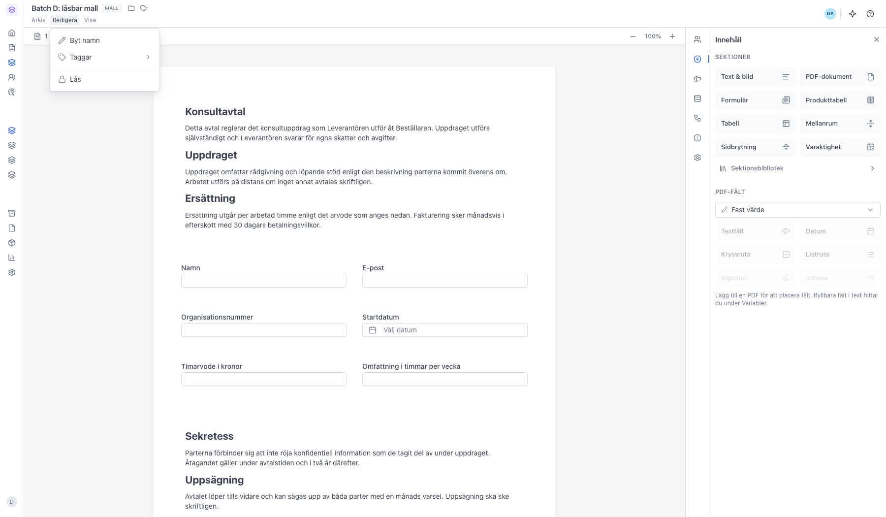
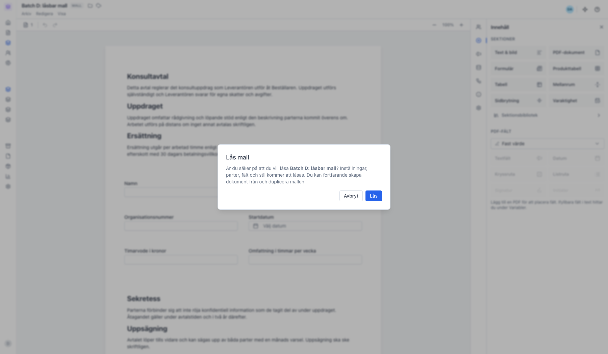
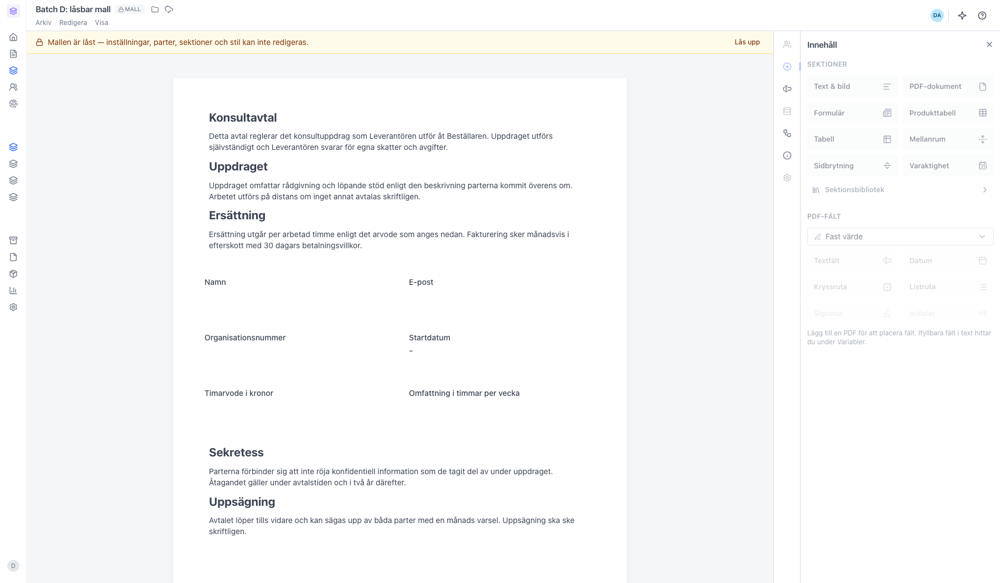
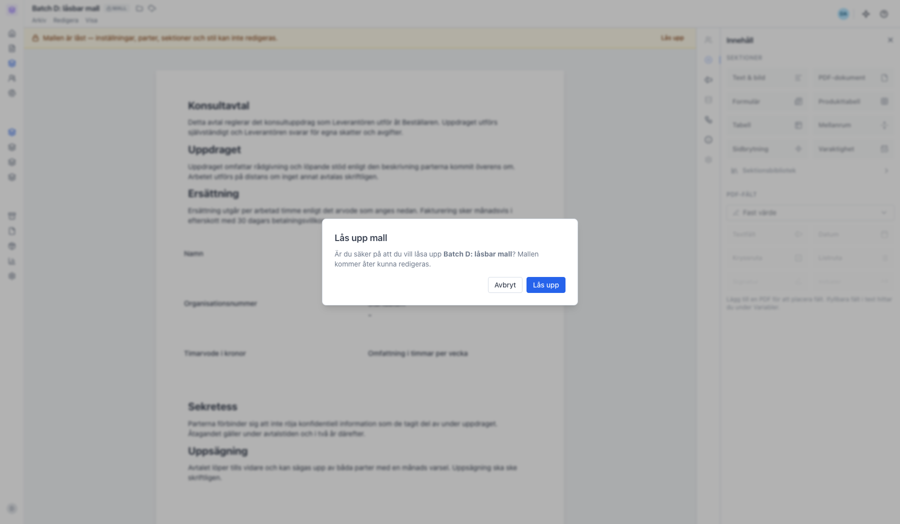

# Lås en mall så ingen ändrar den av misstag

<!--
slug: lock-template
audience: Arbetsyteadministratörer
last_verified: 2026-09-13
auto-generated from steps.json — edit the spec, then re-run the runner
-->

En låst mall går fortfarande att använda för nya dokument, men själva mallen kan inte redigeras förrän någon låser upp den.

## Innan du börjar

- Du har behörigheten Lås mall i arbetsytan.

## Steg

### 1. Öppna Mallar och välj mallen du vill låsa

### 2. Lås ligger längst ner i Redigera-menyn

### 3. Bekräfta i dialogen Lås mall

### 4. Den låsta mallen får en banner högst upp

### 5. Lås upp går via samma dialog

---

*Senast verifierad: 2026-09-13. Generad av `scripts/guide-runner.ts`.*
