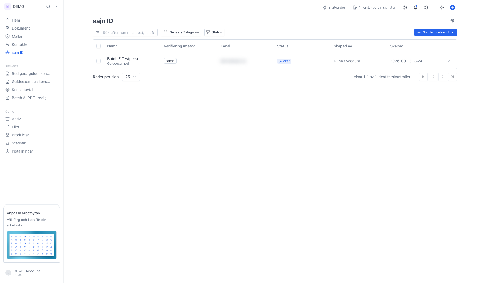
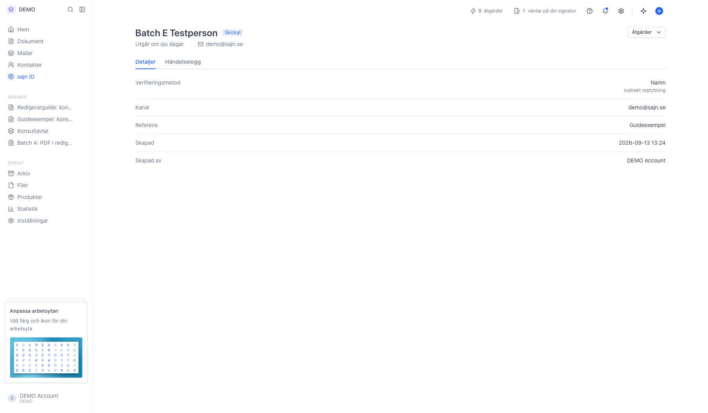
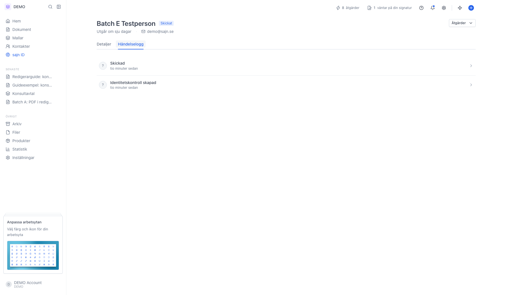
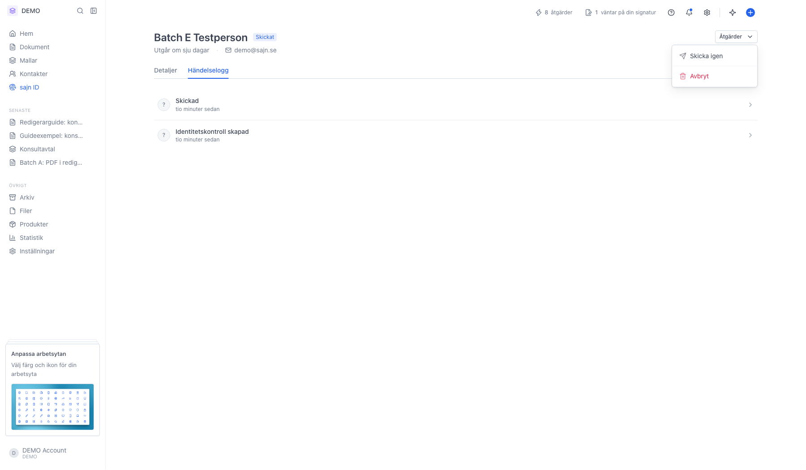

# Följ upp en identitetskontroll

<!--
slug: manage-sajn-id
audience: Alla med behörighet att se sajn ID
last_verified: 2026-09-13
auto-generated from steps.json — edit the spec, then re-run the runner
-->

En identitetskontroll du redan skickat går att öppna när som helst: läsa vad BankID svarade, följa händelseloggen och skicka länken igen eller avbryta den.

## Innan du börjar

- Du är inloggad och har valt en arbetsyta.
- Du har behörigheten Visa sajn-id. Skicka igen och Avbryt kräver Hantera sajn-id.
- Arbetsytan har minst en identitetskontroll.

## Steg

### 1. Statuskolumnen ger lägesbilden

Väntande betyder att kontrollen är skapad men inte skickad, Skickat att länken gått iväg, Öppnat att mottagaren klickat på den, Verifierat att BankID-flödet är klart, Misslyckades att verifieringen avbröts eller inte matchade, Utgången att utgångsdatumet passerat och Avbrutet att någon återkallade kontrollen. Referensen står under namnet. Kryssrutorna längst till vänster låter dig skicka igen eller avbryta flera på en gång.

### 2. Fliken Detaljer visar uppgifterna och resultatet

Verifieringsmetod är antingen Namn med indirekt matchning eller Personnummer med direkt matchning. Kanal visar adressen eller numret länken gick till. Är kontrollen verifierad står BankID:s svar här, och för misslyckade eller utgångna kontroller står anledningen i stället. Överst syns status och när länken slutar gälla.

### 3. Händelseloggen är kontrollens hela historik

Varje viktig händelse listas med den senaste överst: skapad, skickad, öppnad, verifierad eller misslyckad. Klicka på en rad för att fälla ut tidpunkt, händelse-ID, IP-adress och enhet. Loggen går inte att ändra eller ta bort i efterhand, och det är den som ger kontrollen sitt bevisvärde.

### 4. Åtgärder skickar länken igen eller avbryter kontrollen

Skicka igen skickar samma länk en gång till på samma kanal. Avbryt återkallar kontrollen så att länken slutar fungera. Båda är gråmarkerade när kontrollen redan är avslutad, alltså verifierad, misslyckad, utgången eller avbruten.

---

*Senast verifierad: 2026-09-13. Generad av `scripts/guide-runner.ts`.*
