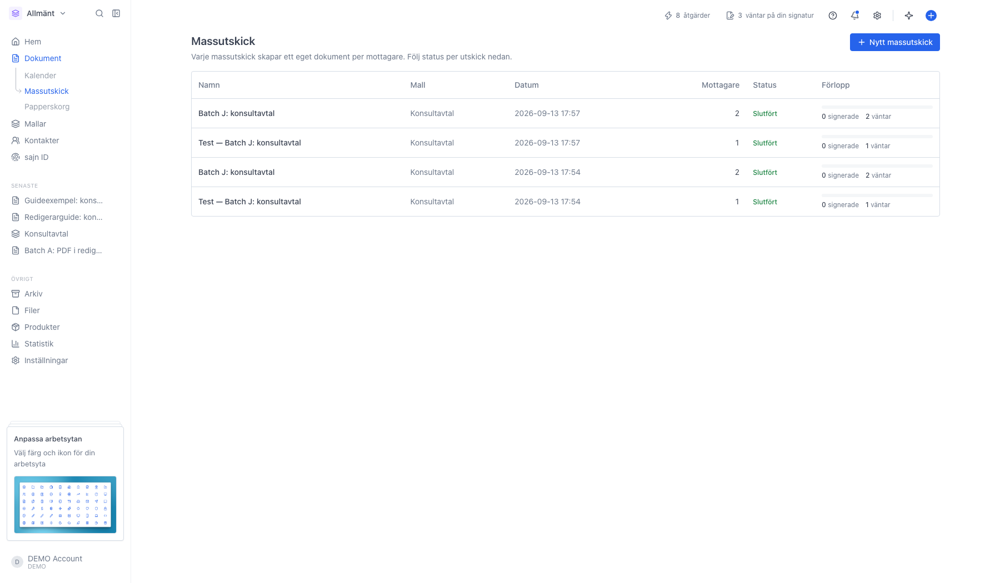
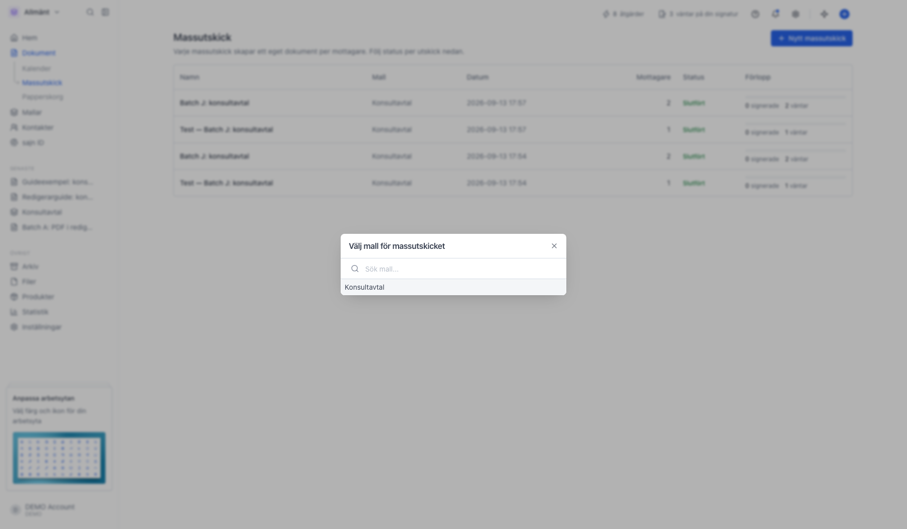
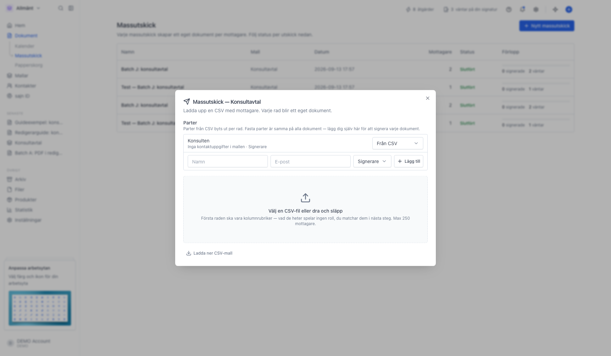
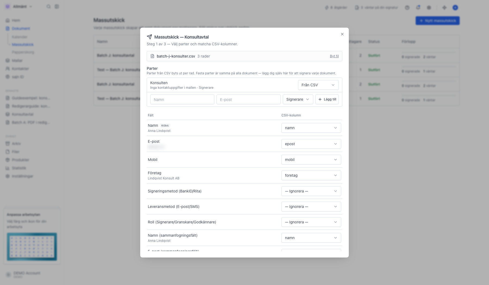
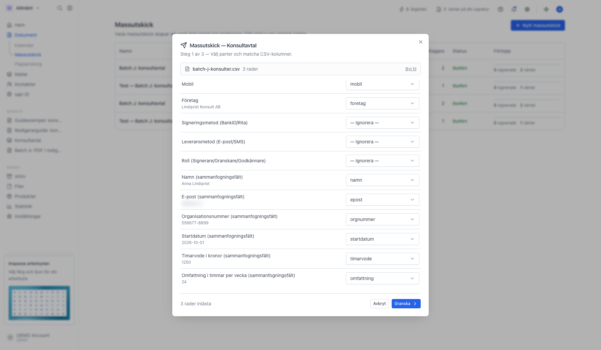
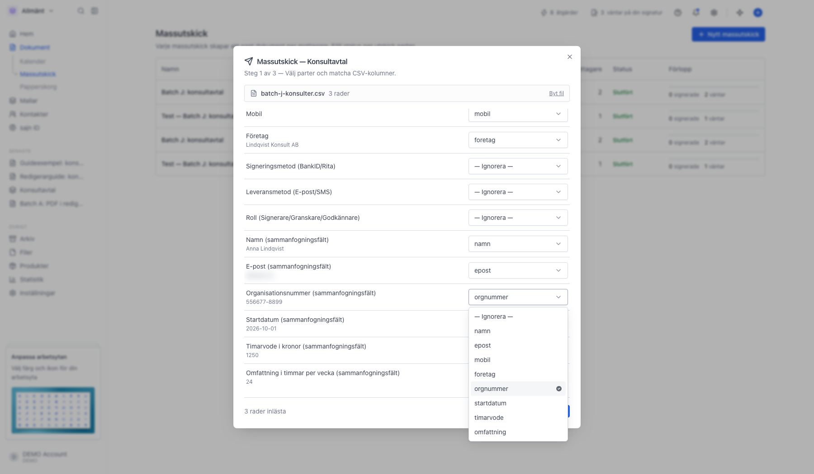
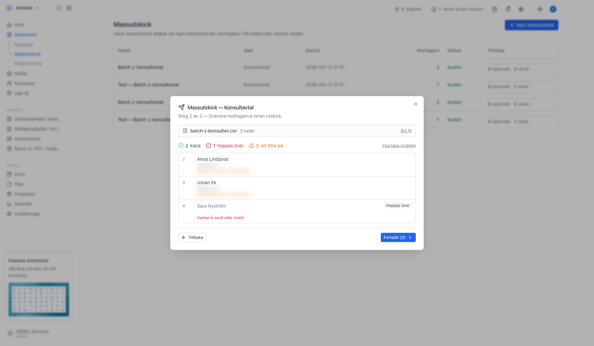
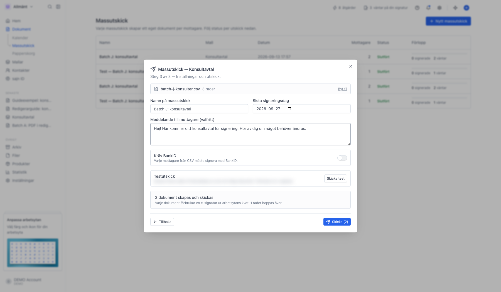
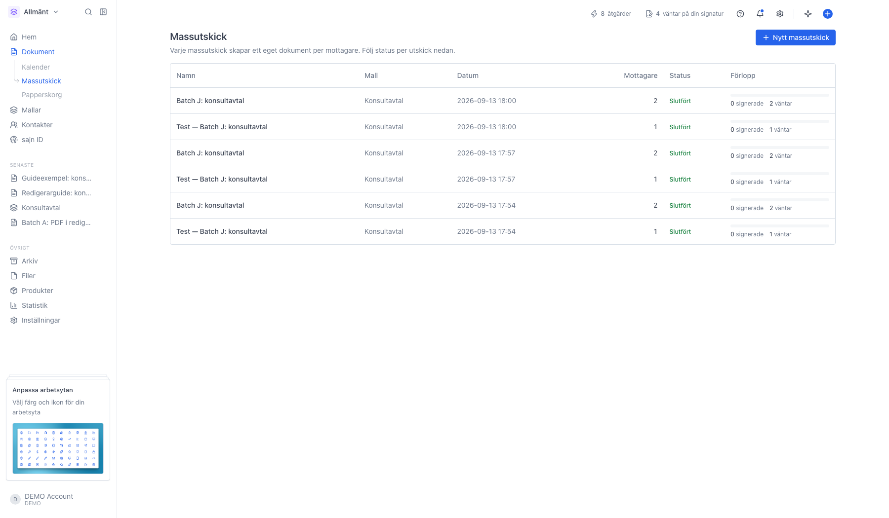

# Skicka ett massutskick

<!--
slug: massutskick
audience: Den som skickar dokument i arbetsytan
last_verified: 2026-09-13
auto-generated from steps.json — edit the spec, then re-run the runner
-->

Ett massutskick tar en mall och en fil med mottagare, och skapar ett eget dokument per rad. Varje mottagare får sin egen inbjudan och signerar sitt eget dokument. Kolumnerna i filen kopplas till mallens fält, så samma avtal går ut med olika uppgifter i texten.

## Innan du börjar

- Du är inloggad i en arbetsyta där du får skapa och skicka dokument utan godkännande.
- Du har en mall att skicka. Mallens fält behöver nycklar för att kunna fyllas från filen.
- Massutskick kräver Solo eller högre.

## Steg

### 1. Öppna Massutskick under Dokument

Sidan listar utskicken du gjort, med mallen de utgår från, antal mottagare och hur långt de kommit. Ett nytt utskick startar du uppe till höger.

### 2. Välj mallen som ska skickas

Alla mallar i arbetsytan går att skicka som massutskick. Vi väljer Konsultavtal.

### 3. Bestäm vilka parter som kommer från filen

Mallens parter listas överst. Från CSV betyder att parten byts ut för varje rad, alltså mottagaren. Fast part betyder samma person på alla dokument, till exempel du själv som motpart. Behöver du en part till på varje dokument lägger du till den på raden längst ner.

Ladda ner CSV-mall ger en fil där rubrikraden redan är de kolumner utskicket känner igen. Fyll i den i Excel eller Google Kalkylark och ladda upp den här. Max 250 mottagare per utskick.

### 4. Matcha filens kolumner mot fälten

Vänsterkolumnen är vad utskicket kan fylla, högerkolumnen är vilken kolumn i din fil som ska användas. Kolumner som heter samma sak som fältet matchas automatiskt, resten väljer du själv. Under varje matchad rad visas värdet från filens första rad, så du ser direkt att rätt kolumn hamnat rätt.

Namn är det enda som krävs. Fält du inte vill fylla lämnar du på Ignorera.

### 5. Sammanfogningsfälten är mallens egna fält

Raderna märkta sammanfogningsfält är fälten i mallen som har en nyckel. Värdet i filen skrivs in i dokumentets fält med den nyckeln, så varje mottagare får sitt eget organisationsnummer, startdatum och timarvode i avtalstexten. Fält utan nyckel kan inte fyllas från en fil.

### 6. Välj kolumn själv när namnen inte stämmer

Heter kolumnen i ditt kalkylark något annat än fältets nyckel hittas den inte automatiskt. Öppna listan på raden och peka ut rätt kolumn. Listan innehåller alla rubriker i filen.

### 7. Granska raderna innan du skickar

Varje rad kontrolleras innan något skickas. Klara rader skickas. Rader med fel hoppas över, till exempel om namnet saknas eller om varken e-post eller mobilnummer finns. Gula rader skickas, men är värda en titt: samma e-postadress på flera rader är oftast ett misstag.

Siffran till vänster är radnumret i filen, så du hittar tillbaka till rätt rad i kalkylarket. Visa bara problem filtrerar listan när filen är lång.

### 8. Namnge utskicket och sätt sista signeringsdag

Namnet är ditt eget, det syns bara internt. Sista signeringsdag gäller alla dokument i utskicket och står som förslag två veckor fram. Meddelandet skrivs in i e-postinbjudan till varje mottagare.

Kräv BankID tvingar alla mottagare från filen att signera med BankID, oavsett vad mallen säger. Skicka test skickar första raden till din egen adress som ett riktigt dokument, så du ser exakt vad mottagarna får.

### 9. Följ utskicket på Massutskick-sidan

Dokumenten skapas i bakgrunden, en rad i taget, och listan uppdaterar sig själv medan det pågår. Förloppet räknar signerade, väntande, avböjda och eventuella fel. Klicka på raden för att se de enskilda dokumenten.

---

*Senast verifierad: 2026-09-13. Generad av `scripts/guide-runner.ts`.*
