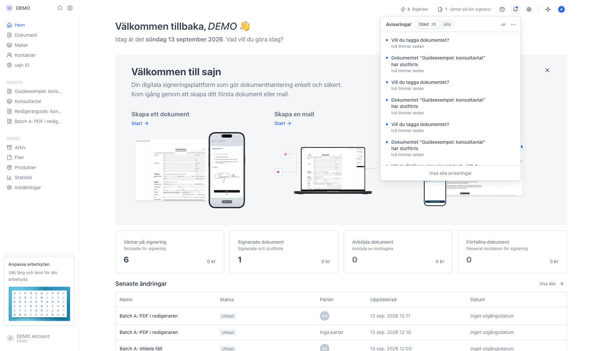
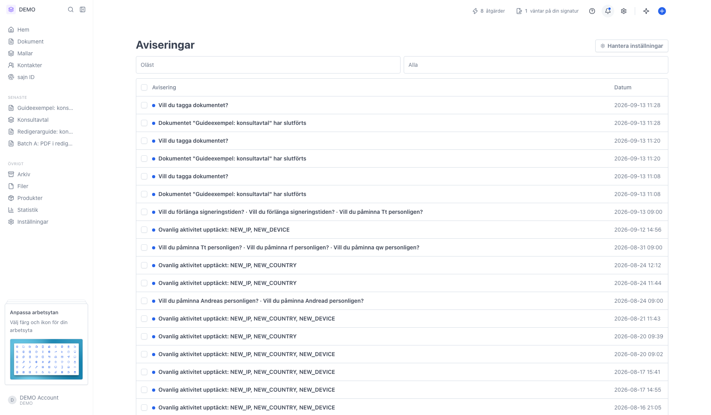
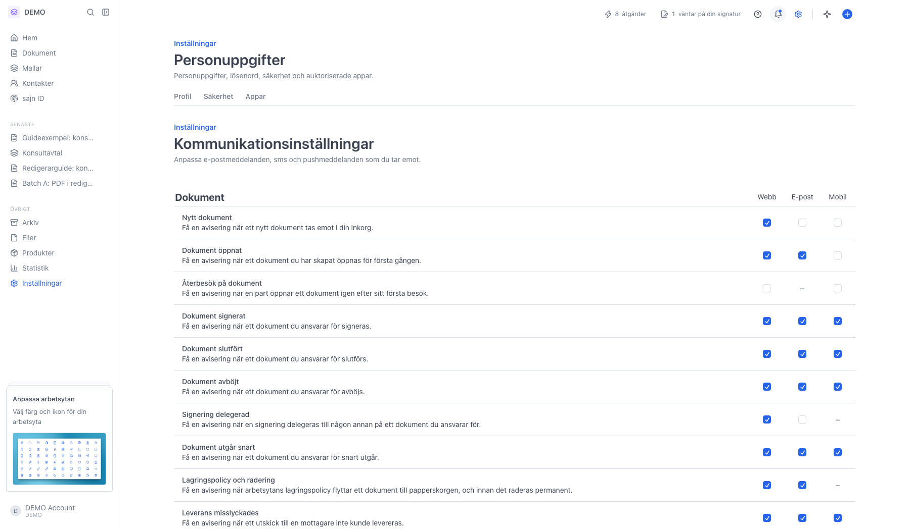

# Håll koll på aviseringar

<!--
slug: notifications
audience: Alla användare
last_verified: 2026-09-13
auto-generated from steps.json — edit the spec, then re-run the runner
-->

Aviseringar samlar det som händer kring dina dokument: signeringar, kommentarer, förslag på påminnelser och säkerhetshändelser. Klockan i toppmenyn visar de senaste, och sidan Aviseringar visar hela historiken.

## Innan du börjar

- Du är inloggad i sajn.
- Vilka aviseringar du får styrs av dina kommunikationsinställningar.

## Steg

### 1. Klockan i toppmenyn visar de senaste aviseringarna

Siffran bredvid Oläst är hur många du inte har öppnat. Klicka på en rad för att gå till dokumentet den handlar om. Det är bara här aviseringar markeras som lästa, en och en eller med bocken uppe till höger. Längst ner tar Visa alla aviseringar dig till hela listan.

### 2. Sidan Aviseringar visar hela historiken

Kolumnen Avisering är meddelandet, Datum är när det skapades. Olästa rader står i fet stil med en färgad prick framför. Oläst och Alla överst filtrerar listan, och valet ligger i adressen så att du kan spara en vy som bokmärke. Längst ner väljer du 10, 25 eller 50 rader per sida och bläddrar med pilarna.

### 3. Hantera inställningar styr vad du får

Knappen uppe till höger på aviseringssidan leder hit. Varje rad är en händelse och kolumnerna Webb, E-post och Mobil styr var du får den. Ett streck betyder att kanalen inte finns för den händelsen.

---

*Senast verifierad: 2026-09-13. Generad av `scripts/guide-runner.ts`.*
